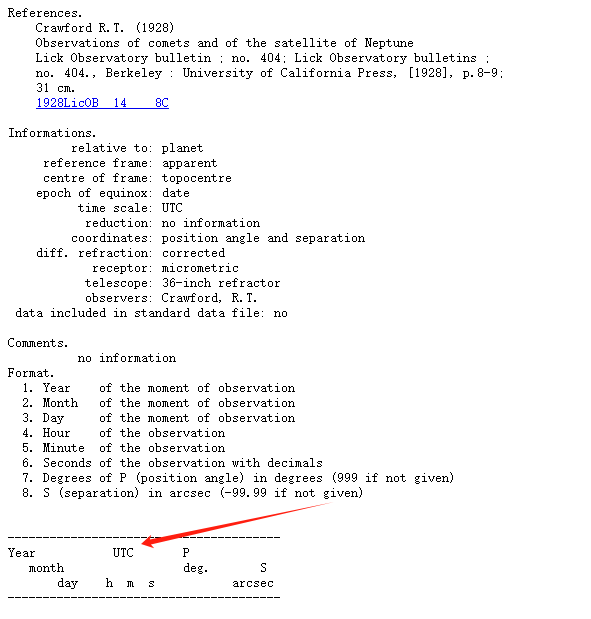
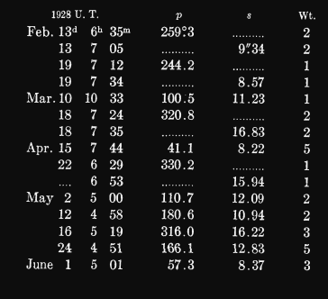

[TOC]

## 1. Organization

- 2024.11: 完成NSDC的数据处理✅
- 2024.12: 搜集新数据整理&准备考试📚
- 2025.01: 完成所有的数据&转换🔄
- 2025.02: 完善数据分析&矫正并撰写初稿✍
- 2025.03: 正式撰写文章📄
- 2025.04: 完善文章准备投递📬

## 2. Record

### 2.1 Date Preprocess

#### 2.1.1 html info

首先，因为NSDC上的数据是以content+data的双文件形式存储的。编写一个类似于爬虫的文本分析文件，将每一个content 的相关数据都整理到了一个csv文件，称之为information。Information里包含了时间尺度、坐标系统和观测台等信息，方便在某些数据记录中不包含某些数据时补上。
Information中包含了以下字段的信息
Id、Type、Dates、Observatory、Reference Frame、Centre of Frame、Epoch of Equinox、Time Scale、Reduction、Coordinates、Diffraction、Receptor、Telescope、Observers、Relative To


其次，因为最一开始并不了解时间尺度和坐标系统的概念和定义，故统计出了information中出现的所有时间尺度的类型。


#### 2.1.2 csv errror

Python对txt文件并不算特别友好，计划将txt文件转换成了csv文件方便之后的各种操作，但是转换途中发现有的观测数据的格式并不完整，编写了一个csv_error程序分析格式错误并改正。

| 文件名     | 错误信息                                                     | 修正 |
| ---------- | ------------------------------------------------------------ | ---- |
| jg0004.csv | 多余的空格                                                   | 删除 |
| jg0008.csv | 多余的空格                                                   | 删除 |
| jg0014.csv | 最后一列是 note(N) Note (if equal to 1) that latitude correction is not accurate | 更名 |
| jg0029.csv | 最后一列是天文台的名称                                       | 删除 |
| jg0033.csv | 特殊标注了一行观测台站变更                                   | 是   |
| jg0050.csv | 多余的空格                                                   | 删除 |
| jo0035.csv | 13. 震级，Mag（若未指定则留空） 14. 震级带，Band（若未指定则留空） | 更名 |
| jo0046.csv | 13. 震级，Mag（若未指定则留空） 14. 震级带，Band（若未指定则留空） | 更名 |
| jo0047.csv | 13. 震级，Mag（若未指定则留空） 14. 震级带，Band（若未指定则留空） | 更名 |
| jo0050.csv | 13. 震级，Mag（若未指定则留空） 14. 震级带，Band（若未指定则留空） | 更名 |
| jo1042.csv | 列 'C12' 空值比例过高 (91.5%)                                |      |
| jo1045.csv | 12. Magnitude in R band (blank if not available)             | 更名 |

改正所有错误之后开始对txt文件进行转换。并给所有的csv文件添加了一个表头，便于根据表头实现对多表的合并。

#### 2.1.3 csv convert

转换之后的csv文件如下，我为每个数据加上前后括号强制转换为文本，防止数据精度丢失。


#### 2.1.4 csv header

为了批量处理时间到统一的格式，亦或方便去对不同的数据类型处理，例如有些数据是赤经赤纬，有些数据是空间坐标。因此要将Data中的数据对应上相应的列名，编写了一个程序首先给所有csv文件增加一行标题行，然后通过编写一个软件实现直接更改各个文件的表头的功能，另外为了防止出错，在右侧会同步输出html文件，最后加上二次验证。确保所有的数据是准确无误的。
替换表头程序：


#### 2.1.5 csv utils


### 2.2 Date Convert

#### 2.2.1 csv merge

基于上述的数据准备，编写一个简单的程序就能实现多表合并，还为所有的行都新增了一列id，以文件名+行号形式构成，方便对数据的检索和对某些指定的数据整理。整合之后的表格如下。一共包含了内部、外部、伽利略卫星等十几个卫星的5万多条观测数据，基本实现了对观测数据的整合。


#### 2.2.2 csv extractor

通过前期整理，总计整理了57258条卫星星表数据。原始文件的时间尺度类型为

| file_line | year   | mon  | day         | hour | min  | sec  | JD   |
| --------- | ------ | ---- | ----------- | ---- | ---- | ---- | ---- |
| jg0002_2  | [1998] | [08] | [26.999456] |      |      |      |      |

数据根据 `classify` 列分为四大类：

1. 第1类 (`classify=1`)：
  1. 仅 `file_line`、`year`、`mon` 和 `day` 列有值。
  2. `day` 列包含小数，表示完整时间（包括日、时、分、秒）。其他列均为空。
2. 第2类 (`classify=2`)：
  1. 仅 `file_line`、`year`、`mon`、`day`、`hour`、`min` 和 `sec` 列有值。其他列均为空。
3. 第3类 (`classify=3`)：
  1. 仅 `jd` 列有值。其他列均为空。
4. 第4类 (`classify=4`)：
  1. 不符合上述任何分类规则，直接输出 `null`。


使用excel函数可以实现对数据的分类。

```
=IF(AND(ISNUMBER(SEARCH(".", D2)), D2<>"", E2="", F2="", G2="", H2="", I2="", J2="", A2<>""), 1,
   IF(AND(A2<>"", B2<>"", C2<>"", D2<>"", E2<>"", F2<>"", G2<>"", H2="", I2="", J2=""), 2,
   IF(AND(H2<>"", I2="", J2=""), 3,
   4)))
```

整理如下

| 时间尺度                                                     | 数据类型                                                     | 数据数量                                               |
| ------------------------------------------------------------ | ------------------------------------------------------------ | ------------------------------------------------------ |
| UTC    GMT    <br/>UT1    <br/>TT    ET    <br/>Cape sideral time    <br/>TCB    TDB | 第1类： 只有 `file_line`、`year`、`mon`、`day` 有值，且 `day` 列的值含小数点，其余列为空。<br/>第2类： 只有 `file_line`、`year`、`mon`、`day`、`hour`、`min`、`sec` 有值，其余列为空。<br/>第3类： 只有 `jd` 列有值，其余列为空。<br/>第4类： 不符合上述任何规则。 | 1	22964<br/>2	10726<br/>3	14396<br/>4	9172 |

第四类数据

| 文件名 | 类别 | 出现总次数 | 异常                  | 处理                                                         |
| ------ | ---- | ---------- | --------------------- | ------------------------------------------------------------ |
| jg0001 | 2    | 1606       | sec格式不一           |                                                              |
| jg0004 | 3    | 144        | 有jd,无时分秒         | 按jd                                                         |
| jg0008 | 4    | 738        | Cape sideral time     |                                                              |
| jg0032 | 3    | 448        | 有jd,有年月带小数的秒 | 按jd                                                         |
| ji0015 | 3    | 54         | jd                    | Julian date of observation (TDB)                             |
| jg0020 | 4    | 26         | mjd                   | MJD - time of topocentric observation (MJD=JD-2400000.5), TT |
| jg0021 | 4    | 16         | mjd                   | MJD - time of topocentric observation (MJD=JD-2400000.5), TT |
| jg0069 | 4    | 209        | Epoch_TCB             | Gaia-centric epoch in TCB relative to 2455197.5 (Epoch_TCB, days) |
| jg0073 | 4    | 295        | Epoch_TCB             | Gaia-centric epoch in TCB relative to 2455197.5 (Epoch_TCB, days) |
| ji0001 | 4    | 35         | hour带小数无min sec   | Hour of the moment of observation with decimals              |
| ji0002 | 4    | 160        | hour带小数无min sec   | Hour of the moment of observation with decimals              |
| ji0004 | 4    | 123        | hour带小数无min sec   | Hour of the moment of observation with decimals              |
| ji0005 | 4    | 156        | min                   | Minutes from 0 h UTC, 3 December 1988 (JD=2447498.5)         |
| ji0007 | 4    | 10         | mjd                   | MJD of observation with decimals (43494 = 17 Dec 1977)       |
| jo0069 | 4    | 1712       | Epoch_TCB             | Gaia-centric epoch in TCB relative to 2455197.5 (Epoch_TCB, days) |
| jo0077 | 4    | 3756       | Epoch_TCB             | Gaia-centric epoch in TCB relative to 2455197.5 (Epoch_TCB, days) |
| jo1057 | 4    | 92         | Epoch_TCB             | Gaia-centric epoch in TCB relative to 2455197.5 (Epoch_TCB, days) |
| jo1061 | 4    | 238        | Epoch_TCB             | Gaia-centric epoch in TCB relative to 2455197.5 (Epoch_TCB, days) |


#### 2.3.3 time convert

鉴于SOFA是在C/C++平台上的第三方库，对Python并不友好，但Astropy是一款功能强大的Python库，专为天文学和天体物理学研究设计。它提供了多种模块和工具来处理常见的天文数据和计算需求。两者的异同如下。

Astropy：

1. 语言：Python

2. 定位：用于天文数据分析的高层次库，提供了用户友好的 API，支持多种时间尺度处理。

3. 主要特点：

  1. 内置高效的时间转换功能。
  2. 支持多种日期格式（ISO、MJD、JD 等）。
  3. 易于与其他 Python 库（如 NumPy、Matplotlib）集成。

SOFA：

1. 语言：C/C++

2. 定位：由国际天文学联合会 (IAU) 提供的标准化库，用于高精度的天文计算。

3. 主要特点：

  1. 精度最高，完全遵循 IAU 的标准。
4. 提供底层函数接口，适合对时间转换要求极高的应用场景。

支持的时间尺度

| 时间尺度         | Astropy 示例        | SOFA 示例                                         |
| ---------------- | ------------------- | ------------------------------------------------- |
| UTC (协调世界时) | `Time(scale='utc')` | `iauUtcut1`                                       |
| TAI (国际原子时) | `Time(scale='tai')` | `iauTaiut1`                                       |
| TT (地球时间)    | `Time(scale='tt')`  | `iauDtt`                                          |
| UT1 (世界时1)    | `Time(scale='ut1')` | `iauUtcut1`                                       |
| TDB (动态时)     | `Time(scale='tdb')` | `iauTdbtt`                                        |
| TCB / TCG        | `Time(scale='tcb')` | 使用多个函数组合实现，如 `iauTdbtt` 和 `iauTcgtt` |

相同点：

1. 支持时间尺度的种类：两者均支持 IAU 定义的时间尺度。
2. 时间转换的精度：Astropy 的时间转换底层基于 SOFA 提供的标准函数，因此精度接近。
3. 时间单位处理：都支持秒、天等单位，转换时可选择合适的单位。

不同点：

| 维度           | Astropy                                 | SOFA                              |
| -------------- | --------------------------------------- | --------------------------------- |
| 易用性         | 高层 API，操作简单                      | 低层函数调用，需掌握 IAU 算法细节 |
| 语言生态       | 与 Python 生态系统（NumPy、Pandas）兼容 | 适合嵌入 C/C++ 高性能应用         |
| 时间更新机制   | 自动更新闰秒                            | 需手动维护闰秒表                  |
| 并行与数组操作 | 支持数组化操作（基于 NumPy）            | 无直接数组支持，需循环调用函数    |

结合上述内容即可根据平台编写处理代码。

```python
函数流程
    1.根据classify对所有的数据进行分类处理
    2.将所有数据的方括号去掉
    3.先将年月日等时间类型转换到mjd或jd
    4.将各个时间尺度下的mjd或jd转换到TT或UTC下。
注意
	1.实质上Astropy和SOFA的函数逻辑是相同的的，两者计算出的精度区别是由于SOFA是依靠程序内部的闰秒表，而Astropy是通过内部函数从网络上更新闰秒表。
    2.Astropy可以更好的对数组进行处理，不用担心精度丢失的问题

程序ti
```


#### 2.3.4 time verification

在完成代码编写后，需要对代码的准确性进行验证。将Observational catalogs and numerical ephemerides for the satellite system of Neptune（以下简称Nep）文中已经处理完成的数据作为对照组，验证准确性。Nep中共收集了91个观测原数据文件，涉及14574条观测信息。具体流程如下。

随机提取每一个时间尺度下的两条观测信息，其中
ts为观测选用的时间尺度
obsTime为观测时刻的儒略日
obsTt为转换到TT下的mjd

| db   | df                         | pubRef              | ts   | obsTime             | obsTt               | pubSrc | site | type | tech | rfs   | rfsCnt | obs  | obsCnt | obsTrg | obsCoord                                  | dpTime              | dpCoord        | astCat | aberr | refrac | phase | obsCoordIcrsB                             | catBias                                     | aberrRsd | refracRsd | phaseRsd | theoryRsd      | rsdIcrsB                                    | rsdIcrsA                                    |
| ---- | -------------------------- | ------------------- | ---- | ------------------- | ------------------- | ------ | ---- | ---- | ---- | ----- | ------ | ---- | ------ | ------ | ----------------------------------------- | ------------------- | -------------- | ------ | ----- | ------ | ----- | ----------------------------------------- | ------------------------------------------- | -------- | --------- | -------- | -------------- | ------------------------------------------- | ------------------------------------------- |
| ADS  | 1974AJ_____79__489R        | 1974AJ.....79..489R | ET   | 33037.276           | 33037.27600000007   | ADS    | 711  | O    | P    | B1950 | 711    | DIF  | 899    | 802    | [-164.1, 110.2]                           | 86.4                | [0.1, 0.1]     | ?      | E     | E      | I     | [-164.22011338372772, 110.02120673318402] | [0, 0]                                      | E        | E         | I        | DE438/NEP081xl | [1.8137696955868137, -0.4154173694506369]   | [1.8137696955868137, -0.4154173694506369]   |
| ADS  | 1974AJ_____79__489R        | 1974AJ.....79..489R | ET   | 33065.192           | 33065.191999999806  | ADS    | 711  | O    | P    | B1950 | 711    | DIF  | 899    | 802    | [-236.2, 144.8]                           | 86.4                | [0.1, 0.1]     | ?      | E     | E      | I     | [-236.35145904146842, 144.5528879624063]  | [0, 0]                                      | E        | E         | I        | DE438/NEP081xl | [0.16262055695690947, -0.22031271352523163] | [0.16262055695690947, -0.22031271352523163] |
| ADS  | 1996A+AS__115__319V-Nereid | 1996A&AS..115..319V | TDT  | 45859.231180555566  | 45859.23118055565   | ADS    | 874  | O    | P    | B1950 | 874    | DIF  | 899    | 802    | [-88.22, 22.09]                           | 1.0                 | [0.01, 0.01]   | p      | E     | E      | I     | [-88.33479351161789, 21.62667638755279]   | [0, 0]                                      | E        | E         | I        | DE438/NEP081xl | [0.12574018252617236, -0.16209671858076646] | [0.12574018252617236, -0.16209671858076646] |
| ADS  | 1996A+AS__115__319V-Nereid | 1996A&AS..115..319V | TDT  | 45859.25201388889   | 45859.25201388868   | ADS    | 874  | O    | P    | B1950 | 874    | DIF  | 899    | 802    | [-90.08, 21.9]                            | 1.0                 | [0.01, 0.01]   | p      | E     | E      | I     | [-90.193773174496, 21.426916587106334]    | [0, 0]                                      | E        | E         | I        | DE438/NEP081xl | [-1.6971003025943787, -0.35436161233020513] | [-1.6971003025943787, -0.35436161233020513] |
| NSDC | nm0051                     | 1849MNRAS...9..103L | LMT  | -4040.677083333334  | -4040.17727153888   | ADS    | 503  | O    | M    | TOD   | 503    | PAS  | 899    | 801    | [230.0, 15.4]                             | 60.0                | [3600.0, 0.1]  | /      | I     | ?      | I     | [229.5780409050926, 15.400000000000002]   | [0, 0]                                      | I        | i         | I        | DE438/NEP081xl | [1.2284137597538904, -0.9403376764145044]   | [1.2284137597538904, -0.9403376764145044]   |
| NSDC | nm0042                     | 1900AJ.....20..191H | GMT  | -4040.6497916666663 | -4040.1497165388428 | ADS    | 802  | O    | M    | TOD   | 802    | PAS  | 899    | 801    | [230.0, 15.4]                             | 6.0                 | [360.0, 0.1]   | /      | T     | ?      | I     | [229.5773360770347, 15.400000000000002]   | [0, 0]                                      | T        | i         | I        | DE438/NEP081xl | [0.28887188298551497, -0.10294356198207133] | [0.28887188298551497, -0.10294356198207133] |
| NSDC | nm0051                     | 1849MNRAS...9..103L | LMT  | -4038.6875          | -4038.187688209117  | ADS    | 503  | O    | M    | TOD   | 503    | PAS  | 899    | 801    | [29.0, 13.6]                              | 60.0                | [3600.0, 0.1]  | /      | I     | ?      | I     | [28.57790263054221, 13.6]                 | [0, 0]                                      | I        | i         | I        | DE438/NEP081xl | [0.34115622987323624, 2.3577704112454825]   | [0.34115622987323624, 2.3577704112454825]   |
| NSDC | nm0042                     | 1900AJ.....20..191H | GMT  | -4038.660416666666  | -4038.1603415426794 | ADS    | 802  | O    | M    | TOD   | 802    | PAS  | 899    | 801    | [28.8, 13.5]                              | 6.0                 | [360.0, 0.1]   | /      | T     | ?      | I     | [28.37713083097832, 13.499999999999998]   | [0, 0]                                      | T        | i         | I        | DE438/NEP081xl | [-0.9456991817822142, 0.07578292996206137]  | [-0.9456991817822142, 0.07578292996206137]  |
| NSDC | nm0048                     | 1886BuAsI...3..488H | PMT  | 8840.471527777778   | 8840.964974172413   | ADS    | 007  | O    | M    | TOD   | 007    | PAS  | 899    | 801    | [nan, 18.0]                               | 1.0                 | [nan, 0.1]     | /      | I     | ?      | I     | [nan, 18.0]                               | [0, 0]                                      | I        | i         | I        | DE438/NEP081xl | [nan, 2.441639061112408]                    | [nan, 2.441639061112408]                    |
| NSDC | nm0048                     | 1886BuAsI...3..488H | PMT  | 8840.477777777778   | 8840.971224172506   | ADS    | 007  | O    | M    | TOD   | 007    | PAS  | 899    | 801    | [213.0, nan]                              | 1.0                 | [360.0, nan]   | /      | I     | ?      | I     | [213.47406820377327, nan]                 | [0, 0]                                      | I        | i         | I        | DE438/NEP081xl | [-0.47670986650716474, nan]                 | [-0.47670986650716474, nan]                 |
| NSDC | nm0068                     | 1893AJ.....13...10B | PST  | 12415.449537037037  | 12416.282795154024  | ADS    | 662  | O    | M    | TOD   | 662    | PAS  | 899    | 801    | [61.2, nan]                               | 1.0                 | [360.0, nan]   | /      | I     | ?      | I     | [61.79988077095976, nan]                  | [0, 0]                                      | I        | i         | I        | DE438/NEP081xl | [-0.13671164883945686, nan]                 | [-0.13671164883945686, nan]                 |
| NSDC | nm0068                     | 1893AJ.....13...10B | PST  | 12415.451122685183  | 12416.284380802419  | ADS    | 662  | O    | M    | TOD   | 662    | PAS  | 899    | 801    | [61.6, nan]                               | 1.0                 | [360.0, nan]   | /      | I     | ?      | I     | [62.199881021883094, nan]                 | [0, 0]                                      | I        | i         | I        | DE438/NEP081xl | [-0.0024928272618295663, nan]               | [-0.0024928272618295663, nan]               |
| NSDC | nm0033                     | 1898AJ.....19...25B | CST  | 14181.61519675926   | 14182.365139529109  | ADS    | 754  | O    | M    | TOD   | 754    | PAS  | 899    | 801    | [242.48, nan]                             | 1.0                 | [36.0, nan]    | /      | I     | ?      | I     | [243.08758052723866, nan]                 | [0, 0]                                      | I        | i         | I        | DE438/NEP081xl | [0.17085532259052147, nan]                  | [0.17085532259052147, nan]                  |
| NSDC | nm0033                     | 1898AJ.....19...25B | CST  | 14181.622708333334  | 14182.372651103418  | ADS    | 754  | O    | M    | TOD   | 754    | PAS  | 899    | 801    | [nan, 16.27]                              | 1.0                 | [nan, 0.01]    | /      | I     | ?      | I     | [nan, 16.27]                              | [0, 0]                                      | I        | i         | I        | DE438/NEP081xl | [nan, 0.4058101392718303]                   | [nan, 0.4058101392718303]                   |
| NSDC | nm0075                     | 1928LicOB..14....8C | UT   | 25289.27430555556   | 25289.274586940184  | ADS    | 662  | O    | M    | TOD   | 662    | PAS  | 899    | 801    | [259.3, nan]                              | 1.0                 | [36.0, nan]    | /      | I     | E      | I     | [259.50033929953895, nan]                 | [0, 0]                                      | I        | E         | I        | DE438/NEP081xl | [0.09706440645801714, nan]                  | [0.09706440645801714, nan]                  |
| NSDC | nm0075                     | 1928LicOB..14....8C | UT   | 25289.29513888889   | 25289.295420273207  | ADS    | 662  | O    | M    | TOD   | 662    | PAS  | 899    | 801    | [nan, 9.34]                               | 1.0                 | [nan, 0.01]    | /      | I     | E      | I     | [nan, 9.34]                               | [0, 0]                                      | I        | E         | I        | DE438/NEP081xl | [nan, 0.1845273897387898]                   | [nan, 0.1845273897387898]                   |
| NSDC | nm0083                     | 2016OAP....29..155Y | UTC  | 38093.079012        | 38093.07950024074   | ADS    | 083  | O    | P    | ICRS  | 083    | ABS  | 0      | 801    | [224.16936249999998, -14.931443333333334] | 0.08639999999999999 | [0.015, 0.001] | g      | E     | E      | I     | [224.16936249999998, -14.931443333333334] | [0.00900268338137096, 0.018626353415224974] | E        | E         | I        | DE438/NEP081xl | [0.9409905607293848, -0.014060269055203805] | [0.9319878773480138, -0.03268662247042878]  |
| NSDC | nm0009                     | 1978AJ.....83..838W | UTC  | 42589.2566          | 42589.25713453721   | ADS    | 689  | O    | P    | TOD   | 689    | DIF  | 899    | 801    | [0.95, 10.45]                             | 8.64                | [0.01, 0.01]   | /      | E     | E      | I     | [0.9256926217376437, 10.452181302441295]  | [0, 0]                                      | E        | E         | I        | DE438/NEP081xl | [0.03250520154033243, 0.016974153816297743] | [0.03250520154033243, 0.016974153816297743] |

> JD（Julian Date）：
>
> 1. JD 是从公元前4714年11月24日中午12时（格林尼治时间）开始计算的连续天数。
> 2. 它是一个连续的计数系统，每过一天，JD 增加1。
> 3. 例如，JD 2451545.0 对应于2000年1月1日中午12时。
>
> MJD（Modified Julian Date）：
>
> 1. MJD 是从1858年11月17日开始计算的连续天数。
> 2. 它是JD的一个简化版本，通过减去2400000.5得到的。
> 3. 例如，MJD 51544.0 对应于2000年1月1日中午12时。
                                             |
                                       另外的，
	                                       美国中部标准时 (Central standard time)、太平洋标准时 (Pacific standard time)、巴黎平时 (Paris mean time)、地方平时 (local mean time)等地方时木星卫星未涉及到，暂不做验证。即验证集为。

| db   | df                         | pubRef              | ts   | obsTime             | obsTt               | pubSrc | site | type | tech | rfs   | rfsCnt | obs  | obsCnt | obsTrg | obsCoord                                  | dpTime              | dpCoord        | astCat | aberr | refrac | phase | obsCoordIcrsB                             | catBias                                     | aberrRsd | refracRsd | phaseRsd | theoryRsd      | rsdIcrsB                                    | rsdIcrsA                                    |
| ---- | -------------------------- | ------------------- | ---- | ------------------- | ------------------- | ------ | ---- | ---- | ---- | ----- | ------ | ---- | ------ | ------ | ----------------------------------------- | ------------------- | -------------- | ------ | ----- | ------ | ----- | ----------------------------------------- | ------------------------------------------- | -------- | --------- | -------- | -------------- | ------------------------------------------- | ------------------------------------------- |
| ADS  | 1974AJ**_**79__489R        | 1974AJ.....79..489R | ET   | 33037.276           | 33037.27600000007   | ADS    | 711  | O    | P    | B1950 | 711    | DIF  | 899    | 802    | [-164.1, 110.2]                           | 86.4                | [0.1, 0.1]     | ?      | E     | E      | I     | [-164.22011338372772, 110.02120673318402] | [0, 0]                                      | E        | E         | I        | DE438/NEP081xl | [1.8137696955868137, -0.4154173694506369]   | [1.8137696955868137, -0.4154173694506369]   |
| ADS  | 1974AJ**_**79__489R        | 1974AJ.....79..489R | ET   | 33065.192           | 33065.191999999806  | ADS    | 711  | O    | P    | B1950 | 711    | DIF  | 899    | 802    | [-236.2, 144.8]                           | 86.4                | [0.1, 0.1]     | ?      | E     | E      | I     | [-236.35145904146842, 144.5528879624063]  | [0, 0]                                      | E        | E         | I        | DE438/NEP081xl | [0.16262055695690947, -0.22031271352523163] | [0.16262055695690947, -0.22031271352523163] |
| ADS  | 1996A+AS**115**319V-Nereid | 1996A&AS..115..319V | TDT  | 45859.231180555566  | 45859.23118055565   | ADS    | 874  | O    | P    | B1950 | 874    | DIF  | 899    | 802    | [-88.22, 22.09]                           | 1.0                 | [0.01, 0.01]   | p      | E     | E      | I     | [-88.33479351161789, 21.62667638755279]   | [0, 0]                                      | E        | E         | I        | DE438/NEP081xl | [0.12574018252617236, -0.16209671858076646] | [0.12574018252617236, -0.16209671858076646] |
| ADS  | 1996A+AS**115**319V-Nereid | 1996A&AS..115..319V | TDT  | 45859.25201388889   | 45859.25201388868   | ADS    | 874  | O    | P    | B1950 | 874    | DIF  | 899    | 802    | [-90.08, 21.9]                            | 1.0                 | [0.01, 0.01]   | p      | E     | E      | I     | [-90.193773174496, 21.426916587106334]    | [0, 0]                                      | E        | E         | I        | DE438/NEP081xl | [-1.6971003025943787, -0.35436161233020513] | [-1.6971003025943787, -0.35436161233020513] |
| NSDC | nm0042                     | 1900AJ.....20..191H | GMT  | -4040.6497916666663 | -4040.1497165388428 | ADS    | 802  | O    | M    | TOD   | 802    | PAS  | 899    | 801    | [230.0, 15.4]                             | 6.0                 | [360.0, 0.1]   | /      | T     | ?      | I     | [229.5773360770347, 15.400000000000002]   | [0, 0]                                      | T        | i         | I        | DE438/NEP081xl | [0.28887188298551497, -0.10294356198207133] | [0.28887188298551497, -0.10294356198207133] |
| NSDC | nm0042                     | 1900AJ.....20..191H | GMT  | -4038.660416666666  | -4038.1603415426794 | ADS    | 802  | O    | M    | TOD   | 802    | PAS  | 899    | 801    | [28.8, 13.5]                              | 6.0                 | [360.0, 0.1]   | /      | T     | ?      | I     | [28.37713083097832, 13.499999999999998]   | [0, 0]                                      | T        | i         | I        | DE438/NEP081xl | [-0.9456991817822142, 0.07578292996206137]  | [-0.9456991817822142, 0.07578292996206137]  |
| NSDC | nm0075                     | 1928LicOB..14....8C | UT   | 25289.27430555556   | 25289.274586940184  | ADS    | 662  | O    | M    | TOD   | 662    | PAS  | 899    | 801    | [259.3, nan]                              | 1.0                 | [36.0, nan]    | /      | I     | E      | I     | [259.50033929953895, nan]                 | [0, 0]                                      | I        | E         | I        | DE438/NEP081xl | [0.09706440645801714, nan]                  | [0.09706440645801714, nan]                  |
| NSDC | nm0075                     | 1928LicOB..14....8C | UT   | 25289.29513888889   | 25289.295420273207  | ADS    | 662  | O    | M    | TOD   | 662    | PAS  | 899    | 801    | [nan, 9.34]                               | 1.0                 | [nan, 0.01]    | /      | I     | E      | I     | [nan, 9.34]                               | [0, 0]                                      | I        | E         | I        | DE438/NEP081xl | [nan, 0.1845273897387898]                   | [nan, 0.1845273897387898]                   |
| NSDC | nm0083                     | 2016OAP....29..155Y | UTC  | 38093.079012        | 38093.07950024074   | ADS    | 083  | O    | P    | ICRS  | 083    | ABS  | 0      | 801    | [224.16936249999998, -14.931443333333334] | 0.08639999999999999 | [0.015, 0.001] | g      | E     | E      | I     | [224.16936249999998, -14.931443333333334] | [0.00900268338137096, 0.018626353415224974] | E        | E         | I        | DE438/NEP081xl | [0.9409905607293848, -0.014060269055203805] | [0.9319878773480138, -0.03268662247042878]  |
| NSDC | nm0009                     | 1978AJ.....83..838W | UTC  | 42589.2566          | 42589.25713453721   | ADS    | 689  | O    | P    | TOD   | 689    | DIF  | 899    | 801    | [0.95, 10.45]                             | 8.64                | [0.01, 0.01]   | /      | E     | E      | I     | [0.9256926217376437, 10.452181302441295]  | [0, 0]                                      | E        | E         | I        | DE438/NEP081xl | [0.03250520154033243, 0.016974153816297743] | [0.03250520154033243, 0.016974153816297743] |

1996A&AS..115..319V文献数据如下


1974AJ.....79..489R文献数据如下


在获取原始数据时，发现imcce网站上的数据并不完全准确，例如观测数据编号nm0075在imcce中的time scale为UTC，但文献中的Time scale是UT。在之后的工作中可能还要对数据的准确性做进一步的验证。





整理的上述文献得：
