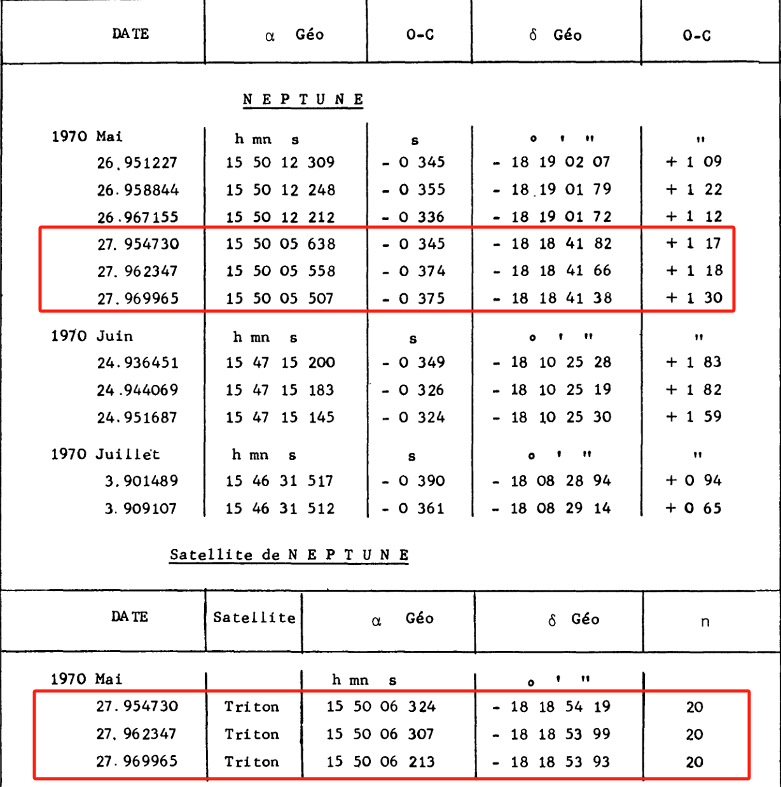

[TOC]

## 专业名词解释

岁差：由于日月行星引力的共同作用，地球自转轴在空间的方向发生周期性变化。岁差的变化缓慢且相对规则，可通过岁差模型（如IAU推荐的岁差模型）实现精确计算和修正。

------

章动：在行星或陀螺仪的自转运动中，轴在进动中的一种轻微不规则运动，使自转轴在方向的改变中出现如“点头”般的摇晃现象。行星的章动来自于力，并使得岁差的速度不是常数，而会随着时间改变。通常采用IAU推荐的章动理论模型（如IAU2000章动模型），实现章动的改正。如下图所示，绿色为地球自转轴，蓝色表示岁差影响，红色表示岁差与章动影响。


- 根据是否考虑岁差与章动改正分成以下三种：

  - 不考虑岁差和章动影响：国际天球坐标系

  - 仅考虑岁差影响：瞬时平天球坐标系（去除了章动干扰）

  - 考虑岁差和章动影响：瞬时真天球坐标系


只要有岁差和章动改正数，就能实现上述三种坐标系统的相互转换

表2-3 坐标系统的相互转换

| 参考系名称            | 是否考虑岁差 | 是否考虑章动 | Z轴垂直方向        | X轴指向          |
| --------------------- | ------------ | ------------ | ------------------ | ---------------- |
| 真赤道真春分点参考系  | 是           | 是           | 真赤道（瞬时赤道） | 真春分点（瞬时） |
| 平赤道平春分点参考系  | 是           | 否           | 平赤道             | 平春分点         |
| 国际天球参考系 (ICRS) | 否           | 否           | J2000.0平赤道      | J2000.0平春分点  |

------

光行差（Aberration of Light）
光行差是由于观测者的运动速度与光速合成效应引起的恒星视位置偏移。地球绕太阳公转、以及地球自转，都使得从地球上观测到的恒星方向与恒星实际所在方向之间存在微小夹角。
根据经典力学和相对论中的速度合成原理，运动的观测者看到的光线传播方向会因自身速度而发生改变。该效应与天体本身无关，只与地球运动有关。
年度光行差最大值约为 20.5 角秒，发生在天体与地球公转速度方向垂直时。日周光行差最大约为 0.3 角秒，影响更小，常用于高精度地面天文台建模。
当从天体视位置转换为平均位置时（或构造星表时），需要减去光行差；若从平均位置计算可见位置，则要加上光行差。光行差模型广泛用于从视方向反推真实方向。
天狼星的平均位置在天球上的变化量在一年内会受到光行差影响最大达 20″，对于高精度星表（如 Gaia）必须考虑。

------

光行差 E 项（Elliptic Terms of Aberration）
 E 项是 FK4 系统在星表编制时人为引入的静态修正项，用于近似补偿地球绕太阳椭圆轨道运动产生的光行差偏移。这一项在天体位置中始终存在，不随观测时间变化。
由于太阳绕地黄道轨道为椭圆形，FK4 系统在恒星位置中加入了依赖黄经的周期性项，以减少建表误差。但在 FK5 或 ICRS 系统中该项被剔除，因其不再符合现代动态模型。
该项的最大偏移约为 0.3″，在全天球呈现周期性变化，方向与黄道位置有关。
从 FK4 → FK5 的坐标转换时必须剔除该项，否则会引入系统性位置误差。SOFA 中的 `iauFk45z` 和 `iauFk425` 函数会自动处理 E 项剔除。
一颗恒星位于黄道上的某一点，若不剔除 E 项，其位置与 FK5 坐标系下的参考结果会偏移最多达 0.3″，在 VLBI 或 Gaia 数据比对中产生不可接受的误差。

------

自行（Proper Motion）
自行是恒星在天球上由于其自身空间速度所引起的位置变化，表现为赤经与赤纬的逐年微小变化，通常以毫角秒/年（mas/yr）表示。
恒星与太阳一样在银河系中运动，但由于距离遥远，其运动在天球中表现为缓慢的线性漂移。自行不包括地球公转或恒星视差引起的视位置变化。
典型恒星自行在 1~100 mas/yr 范围，最著名的 Barnard 星每年约 10.3″，是当前记录中最大的恒星自行。
进行不同历元之间的位置传播（如从 B1950 转换至 1980 或 J2000）时，必须加上历元差乘以自行项。若自行项不精确，将导致恒星位置系统性漂移。
若某恒星在 1950 年赤经为 100°，自行为 50 mas/yr，至 2000 年位置将变为 100.000694°。对于高精度恒星导航任务，必须使用此项。

------

分点差（Equinox Offset）
分点差是由于 FK4 与 FK5 两个坐标系统中分点（即赤经起始点）的定义不一致，导致恒星赤经坐标在两个系统中存在常量偏移，约为 0.085″。
FK4 使用 Newcomb 的岁差常数，而 FK5 使用 Lieske 等人的改进模型，两者在春分点位置的定义存在系统差异。该差异在赤经方向上表现为一个常量修正。
赤经偏移约为 +0.085″，具体值随历元略有不同。赤纬方向影响非常小，通常可忽略。
在进行 FK4 → FK5 转换时必须应用该修正，SOFA 提供的转换函数中已包含分点差校正。
一颗恒星在 FK4 系统中赤经为 120.000000°，若未修正分点差，其转换后 FK5 赤经将比真实值小约 0.085″，相当于 4.1e-5° 的系统性误差。

------

周年视差（Annual Parallax）
周年视差是地球在绕太阳公转轨道上从不同位置观测恒星时，恒星位置在天球上的视在变化。该角度变化称为视差，反映了恒星距离。
视差是一个几何三角测量过程。距离越近的恒星，因地球位置变化带来的背景星方向差越大；距离越远，角度越小。单位是角秒，1角秒视差对应1秒差距（pc）距离。
最亮的近距离恒星如比邻星视差为 0.77″，大多数恒星在 0.01″~0.1″ 之间，银河系中心的恒星视差小于 0.001″。
高精度恒星坐标转换或构造星历时，需要视差配合地球轨道模型计算天体在不同时间下的真实方向。未考虑视差将导致近距离天体位置显著偏移。
Gaia 星表中，一颗 10 pc 的恒星具有 0.1″ 的周年视差，若忽略该效应，其视位置将在天球上偏移最多 0.1″，对精度要求为 1 mas 的任务来说误差高达 100 倍。

## 木卫的基本信息即研究意义

### 研究背景

表1-1 木星部分行星基本信息

| 名称     | 平均半径(km) | 质量(×10²²kg) | 半长轴(km) | 公转周期(地球日) | 轨道倾角(°) | 轨道离心率 | 星等 |
| -------- | ------------ | ------------- | ---------- | ---------------- | ----------- | ---------- | ---- |
| Io       | 1,821.30     | 8.93          | 421,700    | 1.769            | 0.04        | 0.0041     | -1.7 |
| Europa   | 1,560.80     | 4.78          | 671,034    | 3.551            | 0.47        | 0.0094     | -1.4 |
| Ganymede | 2,634.10     | 14.8          | 1,070,412  | 7.155            | 0.195       | 0.0013     | -2.1 |
| Callisto | 2,410.30     | 10.76         | 1,882,700  | 16.689           | 0.281       | 0.0074     | -1.2 |
| Amalthea | 83.5         | 0.208         | 181,366    | 0.498            | 0.375       | 0.0032     | 14.1 |
| Himalia  | 85           | 0.66          | 11,480,000 | 250.566          | 27.52       | 0.157      | 14.6 |
| Thebe    | 50           | 0.43          | 221,889    | 0.674            | 1.08        | 0.012      | 16.0 |

图1-1 太阳系内行星各卫星行星数量


从上世纪80年代以来，随着天文观测技术的不断进步和卫星探测任务的增多，太阳系内卫星的发现数量急剧增加。例如，土星已确认274颗轨道卫星，而木星拥有95颗卫星，位居太阳系第二。木星作为太阳系中最大的行星，其卫星系统不仅涵盖伽利略卫星（木卫一至木卫四），还包括众多小型不规则卫星，这些卫星的轨道特性和物理属性十分复杂。然而，现有的木卫观测星表普遍存在时间系统不统一、数据格式参差不齐等问题，导致在构建卫星运动学模型和进行长期轨道预测时需要额外进行大量的数据预处理和时间转换工作。

### 研究意义

图中展示了伽利略卫星在不同年份模型下1903年到2043年的偏差情况，清晰表明：随着观测数据的不断减少，模型与实际情况的偏差会逐步增大。这是因为模型是依据观测数据来构建的，观测数据越多构建出的模型越接近实际。本研究旨在解决现有星表中存在的数据混乱问题，对历年木卫观测数据进行标准化处理，构建了一份更新、更准确的观测星表。


完成这一系列数据标准化工作后，后续研究者无需再重复进行繁琐的时间转换与数据整合工作，而可以直接利用该标准化星表结合建立运动学模型，可以开展更深入的轨道动力学分析、捕获机制研究以及演化历史探讨，从而大幅提高研究效率并推动相关基础科学问题的突破。

### 整体框架

- ✅观测资料的收集
- ✅时间系统
- 坐标系统
  - ⭐将不同参考系下的绝对坐标变换至 ICRS
  - ⭐变换相对观测坐标至国际天球参考系
- ⭐星表偏差改正
- ⭐绘制观测星表


原始观测数据的标准化与格式统一，具体包括：时间系统转换：统一至参考时间系；坐标系统转换：区分并处理相对坐标与绝对坐标的变换；星表转换：调用星历数据完成天球坐标向惯性坐标的映射。
在状态建模层面，我们以初始状态量为起点，通过数值积分器对目标进行轨道传播，得到状态量。同时引入动力学模型，计算得到理论观测量C，并与实测观测量O进行比较，形成残差O-C。
利用O-C残差与偏导信息，我们进一步完成对初始状态的修正，并将其反馈回初始状态形成闭环迭代。该过程支持逐步收敛，实现轨道改进与模型精度提升。

## 数据源介绍

### IMCCE数据

观测星表的主要来源是IMCCE网站上记录的各时间段、观测台站以及观测设备所采集的数据，采用「目录+数据+content」三层进行存储。本文的目标是对这些观测记录进行系统化整理、清洗与合并，最终形成一个统一的观测数据表，为后续研究提供高精度数据支持。


## 工作详细流程

### 数据预处理

#### 文本与格式处理

首先，将每条观测记录中涉及的关键信息（例如Id、Type、Dates、Observatory、Reference Frame、Centre of Frame、Epoch of Equinox、Time Scale、Reduction、Coordinates、Diffraction、Receptor、Telescope、Observers、Relative To 等)合并收集，并根据字段含义进行整理和规范化。

在从文本文件转换为CSV文件的过程中，部分观测数据存在格式缺失或不一致的问题，需要进行必要的清洗与修正。[附表1](##附表1 IMCCE数据错误信息及修正)列出了需要修正的文件及其主要错误信息、修正手段。

在所有错误修正完成后，给所有CSV文件添加了统一的表头（header)，方便后续自动合并和批量处理。

为防止数据精度丢失，对数值型数据加上前后括号强制转换为文本。

#### 多表合并与数据整合

为了便于检索与特定数据定位，对每条记录新增一列唯一ID（由「文件名+行号」构成)。编写脚本进行多表合并后，得到一个包含数万条观测记录的整合表格，覆盖了若干颗木星卫星及其相关观测。该整合表格为后续数据分析奠定了基础。


### 时间系统

在天文观测和数据处理中，不同的时间尺度可能并存。本文将所有观测记录统一转换到TT。之所以转换到TT是因为构建新的观测星表应该要求时间尺度尽可能均匀连续，以确保新的观测星表在时间轴上的一致性。并且TT易于与其他常见时间尺度互相转换，也适用于后续的历表与动力学计算。本文使用IAU的公益项目SOFA工具进行处理。

#### 时间尺度概述

天文观测中常用的时间尺度可大致分为以下两类：表中展示了设计的所有的时间尺度

- 原子时及力学时
- 地球自转时

GMT起源于19世纪末，以格林尼治皇家天文台为基准，基于地球自转，反映太阳相对于格林尼治子午线的运动。
随着对更精确时间的需求，UT1被提出，它修正了地球自转的不规则性，直接反映了地球自转的实际速度
接下来，TAI在1958年诞生，基于全球约200台原子钟的加权平均，标志着时间测量进入新的精度时代。
为了协调全球时间，UTC在TAI的基础上加入了闰秒调整，保持与UT1的差值不超过0.9秒，又与TAI。
随着天文学和物理学的发展，TT被定义为TAI+32.184秒，用于历法计算。
接着，TCB引入，它代表了零引力场中，质心系坐标静止标准钟的原时秒
最后，TDB在TT基础上加入相对论修正，时间原点移至太阳系质心。

表2-1 时间尺度简述

| 时间尺度 | 定义                                             | 关键特点                                   |
| -------- | ------------------------------------------------ | ------------------------------------------ |
| GMT      | 以格林尼治皇家天文台为基准的平均太阳时           | 基于地球自转，反映太阳在天球上的位置       |
| UT1      | 反映地球实际自转速度，是修正极移（UT0）后的时间  | 直接用于天文观测，修正了地球自转的不规则性 |
| TAI      | 基于全球约200台原子钟的加权平均，采用SI秒        | 与UT1差约为0，从1958年1月1日时起           |
| UTC      | 与TAI同步，通过闰秒调整与世界时（UT1）的差值     | 保持与UT1的差值不超过0.9秒                 |
| TT       | 定义为TAI+32.184秒，用于历表计算                 | 保持与SI秒一致                             |
| TCB      | 零引力场中质心系坐标静止标准钟的原时秒           | 用于天文学和物理学中                       |
| TDB      | 在TT基础上加上相对论修正，时间原点移至太阳系质心 | 用于天体力学和宇宙学研究                   |

通过前期整理，总计整理了57258条星表数据。当前已整理的所有木卫观测记录采用的时间尺度见下表。

表2-2 木卫观测星表时间尺度统计

|        TS         | NUMBER |  记录格式   | 完成情况 |
| :---------------: | :----: | :---------: | -------- |
|        UTC        | 44302  | JD,MJD,Full | √        |
|  UTC(1960年之前)  |  2401  | JD,MJD,Full | √        |
|      UTC-3h       |  706   | JD,MJD,Full | √        |
|        UT1        |  808   |    Full     | √        |
|        GMT        |  562   |    Full     | √        |
|        ET         |  419   | Day_detail  | √        |
|        TT         |  966   | JD,MJD,Full | √        |
| Cape sideral time |  738   |    Full     |          |
|        TDB        |   54   |     JD      | √        |
|        TCB        |  6302  |    Full     | √        |


下图展示了1950年至2020年期间各主要时间尺度的长期变化，包括TAI、TT、TDB、TCB、UT1、UTC等之间的差异。可以看到，TAI与TT之间的恒定差值；UT1与原子时间的不断漂移；UTC通过“阶梯”式的闰秒调整来跟上UT1；TCB/TCG在相对论修正下对TT的持续偏离；
构建观测星表应该要求时间尺度尽可能均匀连续，以确保新的观测星表在时间轴上的一致性。并且TT易于与其他常见时间尺度互相转换。


#### 数据记录格式统一

在进行具体的时间转换前，需将不同文件中记录的观测时刻统一到相同的“记录格式”。常见的记录形式包括：

1.  Day_detail：year、mon、day，小数部分表示当日的时分秒

2.  Full：year、mon、day、hour、min、sec

3.  JD/MJD：儒略日或简化儒略日

4.  其他地方时或特殊格式：如Cape sideral time等

通过编写程序，将记录格式分类，[附表2](##附表2 第四类及特殊记录格式)为第四类格式的汇总。再将这些不同格式统一转换为Full格式或JD两段式格式（利用SOFA的\`iauDtf2d\`等函数)，以便后续做同一基准下的时刻处理。

#### UTC→TT

整体思路是依据闰秒数据转换到TT。但实际上对于1972年的时间是存疑的，因为各研究学者对UT1和UTC划分的时间节点不一致，我先后对比Emelyanov、袁烨等人的操作方法得出下表。

| 作者       | 1972年后       | 1972年-1962年  | 1962之前 |
| ---------- | -------------- | -------------- | -------- |
| Emelyanov  | 按照闰秒表计算 | 按照闰秒表计算 | NULL     |
| 袁烨       | 按照闰秒表计算 | 按照10s计算    | NULL     |
| J. Desmars | 按照闰秒表计算 | NULL           | 视为UT1  |
| 本文       | 按照闰秒表计算 | 按照闰秒表计算 | 视为UT1  |

总结为

1.  1962年之后：利用SOFA内置的闰秒表进行精确转换；
2.  1962年之前，UTC近似为UT1，使用Stephenson和Morrison（1984）中给出的UT1和TT的关系。

```c
static int convert_utc(double d1, double d2, double *tt1, double *tt2)
{
    if (d1 + d2 < 2436934.5) 
        return convert_ut1(d1, d2, tt1, tt2);
    double tai1, tai2;
    int status = iauUtctai(d1, d2, &tai1, &tai2);
    if (status)
        return status;
    return iauTaitt(tai1, tai2, tt1, tt2);
}
```


#### UT1→TT

整体思路是依据已有的ΔT数据转换到TT。

​	1962年之后，使用IERS发布的“EOP_C04_IAU2000”中的UT1-UTC差值，精确到天，无需插值。

​	1956至1962年，使用IERS发布的“EOP_C01_IAU2000”中的UT1-TAI差值，时间跨度比较大以月为单位，需插值到天。

​	1956年之前，使用Stephenson和Morrison（1984）中给出的UT1和TT的ΔT数据，使用三次样条插值细化到日。另外的，NASA的ΔT长期多项式模型（Polynomial Approximation for TT-UT1)也可以外推估计ΔT。

下图为NASA模型、文献数据与已发布的海卫星表之间的相对误差，使用均方根误差（RMSE)作为评价指标。将文献数据插值之后的数据与已发布的海卫星表的吻合度更高，误差指标更低。


我的做法是先对各个辅助文件整合，并将时间间隔统一插值到天。得到1800年至2023年的DeltaT数据。然后再通过调用各自时间尺度对应的DeltaT实现到TT的转换。这样做的弊端就是最终的数据精度取决于IERS等发布的辅助数据。

#### TDB→TT

对于TDB而言根据精度不同可以选用不同的计算方法。

1.  对于精度要求微秒级的，可以使用公式2-1计算。

$$
TDB−TT=0.001658×sin(g)+0.000014×sin(2g);g = 357.53 + 0.9856003 × (JD_{TT} - 2451545.0)
$$

2.  对于精度要求纳秒级的，使用SOFA程序中的Dtdb函数计算。输入参数包括儒略日(date1,date2)、UT1(ut)、观测点经度(elong)、地球自转轴距离(u)和赤道平面距离(v)，最终返回TDB-TT时间差。这里的elong、u、v三个参数都是通过测站的地理信息通过下方的函数测算出来的。但是UT1无法测算，所以这里先使用了TDB近似作为TT再根据DeltaT的数据计算得出，本文也尝试了使用法一中的递推计算TT，结果上与直接使用几乎没有差别。

```c
double xyz[3];
iauGd2gc(1, elong, phi, height, xyz);  // WGS84, longitude, latitude, height
double u = sqrt(xyz[0]*xyz[0] + xyz[1]*xyz[1]) / 6378137.0;
double v = xyz[2] / 6378137.0;
```

代码2-1 根据测站信息提取得到u,v的值。

TDB涉及到的观测台站如下：

| 文件名 | 台站              | elong        | u         | v         |
| ------ | ----------------- | ------------ | --------- | --------- |
| ji0015 | 586 - Pic du Midi | 0.0024836035 | 0.7365363 | 0.6747957 |

ji0015使用Dtdb计算出的值与地带模型的差值为0.00157 秒。[MPC 站点](https://www.minorplanetcenter.net/iau/lists/ObsCodes.html)

#### 补充

对于剩余的时间尺度，我们认为ET=TT，GMT=UT1。另外在解释和使用过去几个世纪发表的天体测量观测结果时，应考虑在1925年之前的观测中，一天的开始被认为是中午，即12小时。而现代一天的开始被认为是午夜，即0小时，如遇此类老资料需整体减0.5日实现对齐。(在早期的观测数据中一般是GMT通常需要这样去处理)

```c
        if (d1 + d2 < 2424148.0){
            if (d2 >= 0.5)
                adj_d2 -= 0.5;
            else{
                adj_d1 -= 1.0;
                adj_d2 += 0.5;
            }
        }
```

到此即完成了各个时间尺度到TT的转换，并尽可能的提高精度。部分结果如下。

| scale | index  | type | file_line | d1          | d2            | tt1         | tt2           |
| ----- | ------ | ---- | --------- | ----------- | ------------- | ----------- | ------------- |
| UTC   | [8922] | [2]  | jg0023_49 | [2454249.5] | [0.333195602] | [2454249.5] | [0.333950046] |
| UTC   | [8923] | [2]  | jg0023_50 | [2454177.5] | [0.540383102] | [2454177.5] | [0.541137546] |
| UTC   | [8924] | [2]  | jg0023_51 | [2454179.5] | [0.535182870] | [2454179.5] | [0.535937314] |
| UTC   | [8925] | [2]  | jg0023_52 | [2454201.5] | [0.476787037] | [2454201.5] | [0.477541481] |
| UTC   | [8926] | [2]  | jg0023_53 | [2454209.5] | [0.453296296] | [2454209.5] | [0.454050740] |
| UTC   | [8927] | [2]  | jg0023_54 | [2454215.5] | [0.436283565] | [2454215.5] | [0.437038009] |
| UTC   | [8928] | [2]  | jg0023_55 | [2454218.5] | [0.427291667] | [2454218.5] | [0.428046111] |
| UTC   | [8929] | [2]  | jg0023_56 | [2454219.5] | [0.423895833] | [2454219.5] | [0.424650277] |
| UTC   | [8930] | [2]  | jg0023_57 | [2454228.5] | [0.397473380] | [2454228.5] | [0.398227824] |
| UTC   | [8931] | [2]  | jg0023_58 | [2454229.5] | [0.395025463] | [2454229.5] | [0.395779907] |
| UTC   | [8932] | [2]  | jg0023_59 | [2454232.5] | [0.386464120] | [2454232.5] | [0.387218564] |
| UTC   | [8933] | [2]  | jg0023_60 | [2454235.5] | [0.376500000] | [2454235.5] | [0.377254444] |

为了验证时间转换程序的准确性，选取海卫星表Observational catalogs and numerical ephemerides for the satellite system of Neptune(简称OCNS2019)中的已转换数据作为对照组，对随机抽取的各类时间尺度(UT1、UTC、GMT、ET、TDT等)进行测试。结果表明，本文程序与文献给出的对照值基本一致，说明转换过程可靠。

### 坐标系统
#### 坐标系统概述

通过前期整理，总计整理了57258条星表数据。当前已整理的所有木卫观测记录采用的坐标系统见下表。

表2-4 木卫观测星表坐标系统统计

|          | rfs                                                          | number |
| :------- | :----------------------------------------------------------- | :----- |
| absolute | J2000                                                        | 41494  |
|          | true of date                                                 | 806    |
|          | ICRF                                                         | 298    |
|          | B1950                                                        | 753    |
|          | 1 Jan of year  of observation                                | 66     |
|          | 1950.0 and  2000.0                                           | 53     |
|          | 1951                                                         | 6      |
|          | 1952                                                         | 6      |
| relative | J2000                                                        | 6458   |
|          | true of date                                                 | 3161   |
|          | B1950                                                        | 1795   |
|          | 1 - mean terrestrial equatorial frame, 1950,     2 - Jovian equatorial frame of the date, | 1138   |
|          | 1950.0 and  2000.0                                           | 875    |
|          | no  information                                              | 349    |

绝对坐标的空间参考系见下表。
表2-5 空间参考系

|       空间参考系       |      类型      |                          特点与实现                          |
| :--------------------: | :------------: | :----------------------------------------------------------: |
|          ICRS          | 国际天球参考系 | 基于射电源的绝对惯性系，精度达微角秒级，与J2000.0对齐（ICRS的理论实现）。 |
|          ICRF          | 国际天球参考架 | 使用电波观测到的参考源实现的国际天球参考系。参考架是参考系的物理实现。 |
| FK4 历元平赤道平春分点 |   经典参考系   | 基于FK4星表（B1950历元），含系统误差（分点差、光行差模型过时）。 |
|          TOD           |   瞬时参考系   |    观测时刻的真春分点坐标系（含章动），需转换到标准历元。    |


#### 数据记录格式统一

| 项目                                            | 含义                                           | 公式或定义                                       | 解释                                                         |
| ----------------------------------------------- | ---------------------------------------------- | ------------------------------------------------ | ------------------------------------------------------------ |
| Alpha, Delta (h, m, s.decimals)                 | 卫星的赤道坐标（赤经与赤纬）。                 | Alpha：赤经，Delta：赤纬                         | 表示卫星在天球上的位置，可为地心或地面视角。                 |
| Diff. X, Y (arcsec)                             | 相对于参考天体的差值坐标。                     | X = Δ(Alpha) ×  cos(Delta)，Y = Δ(Delta)         | X 在赤道方向，Y 在子午线方向，单位为角秒。                   |
| Diff. S (arcsec), Position angle (degrees)      | 选定卫星与参考天体之间的视在角距离和位置角。   | S：角距离（角秒），Position angle：位置角（度）  | S 是两个天体之间的角距离，位置角从北向东测量。               |
| Diff. Inclination (deg),  A, B (arcsec)         | 旋转后的差值坐标系统。                         | X = A·cos I + B·sin I；Y =  -A·sin I + B·cos I   | 通过 Inclination（行星北极方向）对  X,Y 差值坐标进行旋转变换。 |
| Tang. X, Y (arcsec)                             | 天球切平面上的切向坐标。                       | X 向东，Y 向北（单位角秒）                       | 在参考天体所在点的天球切平面上定义的坐标系统。               |
| Tang. S (arcsec), Position  angle (degrees)     | 天球切平面上的角距离和方向角。                 | S = √(X² + Y²)，tg(P) = Y /  X                   | 描述天体之间在切平面上的角度与方向关系。                     |
| Tang. Inclination (deg), A, B (arcsec)          | 旋转切向坐标系统。                             | X = A·cos I + B·sin I；Y = -A·sin I + B·cos I    | 对切向坐标进行旋转以对齐行星北极方向。                       |
| Delta(Alpha), Delta(Delta)  (arcsec)            | 赤经和赤纬的差值。                             | ΔAlpha 与 ΔDelta                                 | 卫星与参考天体之间的赤道坐标差值（角秒）。                   |
| Pseudo-heliocentric X, Y                        | 类日心差值坐标。                               | X = Δ(Alpha) × cos(Delta)，Y = Δ(Delta)          | 用于建模卫星相互掩食时的投影，考虑光行差，单位角秒。         |
| Pseudo-heliocentric S,  Position angle          | 类日心角距离和方向角。                         | S：角距离（角秒），Position  angle：方向角（度） | 建模掩星现象时两个卫星之间的角距离与方向。                   |
| x, y, z, Vx, Vy, Vz Geo-equatorial              | 地赤道参考系下的矩形坐标和速度。               | 单位：km 和 km/日                                | 地心行星坐标系，适用于大多数卫星的三维空间与速度计算。       |
| x, y, z, Vx, Vy, Vz  Geo-ecliptic               | 地黄道参考系下的矩形坐标和速度。               | 单位：km 和 km/日                                | 使用地球黄道面为参考平面计算出的三维位置与速度。             |
| x, y, z, Vx, Vy, Vz Geo-planetocentric          | 行星赤道系下的矩形坐标和速度。                 | 单位：km 和 km/日                                | 以行星赤道面为参考的三维坐标系统。                           |
| R, Alpha, Delta  Geo-planetocentric             | 行星心距、赤经与赤纬。                         | R：距离(km)，Alpha 和 Delta（度）                | 描述卫星相对于行星中心的空间位置。                           |
| Kepler osculat. orbit(geo-equat.)               | 地赤道系下的开普勒轨道元素。                   | 轨道六要素（a, e, i, M, ω, Ω）                   | 描述当时卫星的瞬时椭圆轨道参数。                             |
| Kepler osculat.  orbit(geo-eclipt.)             | 地黄道系下的开普勒轨道元素。                   | 轨道六要素（a, e, i, M, ω, Ω）                   | 与地黄道面相关的轨道元素。                                   |
| Kepler osculat. orbit(planeto-equat.)           | 行星赤道系下的开普勒轨道元素。                 | 轨道六要素（a, e, i, M, ω, Ω）                   | 与行星赤道面对齐的轨道参考系统。                             |
| Plan-equat.lat.,long.,sideral  of sat.          | 卫星在行星赤道上的恒星纬度和经度。             | 角度单位（度）                                   | 描述卫星在行星赤道表面投影的恒星坐标。                       |
| Plan-equat.lat.Earth.,lat.long.synodic of sat.  | 地球和卫星在行星赤道的纬经度。                 | 角度单位（度）                                   | 地球和卫星在行星赤道上的位置关系。                           |
| Plan-equat.lat.Sun,lat.long.heliocentr.of  sat. | 太阳与卫星在行星赤道上的纬度和经度。           | 角度单位（度）                                   | 用于日照、相位角、掩食等天象计算。                           |
| Topoc.alt.,azim.of sat.,alt.,azim.of the Sun    | 卫星和太阳的地面视高和方位角。                 | 角度单位（度），月相（0~1）                      | 提供本地观测条件，包括月相与高度角信息。                     |
| Dist.Sun.-Plan.,app.plan.R,Phase,magn.of  sat.  | 太阳与行星距离，行星视半径，相位角与卫星星等。 | 单位：角度，角秒，度，星等                       | 反映行星亮度、视角大小和光照条件。                           |

#### B1950→J2000

🔷 Step 1：FK4 进动至观测历元

🔷 Step 2：FK4 → FK5 坐标转换（仍在观测历元）

🔷 Step 3：FK5@epoch → FK5@J2000 进动

🔷 Step 4：FK5/J2000 → ICRS（参考架偏差）

Astropy程序计算的 ICRS 坐标与文献结果的差值（Astropy − 文献），单位均为毫角秒（mas）：

| MJD_TT      | ΔRA (mas) | ΔDec (mas) |
| ----------- | --------- | ---------- |
| 46969.18611 | 0.711235  | –0.046511  |
| 46969.19861 | 0.711263  | –0.046511  |
| 46969.23403 | 0.711328  | –0.046512  |
| 46969.24583 | 0.711354  | –0.046514  |

#### TOD→J2000

🔷 Step 1：通过章动模型将真赤道真春分点章动到平赤道平春分点

🔷 Step 2：通过岁差模型将观测历元的平赤道平春分点岁差到J2000的平赤道平春分点

🔷 Step 3：通过参考架偏转实现FK5到ICRS的转换

海卫星表中没有给出关于ABS的坐标数据，只有PAS、TAN、DIF。

DRD如下，但海卫星表中使用的是DRD即相差坐标，文献中使用的是赤经和赤纬的形式。




# 附录

## 附表1 IMCCE数据错误信息及修正

| 文件名 | 错误信息                       | 修正手段      |
| ------ | ------------------------------ | ------------- |
| jg0001 | 第6行  无效日期：第4个月31日   | 日转换，月加1 |
| jg0001 | 第510行  无效日期：第1个月32日 | 日转换，月加3 |
| jg0001 | 第82行  无效日期：第7个月32日  | 日转换，月加5 |
| jg0013 | 第288行  无效日期：第4个月31日 | 日转换，月加2 |
| jg0013 | 第454行  无效日期：第1个月32日 | 日转换，月加4 |
| jg0013 | 第364行  无效日期：第7个月32日 | 日转换，月加6 |
| jg0029 | 第91行  无效日期：第7个月36日  | 日转换，月加7 |
| jg0029 | 第147行  无效日期：书写错误    | 修正错误      |
| jg0029 | 第178行  无效年份：书写错误    | 修正错误      |

## 附表2 第四类及特殊记录格式

|   id   | number |         error         |                          resolution                          |
| :----: | :----: | :-------------------: | :----------------------------------------------------------: |
| jg0008 |  738   |   Cape sideral time   |                                                              |
| jg0001 |  1606  |      sec格式不一      |                        科学计数法处理                        |
| jg0032 |  448   | 有JD,有年月带小数的秒 |                           按JD处理                           |
| jg0004 |  144   |     有JD,无时分秒     |                           按JD处理                           |
| ji0005 |  156   |          min          |     Minutes from 0 h UTC, 3 December 1988 (JD=2447498.5)     |
| ji0015 |   54   |          JD           |               Julian date of observation (TDB)               |
| jg0020 |   26   |          MJD          | MJD - time of topocentric observation (MJD=JD-2400000.5), TT |
| ji0007 |   10   |          MJD          |    MJD of observation with decimals (43494 = 17 Dec 1977)    |
| jg0021 |   16   |          MJD          | MJD - time of topocentric observation (MJD=JD-2400000.5), TT |
| jg0069 |  209   |       Epoch_TCB       | Gaia-centric epoch in TCB relative to 2455197.5 (Epoch_TCB, days) |
| jg0073 |  295   |       Epoch_TCB       | Gaia-centric epoch in TCB relative to 2455197.5 (Epoch_TCB, days) |
| jo0069 |  1712  |       Epoch_TCB       | Gaia-centric epoch in TCB relative to 2455197.5 (Epoch_TCB, days) |
| jo0077 |  3756  |       Epoch_TCB       | Gaia-centric epoch in TCB relative to 2455197.5 (Epoch_TCB, days) |
| jo1057 |   92   |       Epoch_TCB       | Gaia-centric epoch in TCB relative to 2455197.5 (Epoch_TCB, days) |
| jo1061 |  238   |       Epoch_TCB       | Gaia-centric epoch in TCB relative to 2455197.5 (Epoch_TCB, days) |
| ji0001 |   35   |  hour带小数无min sec  |       Hour of the moment of observation with decimals        |
| ji0002 |  160   |  hour带小数无min sec  |       Hour of the moment of observation with decimals        |
| ji0004 |  123   |  hour带小数无min sec  |       Hour of the moment of observation with decimals        |

# 参考文献

J. Desmars. “A new catalogue of observations of the eight major satellites of Saturn (1874–2007).” *Astronomy & Astrophysics* 493, no. 3 (January 2009): 1183–95. https://doi.org/10.1051/0004-6361:200810203.

Jean-Eudes Arlot. “天然卫星相互现象观察：成就和未来.” *Planetary and Space Science* 169 (May 2019): 70–77. https://doi.org/10.1016/j.pss.2019.02.004.

Ye Yuan. “基于Gaia-DR2 的 11 颗海王星卫星的地面天文观测目录.” *Astronomy & Astrophysics* 645 (January 2021): A48. https://doi.org/10.1051/0004-6361/202038776.

“The Dynamics of Natural Satellites of the Planets.” In *The Dynamics of Natural Satellites of the Planets*, i–iii. Elsevier, 2021. https://doi.org/10.1016/B978-0-12-822704-6.00002-9.

jzhao. “Astronomical Times.” Accessed March 12, 2025. https://lweb.cfa.harvard.edu/~jzhao/times.html#TDB.
