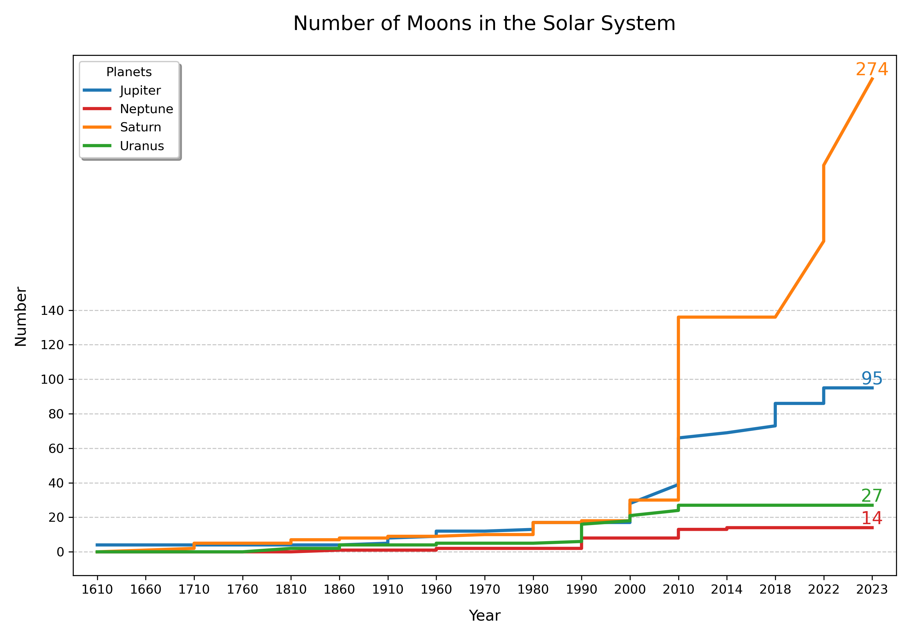
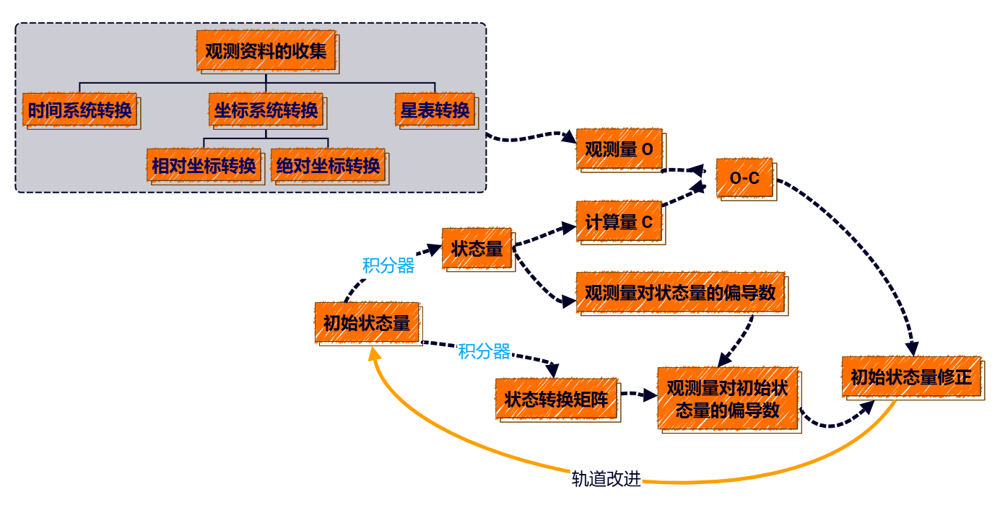
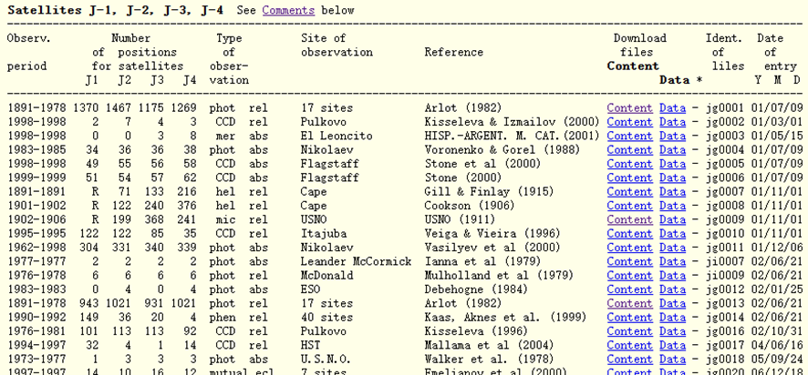
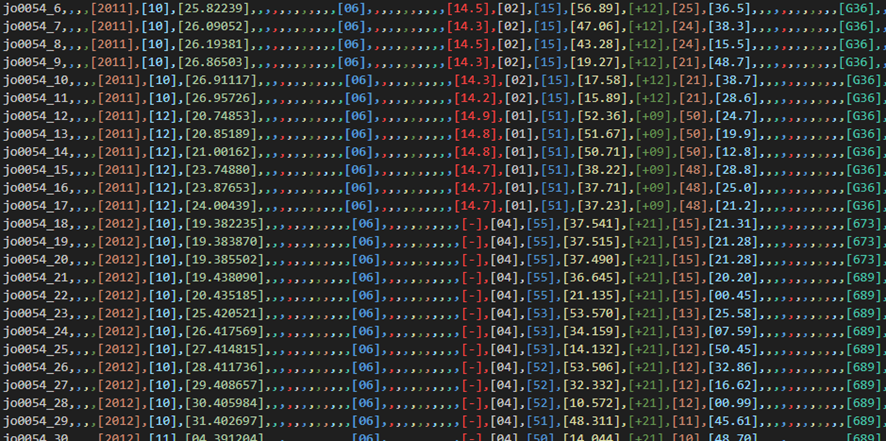
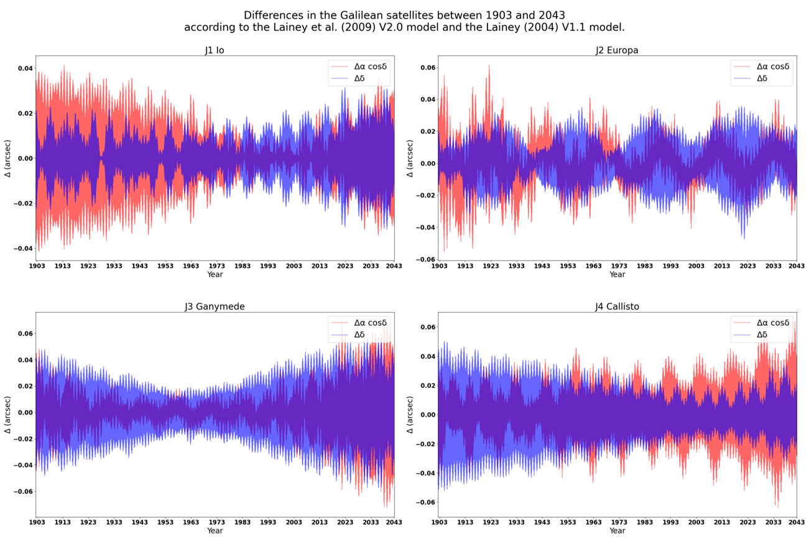
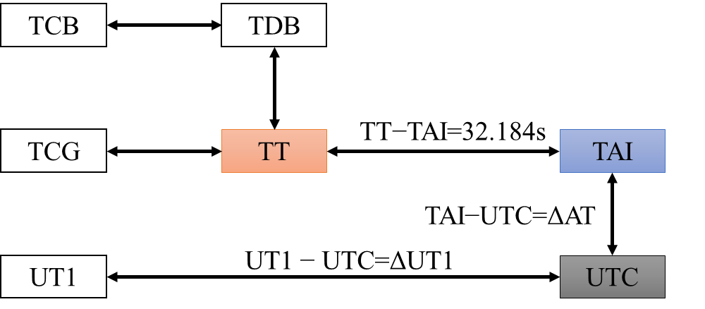
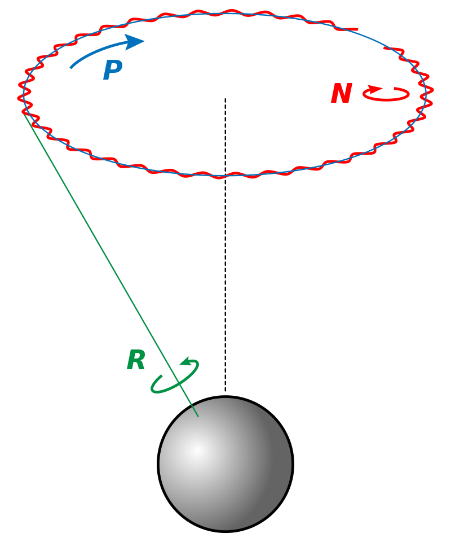
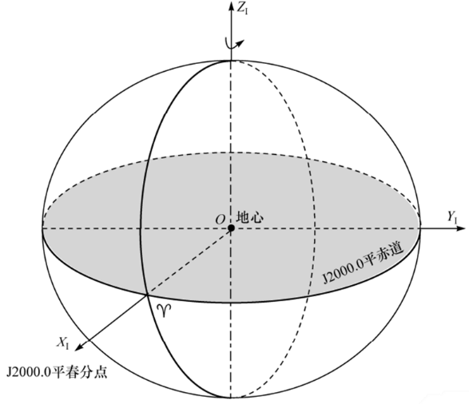

[TOC]

## 木卫的基本信息即研究意义

### 研究背景

表1-1 木星部分行星基本信息

| 名称     | 平均半径(km) | 质量(×10²²kg) | 半长轴(km) | 公转周期(地球日) | 轨道倾角(°) | 轨道离心率 | 星等 |
| -------- | ------------ | ------------- | ---------- | ---------------- | ----------- | ---------- | ---- |
| Io       | 1,821.30     | 8.93          | 421,700    | 1.769            | 0.04        | 0.0041     | -1.7 |
| Europa   | 1,560.80     | 4.78          | 671,034    | 3.551            | 0.47        | 0.0094     | -1.4 |
| Ganymede | 2,634.10     | 14.8          | 1,070,412  | 7.155            | 0.195       | 0.0013     | -2.1 |
| Callisto | 2,410.30     | 10.76         | 1,882,700  | 16.689           | 0.281       | 0.0074     | -1.2 |
| Amalthea | 83.5         | 0.208         | 181,366    | 0.498            | 0.375       | 0.0032     | 14.1 |
| Himalia  | 85           | 0.66          | 11,480,000 | 250.566          | 27.52       | 0.157      | 14.6 |
| Thebe    | 50           | 0.43          | 221,889    | 0.674            | 1.08        | 0.012      | 16.0 |

图1-1 太阳系内行星各卫星行星数量

从上世纪80年代以来，随着天文观测技术的不断进步和卫星探测任务的增多，太阳系内卫星的发现数量急剧增加。例如，土星已确认274颗轨道卫星，而木星拥有95颗卫星，位居太阳系第二。木星作为太阳系中最大的行星，其卫星系统不仅涵盖伽利略卫星（木卫一至木卫四），还包括众多小型不规则卫星，这些卫星的轨道特性和物理属性十分复杂。然而，现有的木卫观测星表普遍存在时间系统不统一、数据格式参差不齐等问题，导致在构建卫星运动学模型和进行长期轨道预测时需要额外进行大量的数据预处理和时间转换工作。

### 研究意义

图中展示了伽利略卫星在不同年份模型下1903年到2043年的偏差情况，清晰表明：随着观测数据的不断减少，模型与实际情况的偏差会逐步增大。这是因为模型是依据观测数据来构建的，观测数据越多构建出的模型越接近实际。本研究旨在解决现有星表中存在的数据混乱问题，对历年木卫观测数据进行标准化处理，构建了一份更新、更准确的观测星表。

完成这一系列数据标准化工作后，后续研究者无需再重复进行繁琐的时间转换与数据整合工作，而可以直接利用该标准化星表结合建立运动学模型，可以开展更深入的轨道动力学分析、捕获机制研究以及演化历史探讨，从而大幅提高研究效率并推动相关基础科学问题的突破。

### 整体框架

- ✅观测资料的收集
- ✅时间系统
- 坐标系统
  - ⭐将不同参考系下的绝对坐标变换至 ICRS
  - ⭐变换相对观测坐标至国际天球参考系
- ⭐星表偏差改正
- ⭐绘制观测星表

原始观测数据的标准化与格式统一，具体包括：时间系统转换：统一至参考时间系；坐标系统转换：区分并处理相对坐标与绝对坐标的变换；星表转换：调用星历数据完成天球坐标向惯性坐标的映射。
在状态建模层面，我们以初始状态量为起点，通过数值积分器对目标进行轨道传播，得到状态量。同时引入动力学模型，计算得到理论观测量C，并与实测观测量O进行比较，形成残差O-C。
利用O-C残差与偏导信息，我们进一步完成对初始状态的修正，并将其反馈回初始状态形成闭环迭代。该过程支持逐步收敛，实现轨道改进与模型精度提升。

## 数据源介绍

### IMCCE数据

观测星表的主要来源是IMCCE网站上记录的各时间段、观测台站以及观测设备所采集的数据，采用「目录+数据+content」三层进行存储。本文的目标是对这些观测记录进行系统化整理、清洗与合并，最终形成一个统一的观测数据表，为后续研究提供高精度数据支持。

## 工作详细流程

### 数据预处理

#### 文本与格式处理

首先，将每条观测记录中涉及的关键信息（例如Id、Type、Dates、Observatory、Reference Frame、Centre of Frame、Epoch of Equinox、Time Scale、Reduction、Coordinates、Diffraction、Receptor、Telescope、Observers、Relative To 等)合并收集，并根据字段含义进行整理和规范化。

在从文本文件转换为CSV文件的过程中，部分观测数据存在格式缺失或不一致的问题，需要进行必要的清洗与修正。[附表1](##附表1 IMCCE数据错误信息及修正)列出了需要修正的文件及其主要错误信息、修正手段。

在所有错误修正完成后，给所有CSV文件添加了统一的表头（header)，方便后续自动合并和批量处理。

为防止数据精度丢失，对数值型数据加上前后括号强制转换为文本。

#### 多表合并与数据整合

为了便于检索与特定数据定位，对每条记录新增一列唯一ID（由「文件名+行号」构成)。编写脚本进行多表合并后，得到一个包含数万条观测记录的整合表格，覆盖了若干颗木星卫星及其相关观测。该整合表格为后续数据分析奠定了基础。

### 时间系统

在天文观测和数据处理中，不同的时间尺度可能并存。本文将所有观测记录统一转换到TT。之所以转换到TT是因为构建新的观测星表应该要求时间尺度尽可能均匀连续，以确保新的观测星表在时间轴上的一致性。并且TT易于与其他常见时间尺度互相转换，也适用于后续的历表与动力学计算。本文使用IAU的公益项目SOFA工具进行处理。

#### 时间尺度概述

天文观测中常用的时间尺度可大致分为以下两类：表中展示了设计的所有的时间尺度

- 原子时及力学时
- 地球自转时

GMT起源于19世纪末，以格林尼治皇家天文台为基准，基于地球自转，反映太阳相对于格林尼治子午线的运动。
随着对更精确时间的需求，UT1被提出，它修正了地球自转的不规则性，直接反映了地球自转的实际速度
接下来，TAI在1958年诞生，基于全球约200台原子钟的加权平均，标志着时间测量进入新的精度时代。
为了协调全球时间，UTC在TAI的基础上加入了闰秒调整，保持与UT1的差值不超过0.9秒，又与TAI。
随着天文学和物理学的发展，TT被定义为TAI+32.184秒，用于历法计算。
接着，TCB引入，它代表了零引力场中，质心系坐标静止标准钟的原时秒
最后，TDB在TT基础上加入相对论修正，时间原点移至太阳系质心。

表2-1 时间尺度简述

| 时间尺度 | 定义                                             | 关键特点                                   |
| -------- | ------------------------------------------------ | ------------------------------------------ |
| GMT      | 以格林尼治皇家天文台为基准的平均太阳时           | 基于地球自转，反映太阳在天球上的位置       |
| UT1      | 反映地球实际自转速度，是修正极移（UT0）后的时间  | 直接用于天文观测，修正了地球自转的不规则性 |
| TAI      | 基于全球约200台原子钟的加权平均，采用SI秒        | 与UT1差约为0，从1958年1月1日时起           |
| UTC      | 与TAI同步，通过闰秒调整与世界时（UT1）的差值     | 保持与UT1的差值不超过0.9秒                 |
| TT       | 定义为TAI+32.184秒，用于历表计算                 | 保持与SI秒一致                             |
| TCB      | 零引力场中质心系坐标静止标准钟的原时秒           | 用于天文学和物理学中                       |
| TDB      | 在TT基础上加上相对论修正，时间原点移至太阳系质心 | 用于天体力学和宇宙学研究                   |

下图展示了1950年至2020年期间各主要时间尺度的长期变化，包括TAI、TT、TDB、TCB、UT1、UTC等之间的差异。可以看到，TAI与TT之间的恒定差值；UT1与原子时间的不断漂移；UTC通过“阶梯”式的闰秒调整来跟上UT1；TCB/TCG在相对论修正下对TT的持续偏离；
构建观测星表应该要求时间尺度尽可能均匀连续，以确保新的观测星表在时间轴上的一致性。并且TT易于与其他常见时间尺度互相转换。

#### 数据记录格式统一

通过前期整理，总计整理了57258条星表数据。当前已整理的所有木卫观测记录采用的时间尺度见下表。

表2-2 木卫观测星表时间尺度统计

|        TS         | NUMBER |  记录格式   |
| :---------------: | :----: | :---------: |
|        ET         |  419   | Day_detail  |
|        TDB        |   54   |     JD      |
|        GMT        |  562   |    Full     |
|        TCB        |  6302  |    Full     |
|        TT         |  966   | JD,MJD,Full |
|        UT1        |  808   |    Full     |
|        UTC        | 46409  | JD,MJD,Full |
| Cape sideral time |  738   |    Full     |

在进行具体的时间转换前，需将不同文件中记录的观测时刻统一到相同的“记录格式”。常见的记录形式包括：

1.  Day_detail：year、mon、day，小数部分表示当日的时分秒

2.  Full：year、mon、day、hour、min、sec

3.  JD/MJD：儒略日或简化儒略日

4.  其他地方时或特殊格式：如Cape sideral time等

通过编写程序，将记录格式分类，[附表2](##附表2 第四类及特殊记录格式)为第四类格式的汇总。再将这些不同格式统一转换为Full格式或JD两段式格式（利用SOFA的\`iauDtf2d\`等函数)，以便后续做同一基准下的时刻处理。

#### UTC→TT

整体思路是依据闰秒数据转换到TT。

1.  1972年之后：利用SOFA内置的闰秒表进行精确转换；

2.  1972年之前，UTC近似为UT1，使用Stephenson和Morrison（1984）中给出的UT1和TT的关系。

#### UT1→TT

整体思路是依据已有的ΔT数据转换到TT。

1973年之后，使用IERS发布的“finals2000A.all.csv”中的UT1-UTC差值，

1956至1973年，使用IERS发布的“EOP_C01_IAU2000”中的UT1-TAI差值，

1956年之前，使用Stephenson和Morrison（1984）中给出的UT1和TT的ΔT数据，使用三次样条插值细化到月。另外的，NASA的ΔT长期多项式模型（Polynomial Approximation for TT-UT1)也可以外推估计ΔT。

下图为NASA模型、文献数据与已发布的海卫星表之间的相对误差，使用均方根误差（RMSE)作为评价指标。将文献数据插值之后的数据与已发布的海卫星表的吻合度更高，误差指标更低。

#### TDB→TT

对于TDB而言根据精度不同可以选用不同的计算方法。

1.  对于精度要求微秒级的，可以使用公式2-1计算。

2.  对于精度要求纳秒级的，使用SOFA程序中的Dtdb函数计算。输入参数包括儒略日(date1,date2)、UT1(ut)、观测点经度(elong)、地球自转轴距离(u)和赤道平面距离(v)，最终返回TDB-TT时间差。

代码2-1 提取得到u,v的值。

#### 补充

在解释和使用过去几个世纪发表的天体测量观测结果时，应考虑在1925年之前的观测中，一天的开始被认为是中午，即12小时。而现代一天的开始被认为是午夜，即0小时，如遇此类老资料需整体减0.5日实现对齐。(在早期的观测数据中一般是GMT通常需要这样去处理)

#### 转换准确性验证

为了验证时间转换程序的准确性，选取海卫星表Observational catalogs and numerical ephemerides for the satellite system of Neptune(简称OCNS2019)中的已转换数据作为对照组，对随机抽取的各类时间尺度(UT1、UTC、GMT、ET、TDT等)进行测试。结果表明，本文程序与文献给出的对照值基本一致，说明转换过程可靠。

### 坐标系统
#### 岁差与章动

岁差：由于日月行星引力的共同作用，地球自转轴在空间的方向发生周期性变化。岁差的变化缓慢且相对规则，可通过岁差模型（如IAU推荐的岁差模型）实现精确计算和修正。

章动：在行星或陀螺仪的自转运动中，轴在进动中的一种轻微不规则运动，使自转轴在方向的改变中出现如“点头”般的摇晃现象。行星的章动来自于力，并使得岁差的速度不是常数，而会随着时间改变。通常采用IAU推荐的章动理论模型（如IAU2000章动模型），实现章动的改正。如下图所示，绿色为地球自转轴，蓝色表示岁差影响，红色表示岁差与章动影响。

- 根据是否考虑岁差与章动改正分成以下三种：

  - 不考虑岁差和章动影响：协议天球坐标系

  - 仅考虑岁差影响：瞬时平天球坐标系

  - 考虑岁差和章动影响：瞬时真天球坐标系

只要有岁差和章动改正数，就能实现上述三种坐标系统的相互转换

表2-3 坐标系统的相互转换

| 参考系名称           | 是否考虑岁差 | 是否考虑章动 | Z轴垂直方向        | X轴指向              |
| -------------------- | ------------ | ------------ | ------------------ | -------------------- |
| 真赤道真春分点参考系 | 是           | 是           | 真赤道（瞬时赤道） | 真春分点（瞬时）     |
| 平赤道平春分点参考系 | 是           | 否           | 平赤道（平滑岁差） | 平春分点（平滑岁差） |
| 协议天球坐标系       | 否           | 否           | J2000.0平赤道      | J2000.0平春分点      |
| FK4坐标系            | 否           | 否           | B1950.0平赤道      | B1950.0平春分点      |

- FK4平赤道平春分点
  - 将绝对坐标变换至观测历元时刻的FK4系统，然后通过FK4到FK5的历元转换方法将坐标变换至J2000.0历元的FK5系统（FK5/J2000）；同时对光行差和FK4-FK5分点差进行相应改正。

- FK5平赤道平春分点

  - 应用FK5参考系与ICRS之间的参考架偏差矩阵，最终变换到国际天球参考系统ICRS。

- 瞬时真赤道真春分点

  - 应用IAU 最新的标准的岁差章动模型，通过岁差矩阵和章动矩阵先后实施章动、岁差旋转，进行坐标变换； 随后进行参考架偏差旋转，从而精确反映观测瞬间的天体位置。

- 瞬时平赤道平春分点

  - 应用IAU 岁差模型仅实施岁差旋转，将ICRS的绝对坐标变换至观测历元的瞬时平赤道平春分点系统，再通过参考架偏差旋转校正至对应的坐标系，从而获得与观测历元时刻一致的天体位置（不含章动效应）。

#### 坐标系统概述

通过前期整理，总计整理了57258条星表数据。当前已整理的所有木卫观测记录采用的坐标系统见下表。

表2-4 木卫观测星表坐标系统统计

| rfs                                                          | number |
| ------------------------------------------------------------ | ------ |
| J2000                                                        | 41494  |
| true of date                                                 | 806    |
| ICRF                                                         | 298    |
| B1950                                                        | 753    |
| 1 Jan of year  of observation                                | 66     |
| 1950.0 and  2000.0                                           | 53     |
| 1951                                                         | 6      |
| 1952                                                         | 6      |
| J2000                                                        | 6458   |
| true of date                                                 | 3161   |
| B1950                                                        | 1795   |
| 1 - mean terrestrial equatorial frame, 1950,     2 - Jovian equatorial frame of the date, | 1138   |
| 1950.0 and  2000.0                                           | 875    |
| no  information                                              | 349    |

绝对坐标的空间参考系见下表。
表2-5 空间参考系

|       空间参考系       |         类型         |                          特点与实现                          |
| :--------------------: | :------------------: | :----------------------------------------------------------: |
|          ICRS          |    国际天球参考系    | 基于射电源的绝对惯性系，精度达微角秒级，与J2000.0对齐（ICRS的理论实现）。 |
|          ICRF          |    国际天球参考架    | 使用电波观测到的参考源实现的国际天球参考系。参考架是参考系的物理实现。 |
| FK4 历元平赤道平春分点 |      经典参考系      | 基于FK4星表（B1950历元），含系统误差（分点差、光行差模型过时）。 |
|        B⟨年份⟩         | 平赤道平春分点参考系 |   表示 ⟨年份⟩ 所指贝塞尔历元处的FK4平赤道平春分点参考系。    |
|   瞬时真赤道真春分点   |      瞬时参考系      |    观测时刻的真春分点坐标系（含章动），需转换到标准历元。    |

## 未来展望

1. 四月之前完成坐标转换和星表偏差改正
2. 六月之前完成文章撰写
3. 形成完整的知识体系

# 附录

## 附表1 IMCCE数据错误信息及修正

| 文件名 | 错误信息                                | 修正手段          |
| ------ | --------------------------------------- | ----------------- |
| jg0004 | 多余的空格                              | 删除空格          |
| jg0008 | 多余的空格                              | 删除空格          |
| jg0014 | 最后一列是note(N)                       | 更改列名          |
| jg0029 | 最后一列是天文台名称                    | 删除多余列        |
| jg0033 | 特殊标注了一行 观测台站变更             | 根据注释进行 处理 |
| jg0050 | 多余的空格                              | 删除空格          |
| jo0035 | 第13列为震级(Mag)，第14列为震级带(Band) | 更改列名          |
| jo0046 | 同上                                    | 更改列名          |
| jo0047 | 同上                                    | 更改列名          |
| jo0050 | 同上                                    | 更改列名          |
| jo1045 | 第12列为R波段星等(若未指定则留空)       | 更改列名          |
| jo1042 | 列'C12'空值比例过高(91.5%)              | 待后续定向处理    |
| jg0001 | 第6行 无效日期：第4个月31日             | 日转换，月加1     |
| jg0013 | 第288行 无效日期：第4个月31日           | 日转换，月加2     |
| jg0001 | 第510行 无效日期：第1个月32日           | 日转换，月加3     |
| jg0013 | 第454行 无效日期：第1个月32日           | 日转换，月加4     |
| jg0001 | 第82行 无效日期：第7个月32日            | 日转换，月加5     |
| jg0013 | 第364行 无效日期：第7个月32日           | 日转换，月加6     |
| jg0029 | 第91行 无效日期：第7个月36日            | 日转换，月加7     |
| jg0029 | 第147行 无效日期：书写错误              | 修正错误          |
| ji0010 | 第5行 无效时间：24小时                  | 时置0，日加1      |
| ji0010 | 第6行 无效时间：24小时                  | 时置0，日加1      |
| ji0010 | 第7行 无效时间：24小时                  | 时置0，日加1      |
| ji0010 | 第8行 无效时间：24小时                  | 时置0，日加1      |
| ji0010 | 第15行 无效时间：24小时                 | 时置0，日加1      |
| ji0010 | 第30行 无效时间：24小时                 | 时置0，日加1      |
| ji0010 | 第32行 无效时间：24小时                 | 时置0，日加1      |
| ji0016 | 第288行 无效时间：24小时                | 时置0，日加1      |
| ji0016 | 第289行 无效时间：24小时                | 时置0，日加1      |
| ji0016 | 第290行 无效时间：24小时                | 时置0，日加1      |
| ji0016 | 第291行 无效时间：24小时                | 时置0，日加1      |
| ji0016 | 第292行 无效时间：24小时                | 时置0，日加1      |
| ji0016 | 第293行 无效时间：24小时                | 时置0，日加1      |
| ji0016 | 第294行 无效时间：24小时                | 时置0，日加1      |
| jo0010 | 第924行 无效秒数：60秒                  | 秒置0，分加1      |
| jg0013 | 第601行 无效秒数：60秒                  | 秒置0，分加1      |
| jo0010 | 第964行 无效秒数：60秒                  | 秒置0，分加1      |
| jo0010 | 第1217行 无效秒数：60秒                 | 秒置0，分加1      |
| jg0013 | 第971行 无效秒数：60秒                  | 秒置0，分加1      |
| jg0013 | 第976行 无效秒数：60秒                  | 秒置0，分加1      |
| jg0013 | 第977行 无效秒数：60秒                  | 秒置0，分加1      |
| jg0013 | 第978行 无效秒数：60秒                  | 秒置0，分加1      |
| jg0013 | 第979行 无效秒数：60秒                  | 秒置0，分加1      |
| jg0013 | 第980行 无效秒数：60秒                  | 秒置0，分加1      |
| jg0013 | 第988行 无效秒数：60秒                  | 秒置0，分加1      |
| jg0013 | 第989行 无效秒数：60秒                  | 秒置0，分加1      |
| jg0013 | 第992行 无效秒数：60秒                  | 秒置0，分加1      |
| jg0013 | 第993行 无效秒数：60秒                  | 秒置0，分加1      |
| jg0013 | 第997行 无效秒数：60秒                  | 秒置0，分加1      |
| jg0013 | 第1002行 无效秒数：60秒                 | 秒置0，分加1      |
| jg0013 | 第1007行 无效秒数：60秒                 | 秒置0，分加1      |
| jg0013 | 第1009行 无效秒数：60秒                 | 秒置0，分加1      |
| jg0013 | 第1013行 无效秒数：60秒                 | 秒置0，分加1      |
| jg0013 | 第1020行 无效秒数：60秒                 | 秒置0，分加1      |
| jg0013 | 第1024行 无效秒数：60秒                 | 秒置0，分加1      |
| jg0013 | 第1027行 无效秒数：60秒                 | 秒置0，分加1      |
| jg0013 | 第1038行 无效秒数：60秒                 | 秒置0，分加1      |
| jg0013 | 第1039行 无效秒数：60秒                 | 秒置0，分加1      |
| jg0013 | 第1042行 无效秒数：60秒                 | 秒置0，分加1      |
| jg0013 | 第1044行 无效秒数：60秒                 | 秒置0，分加1      |
| jg0013 | 第1046行 无效秒数：60秒                 | 秒置0，分加1      |
| jg0013 | 第1059行 无效秒数：60秒                 | 秒置0，分加1      |
| jg0013 | 第1060行 无效秒数：60秒                 | 秒置0，分加1      |
| jg0013 | 第1070行 无效秒数：60秒                 | 秒置0，分加1      |
| jg0013 | 第1073行 无效秒数：60秒                 | 秒置0，分加1      |
| jg0013 | 第1075行 无效秒数：60秒                 | 秒置0，分加1      |
| jg0013 | 第1077行 无效秒数：60秒                 | 秒置0，分加1      |
| jg0013 | 第1078行 无效秒数：60秒                 | 秒置0，分加1      |
| jg0013 | 第1080行 无效秒数：60秒                 | 秒置0，分加1      |
| jg0013 | 第1081行 无效秒数：60秒                 | 秒置0，分加1      |
| jg0013 | 第1083行 无效秒数：60秒                 | 秒置0，分加1      |
| jg0013 | 第1084行 无效秒数：60秒                 | 秒置0，分加1      |
| jg0013 | 第1086行 无效秒数：60秒                 | 秒置0，分加1      |
| jg0013 | 第1088行 无效秒数：60秒                 | 秒置0，分加1      |
| jg0013 | 第1089行 无效秒数：60秒                 | 秒置0，分加1      |
| jg0013 | 第1092行 无效秒数：60秒                 | 秒置0，分加1      |
| jg0013 | 第1095行 无效秒数：60秒                 | 秒置0，分加1      |
| jg0013 | 第1098行 无效秒数：60秒                 | 秒置0，分加1      |
| jg0013 | 第1100行 无效秒数：60秒                 | 秒置0，分加1      |
| jg0013 | 第1102行 无效秒数：60秒                 | 秒置0，分加1      |
| jg0013 | 第1104行 无效秒数：60秒                 | 秒置0，分加1      |
| jg0013 | 第1106行 无效秒数：60秒                 | 秒置0，分加1      |
| jo0010 | 第1380行 无效秒数：60秒                 | 秒置0，分加1      |
| jo0035 | 第354行 无效秒数：60秒                  | 秒置0，分加1      |
| jo0005 | 第33行 无效秒数：60秒                   | 秒置0，分加1      |
| jo0008 | 第88行 无效秒数：60秒                   | 秒置0，分加1      |
| jo0008 | 第160行 无效秒数：60秒                  | 秒置0，分加1      |
| jo0027 | 第26行 无效秒数：60秒                   | 秒置0，分加1      |
| jo0044 | 第76行 无效秒数：60秒                   | 秒置0，分加1      |
| jo0047 | 第50行 无效秒数：60秒                   | 秒置0，分加1      |
| jo0048 | 第260行 无效秒数：60秒                  | 秒置0，分加1      |
| jo1042 | 第89行 无效秒数：60秒                   | 秒置0，分加1      |
| jo1042 | 第179行 无效秒数：60秒                  | 秒置0，分加1      |
| jo1048 | 第364行 无效秒数：60秒                  | 秒置0，分加1      |
| jo0059 | 第220行 无效秒数：60秒                  | 秒置0，分加1      |
| jo0073 | 第340行 无效秒数：60秒                  | 秒置0，分加1      |
| jo0064 | 第190行 无效秒数：60秒                  | 秒置0，分加1      |
| jo0064 | 第320行 秒置0，分加1                    | 秒置0，分加1      |

## 附表2 第四类及特殊记录格式

|   id   | number |         error         |                          resolution                          |
| :----: | :----: | :-------------------: | :----------------------------------------------------------: |
| jg0008 |  738   |   Cape sideral time   |                                                              |
| jg0001 |  1606  |      sec格式不一      |                        科学计数法处理                        |
| jg0032 |  448   | 有JD,有年月带小数的秒 |                           按JD处理                           |
| jg0004 |  144   |     有JD,无时分秒     |                           按JD处理                           |
| ji0005 |  156   |          min          |     Minutes from 0 h UTC, 3 December 1988 (JD=2447498.5)     |
| ji0015 |   54   |          JD           |               Julian date of observation (TDB)               |
| jg0020 |   26   |          MJD          | MJD - time of topocentric observation (MJD=JD-2400000.5), TT |
| ji0007 |   10   |          MJD          |    MJD of observation with decimals (43494 = 17 Dec 1977)    |
| jg0021 |   16   |          MJD          | MJD - time of topocentric observation (MJD=JD-2400000.5), TT |
| jg0069 |  209   |       Epoch_TCB       | Gaia-centric epoch in TCB relative to 2455197.5 (Epoch_TCB, days) |
| jg0073 |  295   |       Epoch_TCB       | Gaia-centric epoch in TCB relative to 2455197.5 (Epoch_TCB, days) |
| jo0069 |  1712  |       Epoch_TCB       | Gaia-centric epoch in TCB relative to 2455197.5 (Epoch_TCB, days) |
| jo0077 |  3756  |       Epoch_TCB       | Gaia-centric epoch in TCB relative to 2455197.5 (Epoch_TCB, days) |
| jo1057 |   92   |       Epoch_TCB       | Gaia-centric epoch in TCB relative to 2455197.5 (Epoch_TCB, days) |
| jo1061 |  238   |       Epoch_TCB       | Gaia-centric epoch in TCB relative to 2455197.5 (Epoch_TCB, days) |
| ji0001 |   35   |  hour带小数无min sec  |       Hour of the moment of observation with decimals        |
| ji0002 |  160   |  hour带小数无min sec  |       Hour of the moment of observation with decimals        |
| ji0004 |  123   |  hour带小数无min sec  |       Hour of the moment of observation with decimals        |

# 参考文献

