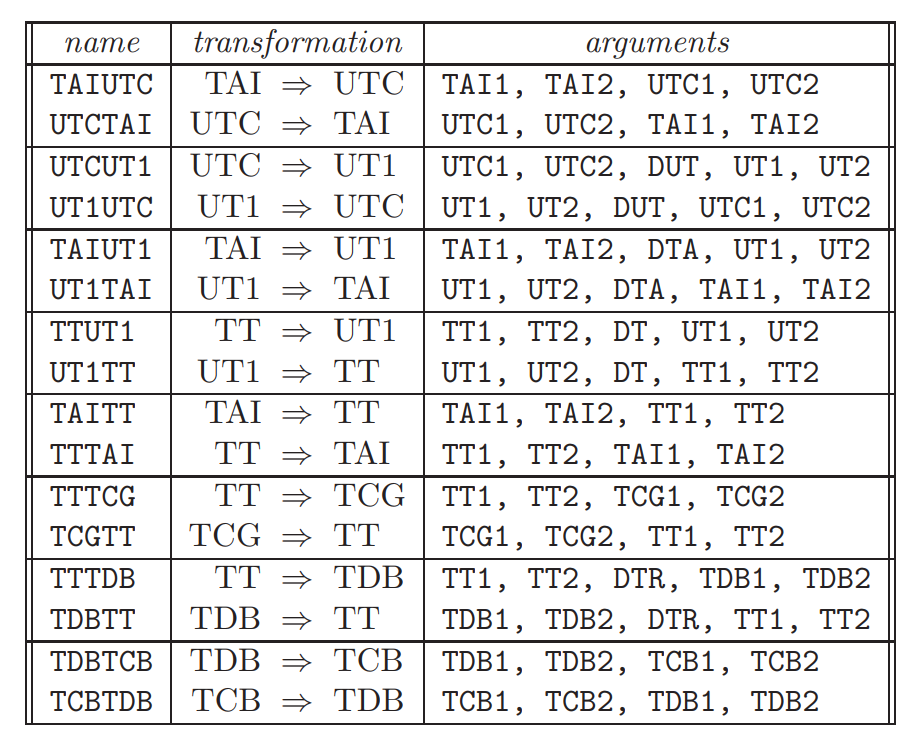

## 1. Arrangement

- 2024.11: 完成NSDC的数据处理✅
- 2024.12: 搜集新数据整理&准备考试📚
- 2025.01: 完成所有的数据&转换🔄
- 2025.02: 完善数据分析&矫正并撰写初稿✍
- 2025.03: 正式撰写文章📄
- 2025.04: 完善文章准备投递📬

## 2. Knowledge

**SOFA的支持的时间尺度？**

​	TAI (国际原子时): 这是国际上采用的原子时基准，其时间单位是SI秒（国际单位制秒）。TAI不受地球自转等天文现象的影响，其时间连续且均匀。它是所有其他时间尺度的基础。
​	UTC (协调世界时): 这是民用时间标准，基于TAI，但为了与地球自转保持大致一致，会周期性地引入闰秒。闰秒的引入使得UTC的时间并非完全均匀，但它与日常生活中的时间保持一致。
​	UT1 (世界时): 这是基于地球自转的时间尺度。由于地球自转并不完全均匀，UT1的秒长会略微变化。UT1主要用于天文观测中需要考虑地球自转影响的场合，例如望远镜指向、天文测量等。
​	TT (地球时): 这是用于太阳系星历计算的时间尺度。TT与TAI之间存在一个固定的偏移量，它在理论上更接近于地球上的理想钟表所指示的时间。
​	TCG (地心坐标时): 这是以地球质心为参考点的时间尺度，用于相对论性地心坐标系 (GCRS) 的计算。它与TT之间存在线性关系，考虑了地球的引力势的影响。
​	TCB (质心坐标时): 这是以太阳系质心为参考点的时间尺度，用于相对论性质心坐标系 (BCRS) 的计算。它考虑了观测者相对于太阳系质心的运动和引力势的影响，与TCG之间存在四维时空变换的关系。
​	TDB (质心动力学时): 这是TCB的一种修正形式，旨在使其平均上与TT保持一致。TDB与TT的差异是准周期性的，主要由地球的周年运动引起。它主要用于太阳系天体的运动计算。

**SOFA各个时间尺度下的转换流程是怎么样的？**


**SOFA的基本函数，以及各个时间系统之间的转换关系**



**注意事项**

​	1925年前的观测日期以中午12时为一天的起点。
​	修正儒略日（MJD）与JD的关系为： JD = MJD + 2400000.5。

## 3. Record

### 3.1 数据预处理

#### 3.1.1 文件内容信息

​	首先，因为NSDC上的数据是以content+data的双文件形式存储的。编写一个类似于爬虫的文本分析文件，将每一个content 的相关数据都整理到了一个csv文件，称之为information。Information里包含了时间尺度、坐标系统和观测台等信息，方便在某些数据记录中不包含某些数据时补上。
​	Information中包含了以下字段的信息：Id、Type、Dates、Observatory、Reference Frame、Centre of Frame、Epoch of Equinox、Time Scale、Reduction、Coordinates、Diffraction、Receptor、Telescope、Observers、Relative To


​	其次，因为最一开始并不了解时间尺度和坐标系统的概念和定义，故统计出了information中出现的所有时间尺度的类型。

#### 3.1.2 异常数据

​	Python对txt文件并不算特别友好，计划将txt文件转换成了csv文件方便之后的各种操作，但是转换途中发现有的观测数据的格式并不完整，修正如下。

| 文件名        | 错误信息                                                                        | 修正  |
| ---------- | --------------------------------------------------------------------------- | --- |
| jg0004.csv | 多余的空格                                                                       | 删除  |
| jg0008.csv | 多余的空格                                                                       | 删除  |
| jg0014.csv | 最后一列是 note(N) Note (if equal to 1) that latitude correction is not accurate | 更名  |
| jg0029.csv | 最后一列是天文台的名称                                                                 | 删除  |
| jg0033.csv | 特殊标注了一行观测台站变更                                                               | 是   |
| jg0050.csv | 多余的空格                                                                       | 删除  |
| jo0035.csv | 13. 震级，Mag（若未指定则留空） 14. 震级带，Band（若未指定则留空）                                   | 更名  |
| jo0046.csv | 13. 震级，Mag（若未指定则留空） 14. 震级带，Band（若未指定则留空）                                   | 更名  |
| jo0047.csv | 13. 震级，Mag（若未指定则留空） 14. 震级带，Band（若未指定则留空）                                   | 更名  |
| jo0050.csv | 13. 震级，Mag（若未指定则留空） 14. 震级带，Band（若未指定则留空）                                   | 更名  |
| jo1042.csv | 列 'C12' 空值比例过高 (91.5%)                                                      |     |
| jo1045.csv | 12. Magnitude in R band (blank if not available)                            | 更名  |

​	改正所有错误之后开始对txt文件进行转换。并给所有的csv文件添加了一个表头，便于根据表头实现对多表的合并。

#### 3.1.3 TXT转CSV

​	转换之后的csv文件如下，为每个数据加上前后括号强制转换为文本，防止数据精度丢失。


#### 3.1.4 原文件增加表头

​	为批量处理时间到统一的格式，亦或方便去对不同的数据类型处理，例如有些数据是赤经赤纬，有些数据是空间坐标。因此要将Data中的数据对应上相应的列名，编写了一个程序首先给所有csv文件增加一行标题行，然后通过编写一个软件实现直接更改各个文件的表头的功能，另外为了防止出错，在右侧会同步输出html文件，最后加上二次验证。确保所有的数据是准确无误的。表头程序：


### 3.2 时间系统

#### 3.2.1 数据合并

​	基于上述的数据准备，编写一个简单的程序就能实现多表合并，还为所有的行都新增了一列id，以文件名+行号形式构成，方便对数据的检索和对某些指定的数据整理。整合之后的表格如下。一共包含了内部、外部、伽利略卫星等十几个卫星的5万多条观测数据，基本实现了对观测数据的整合。


#### 3.2.2 时间提取

通过前期整理，总计整理了57258条星表数据。根据 classify 列分为四大类：
	第1类 (classify=1)：仅 file_line、year、mon 和 day 列有值。day 列包含小数，表示完整时间（包括日、时、分、秒）。其他列均为空。
	第2类 (classify=2)：仅 file_line、year、mon、day、hour、min 和 sec 列有值。其他列均为空。
	第3类 (classify=3)：仅 jd 列有值。其他列均为空。
	第4类 (classify=4)：不符合上述任何分类规则，直接输出 null。
	使用函数可以实现对数据的分类:

```c
=IF(AND(ISNUMBER(SEARCH(".", D2)), D2<>"", E2="", F2="", G2="", H2="", I2="", J2="", A2<>""), 1,IF(AND(A2<>"", B2<>"", C2<>"", D2<>"", E2<>"", F2<>"", G2<>"", H2="", I2="", J2=""), 2,IF(AND(H2<>"", I2="", J2=""), 3,4)))
```

| 时间尺度                                                    | 数据类型                                                     | 数据数量                                                |
| ----------------------------------------------------------- | ------------------------------------------------------------ | ------------------------------------------------------- |
| UTC<br/>UT1/GMT<br/>TT/ET<br/>Cape sideral time<br/>TCB/TDB | 第1类： 只有 file_line、year、mon、day 有值，且 day 列的值含小数点，其余列为空。<br/>第2类： 只有 file_line、year、mon、day、hour、min、sec 有值，其余列为空。<br/>第3类： 只有 jd 列有值，其余列为空。<br/>第4类： 不符合上述任何规则。 | 1    22964<br/>2    10726<br/>3    14396<br/>4    09172 |

​	**第四类数据(异常数据):**

| 文件名 | 类别 | 出现总次数 | 异常                  | 处理                                                         |
| ------ | ---- | ---------- | --------------------- | ------------------------------------------------------------ |
| jg0001 | 2    | 1606       | sec格式不一           |                                                              |
| jg0004 | 3    | 144        | 有jd,无时分秒         | 按jd                                                         |
| jg0008 | 4    | 738        | Cape sideral time     |                                                              |
| jg0032 | 3    | 448        | 有jd,有年月带小数的秒 | 按jd                                                         |
| ji0005 | 4    | 156        | min                   | Minutes from 0 h UTC, 3 December 1988 (JD=2447498.5)         |
| ji0015 | 3    | 54         | jd                    | Julian date of observation (TDB)                             |
| jg0020 | 4    | 26         | mjd                   | MJD - time of topocentric observation (MJD=JD-2400000.5), TT |
| ji0007 | 4    | 10         | mjd                   | MJD of observation with decimals (43494 = 17 Dec 1977)       |
| jg0021 | 4    | 16         | mjd                   | MJD - time of topocentric observation (MJD=JD-2400000.5), TT |
| ji0001 | 4    | 35         | hour带小数无min sec   | Hour of the moment of observation with decimals              |
| ji0002 | 4    | 160        | hour带小数无min sec   | Hour of the moment of observation with decimals              |
| ji0004 | 4    | 123        | hour带小数无min sec   | Hour of the moment of observation with decimals              |
| jg0069 | 4    | 209        | Epoch_TCB             | Gaia-centric epoch in TCB relative to 2455197.5 (Epoch_TCB, days) |
| jg0073 | 4    | 295        | Epoch_TCB             | Gaia-centric epoch in TCB relative to 2455197.5 (Epoch_TCB, days) |
| jo0069 | 4    | 1712       | Epoch_TCB             | Gaia-centric epoch in TCB relative to 2455197.5 (Epoch_TCB, days) |
| jo0077 | 4    | 3756       | Epoch_TCB             | Gaia-centric epoch in TCB relative to 2455197.5 (Epoch_TCB, days) |
| jo1057 | 4    | 92         | Epoch_TCB             | Gaia-centric epoch in TCB relative to 2455197.5 (Epoch_TCB, days) |
| jo1061 | 4    | 238        | Epoch_TCB             | Gaia-centric epoch in TCB relative to 2455197.5 (Epoch_TCB, days) |

**完成代码的提取之后就要选用时间转换的工具，依照IAU的公益项目SOFA，使用C++平台进行编写。**
**1.根据classify的值对时间的格式进行统一**

```shell
# 步骤1：标准化时间格式
gcc format_time.c -o format_time
./format_time input.csv formatted.csv
```
**2.将各自的时间转换到原本时间尺度下的简化儒略日**

```shell
# 步骤2：转换为儒略日
gcc -pedantic -Wall -O convert_jd.c -I/include/ -L/lib/ -lsofa_c -lm -o convert_jd
./convert_jd formatted.csv jd_results.csv
```
**3.将各个时间尺度下的MJD统一转换到TT下的MJD。**

```shell
# 步骤3：统一转换为TT时间
gcc -pedantic -Wall -O convert_tt.c -I/include/ -L/lib/ -lsofa_c -lm -o convert_ttt
./convert_tt jd_results.csv final_tt.csv
```

#### 3.3.3 转换及验证

​	在完成代码编写后，需要对代码的准确性进行验证。将Observational catalogs and numerical ephemerides for the satellite system of Neptune（以下简称Nep）文中已经处理完成的数据作为对照组，验证准确性。Nep中共收集了91个观测原数据文件，涉及14574条观测信息。具体流程如下。随机提取每一个时间尺度下的三条观测信息，其中：
​	ts为观测选用的时间尺度
​	obsTime为观测时刻的儒略日
​	obsTt为转换到TT下的mjd

​	另外的，美国中部标准时 (Central standard time)、太平洋标准时 (Pacific standard time)、巴黎平时 (Paris mean time)、地方平时 (local mean time)等地方时木星卫星未涉及到，暂不做验证。

​	**1996A&AS..115..319V文献数据如下**


​	**1974AJ.....79..489R文献数据如下**


​	**整理上述文献得待转换的Time Scale为：**

| file_line           | scale | year | mon | day      | hour | min | sec | classify |
| ------------------- | ----- | ---- | --- | -------- | ---- | --- | --- | -------- |
| nm0075_2            | UT1   | 1928 | 2   | 13       | 6    | 35  | 0   | 2        |
| nm0075_3            | UT1   | 1928 | 2   | 13       | 7    | 5   | 0   | 2        |
| nm0009_2            | UTC   | 1975 | 6   | 26.2566  |      |     |     | 1        |
| nm0042_2            | GMT   | 1847 | 10  | 25       | 8    | 24  | 18  | 2        |
| nm0042_3            | GMT   | 1847 | 10  | 27       | 8    | 9   | 0   | 2        |
| nm0083_2            | UTC   | 1963 | 3   | 5.079012 |      |     |     | 1        |
| 1974AJ.....79..489R | ET    | 1949 | 5   | 1.276    |      |     |     | 1        |
| 1974AJ.....79..489R | ET    | 1949 | 5   | 29.192   |      |     |     | 1        |
| 1996A&AS..115..319V | TDT   | 1984 | 6   | 8        | 5    | 32  | 54  | 2        |
| 1996A&AS..115..319V | TDT   | 1984 | 6   | 8        | 6    | 2   | 54  | 2        |

​	**转换之后的Time Scale为：**

| file_line           | scale | mjd_old         | mjd_tt          |
| ------------------- | ----- | --------------- | --------------- |
| nm0075_2            | UT1   | 25289.274305556 | 25289.274586940 |
| nm0075_3            | UT1   | 25289.295138889 | 25289.295420274 |
| nm0009_2            | UTC   | 42589.256600000 | 42589.257134537 |
| nm0042_2            | UT1   | -4040.649791667 | -4040.149716539 |
| nm0042_3            | UT1   | -4038.660416667 | -4038.160341543 |
| nm0083_2            | UTC   | 38093.079012000 | 38093.079500240 |
| 1974AJ.....79..489R | ET    | 33037.276000000 | 33037.276000000 |
| 1974AJ.....79..489R | ET    | 33065.192000000 | 33065.191999999 |
| 1996A&AS..115..319V | TT    | 45859.231180556 | 45859.231180556 |
| 1996A&AS..115..319V | TT    | 45859.252013889 | 45859.252013889 |

​	对比吻合Nep中的OCNS2019文献数据，故准确性得证。

| db   | df                         | pubRef              | ts   | obsTime             | obsTt               | pubSrc | site | type | tech | rfs   |
| ---- | -------------------------- | ------------------- | ---- | ------------------- | ------------------- | ------ | ---- | ---- | ---- | ----- |
| NSDC | nm0075                     | 1928LicOB..14....8C | UT   | 25289.27430555556   | 25289.274586940184  | ADS    | 662  | O    | M    | TOD   |
| NSDC | nm0075                     | 1928LicOB..14....8C | UT   | 25289.29513888889   | 25289.295420273207  | ADS    | 662  | O    | M    | TOD   |
| NSDC | nm0009                     | 1978AJ.....83..838W | UTC  | 42589.2566          | 42589.25713453721   | ADS    | 689  | O    | P    | TOD   |
| NSDC | nm0042                     | 1900AJ.....20..191H | GMT  | -4040.6497916666663 | -4040.1497165388428 | ADS    | 802  | O    | M    | TOD   |
| NSDC | nm0042                     | 1900AJ.....20..191H | GMT  | -4038.660416666666  | -4038.1603415426794 | ADS    | 802  | O    | M    | TOD   |
| NSDC | nm0083                     | 2016OAP....29..155Y | UTC  | 38093.079012        | 38093.07950024074   | ADS    | 083  | O    | P    | ICRS  |
| ADS  | 1974AJ**_**79__489R        | 1974AJ.....79..489R | ET   | 33037.276           | 33037.27600000007   | ADS    | 711  | O    | P    | B1950 |
| ADS  | 1974AJ**_**79__489R        | 1974AJ.....79..489R | ET   | 33065.192           | 33065.191999999806  | ADS    | 711  | O    | P    | B1950 |
| ADS  | 1996A+AS**115**319V-Nereid | 1996A&AS..115..319V | TDT  | 45859.231180555566  | 45859.23118055565   | ADS    | 874  | O    | P    | B1950 |
| ADS  | 1996A+AS**115**319V-Nereid | 1996A&AS..115..319V | TDT  | 45859.25201388889   | 45859.25201388868   | ADS    | 874  | O    | P    | B1950 |

​	完整验证之后即可对木卫的时间系统批量转换添加到星表中。

#### 3.3.4 时间系统补充

​	在获取原始数据时，发现imcce网站上的数据并非完全准确，例如观测数据编号**nm0075**在imcce中的time scale为UTC，但文献中是UT(准确来说是UT1)。

​	因此在之后的工作中还要对数据的准确性做进一步的验证。


### 3.3 空间参考系

#### 3.3.1 参考系简述

**1. 标准历元**

| 名称      | 定义时间                           | 特点与应用场景                                               |
| --------- | ---------------------------------- | ------------------------------------------------------------ |
| **B1950** | 1950年1月0.9235日（UT）            | 基于旧星表（如FK4），含分点偏差，需转换到现代系统（如J2000）。 |
| **J2000** | 2000年1月1日12:00（TT，JD2451545） | 现代天文学标准历元（如ICRS、Gaia星表），惯性参考系对齐，精度高。 |
| **Date**  | 实际观测时刻（瞬时历元）           | 需通过岁差、章动模型转换至标准历元（如J2000）。              |

**2. 历元相关术语**

- **of Date**：表示坐标基于观测时刻的瞬时参考系（需明确是否含章动）。
  - **True of Date**：包含章动的真春分点坐标系（用于实时观测）。
  - **Mean of Date**：仅含岁差的平春分点坐标系（用于平滑长期计算）。
  
- **1 Jan of year of observation**：以观测年份的1月1日为简化历元（非标准）。

木卫中出现的所有历元如下:

| 值                                                           | 出现总次数 |
| ------------------------------------------------------------ | ---------- |
| 1950                                                         | 10         |
| 1951                                                         | 1          |
| 1952                                                         | 1          |
| 1 - mean  terrestrial equatorial frame, 1950, <br />   2 - Jovian equatorial frame of the date, | 1          |
| 1 Jan of year of observation                                 | 1          |
| 1950.0, 2000.0                                               | 1          |
| B1950                                                        | 7          |
| B1950.0 and J2000 (see  comments)                            | 1          |
| date                                                         | 9          |
| ICRF                                                         | 2          |
| ICRS/J2000.0                                                 | 2          |
| J2000                                                        | 186        |
| no information                                               | 3          |
| of date                                                      | 1          |
| true of date                                                 | 2          |
| true of date, 2000.0                                         | 1          |

**二、参考系（Reference Frame）**

参考系定义天体位置的空间基准框架，需结合历元使用。

**1. 主要类型**

| 名称                                  | 类型             | 特点与实现                                                   |
| ------------------------------------- | ---------------- | ------------------------------------------------------------ |
| **ICRF**                              | 国际天球参考框架 | 基于射电源的绝对惯性系，精度达微角秒级，与J2000.0对齐（ICRS的理论实现）。 |
| **FK4 历元平赤道平春分点**            | 经典参考系       | 基于FK4星表（B1950历元），含系统误差（分点差、光行差模型过时）。 |
| **瞬时真赤道真春分点**                | 瞬时参考系       | 观测时刻的真春分点坐标系（含章动），需转换到标准历元。       |
| **Mean Terrestrial Equatorial Frame** | 地球平赤道系     | 以地球平赤道和平春分点定义（如1950年版本），近似于FK4。      |

- **FK4 → ICRS**：需修正分点差、光行差E项及参考架偏差（见Seidelmann方法）。
- **瞬时真参考系 → ICRS**：通过章动、岁差、架偏差逐步转换。

Python的`astropy.coordinates`库，支持自动历元转换。

```python
from astropy.coordinates import SkyCoord
from astropy.time import Time
# 将B1950坐标转换到J2000
coord_b1950 = SkyCoord(ra=120, dec=30, unit='deg', frame='fk4', equinox='B1950.0')
coord_j2000 = coord_b1950.transform_to('icrs')  # 自动应用岁差和架偏差
```

#### 3.3.2 坐标系转换
