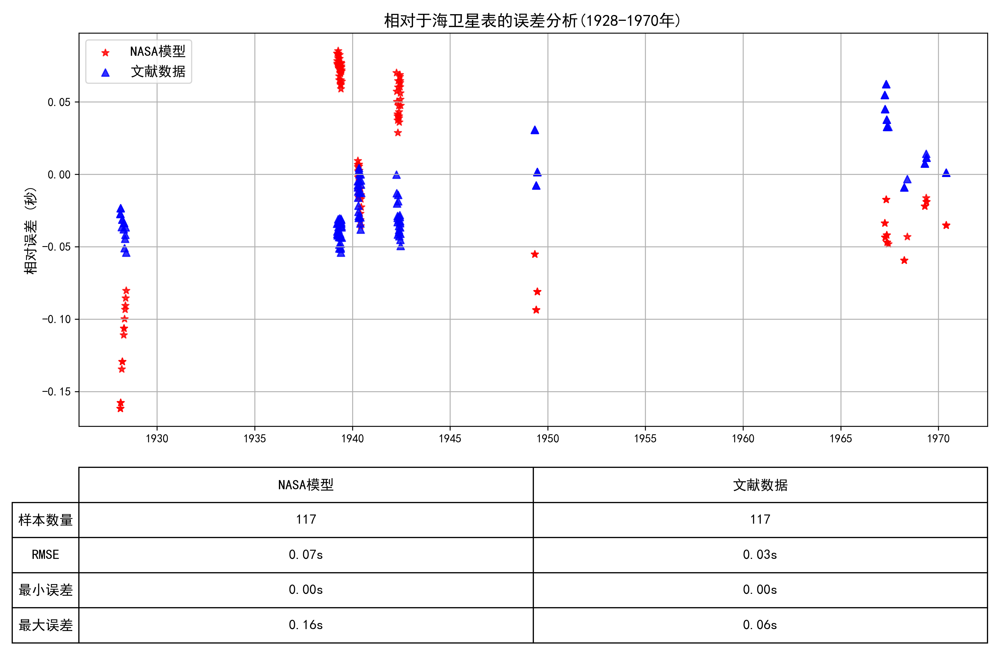

## **2. Detail**

### **2.1 数据预处理**

​	**首先，将NSDB中每一个观测记录的相关数据收集整理。包含了以下字段的信息：Id、Type、Dates、Observatory、Reference Frame、Centre of Frame、Epoch of Equinox、Time Scale、Reduction、Coordinates、Diffraction、Receptor、Telescope、Observers、Relative To。**

****

​	**对观测记录从文本文件转换转换途中发现有的观测数据的格式并不完整，修正如下。**

| **文件名**     | **错误信息**                                                 | **修正手段** |
| -------------- | ------------------------------------------------------------ | ------------ |
| **jg0004.csv** | **多余的空格**                                               | **删除**     |
| **jg0008.csv** | **多余的空格**                                               | **删除**     |
| **jg0014.csv** | **最后一列是 note(N) Note (if equal to 1) that latitude correction is not accurate** | **更名**     |
| **jg0029.csv** | **最后一列是天文台的名称**                                   | **删除**     |
| **jg0033.csv** | **特殊标注了一行观测台站变更**                               | **是**       |
| **jg0050.csv** | **多余的空格**                                               | **删除**     |
| **jo0035.csv** | **13. 震级，Mag（若未指定则留空） 14. 震级带，Band（若未指定则留空）** | **更名**     |
| **jo0046.csv** | **13. 震级，Mag（若未指定则留空） 14. 震级带，Band（若未指定则留空）** | **更名**     |
| **jo0047.csv** | **13. 震级，Mag（若未指定则留空） 14. 震级带，Band（若未指定则留空）** | **更名**     |
| **jo0050.csv** | **13. 震级，Mag（若未指定则留空） 14. 震级带，Band（若未指定则留空）** | **更名**     |
| **jo1042.csv** | **列 'C12' 空值比例过高 (91.5%)**                            |              |
| **jo1045.csv** | **12. Magnitude in R band (blank if not available)**         | **更名**     |

​	**改正所有错误之后开始对txt文件进行转换。并给所有的csv文件添加了一个表头，便于根据表头实现对多表的合并。**

​	**转换之后的csv文件如下，为每个数据加上前后括号强制转换为文本，防止数据精度丢失。**

****

​	**为批量处理时间到统一的格式，亦或方便去对不同的数据类型处理，例如有些数据是赤经赤纬，有些数据是空间坐标。因此要将Data中的数据对应上相应的列名，编写了一个程序首先给所有csv文件增加一行标题行，然后通过编写一个软件实现直接更改各个文件的表头的功能，另外为了防止出错，在右侧会同步输出html文件，最后加上二次验证。确保所有的数据是准确无误的。表头程序：**

****

**基于上述的数据准备，编写一个简单的程序就能实现多表合并，还为所有的行都新增了一列id，以文件名+行号形式构成，方便对数据的检索和对某些指定的数据整理。整合之后的表格如下。一共包含了内部、外部、伽利略卫星等十几个卫星的5万多条观测数据，基本实现了对观测数据的整合。**

****

### **2.2 时间系统**

#### **2.2.1 时间尺度**

**目前使用的时间尺度大致可分为两大类：**

- **原子时及力学时。**
- **地球时。**

**此外，还存在恒星时，即以背景恒星为参考的时间，用于校正天球坐标和天文观测，暂不做讨论。**

**下表对历史上的原子时、力学时、地球时做了系统的归纳摘要。**

| **简称** | **全称**         | **定义与关键特点**                                           | **转换关系**                                                 | **使用时间**                         |
| -------- | ---------------- | ------------------------------------------------------------ | ------------------------------------------------------------ | ------------------------------------ |
| **TAI**  | **国际原子时**   | **基于全球约200台原子钟的加权平均，采用 SI 秒。1958年1月1日时 TAI 与 UT1 差约为0。** | **UTC = TAI - 闰秒； TT = TAI + 32.184 秒；**                | **1958年1月1日**                     |
| **UTC**  | **协调世界时**   | **同于TAI，和世界时的差值不超过0.9s**                        | **UTC = TAI - 闰秒**                                         | **1972年1月1日**                     |
| **TT**   | **地球时**       | **定义为 TAI + 32.184 秒，用于历表计算。继承了 Ephemeris Time (ET) 的均匀性，确保与 SI 秒一致。** | **TT = TAI + 32.184 秒;**                                    | **1977年1月1日**                     |
| **TDB**  | **质心动力学时** | **在 TT 基础上加上相对论修正，将时间原点从地球表面移至太阳系质心。** | **TDB = TT + 0.001658·sin(g) + 0.000014·sin(2g) <br />g = 357.53° + 0.9856003°·(JD – 2451545.0)** | **1984年至今**                       |
| **TCB**  | **质心坐标时**   | **零引力场中质心系坐标静止标准钟的原时秒**                   | **TCB ≈ TDB + 周期性修正（速率差约15.5×10⁻⁹）**              | **1991年至今**                       |
| **UT1**  | **世界时**       | **反映地球实际自转速度，是修正极移（UT0）后的时间，直接用于天文观测。** | **UT1 = UTC + ΔUT (ΔUT = UT1 - UTC，通常小于 0.9 秒)**       | **天文观测沿用至今**                 |
| **GMT**  | **格林尼治平时** | **以格林尼治皇家天文台为基准的平均太阳时，是历史上广泛使用的时间尺度。基于平均太阳日（地球自转），与UT1非常接近，但不含闰秒调整** | **可以认为历史上,GMT = UT**                                  | **历史使用广泛，19世纪至20世纪中期** |


**上图展示了1950年到2020年各个时间时间系统的长期变化。**

- **原子时（TAI）与历表/动力学时（TT/TDB）之间的恒定或周期性差值；**
- **地球自转时（UT1）与原子时间的不断漂移；**
- **协调世界时（UTC）通过“阶梯”式的闰秒调整来跟上UT1；**
- **以及坐标时（TCB/TCG）在相对论修正下对 TT 的持续偏离；**

​	**通过前期整理，总计整理了57258条星表数据。当前可获得的所有海卫绝对位置资料中采用的时间系统见下表。**

| **序号** | **TS**                | **NUMBER** | **记录格式**           | **完成情况** | **待处理项**     |
| -------- | --------------------- | ---------- | ---------------------- | ------------ | ---------------- |
| **1**    | **ET**                | **419**    | **Day_detail**         | **完成**     |                  |
| **2**    | **TDB**               | **54**     | **JD**                 | **完成**     |                  |
| **3**    | **GMT**               | **562**    | **Full**               | **完成**     |                  |
| **4**    | **TCB**               | **6302**   | **Epoch_TCB**          | **完成**     |                  |
| **5**    | **TT**                | **966**    | **JD,MJD,Full**        | **完成**     | **jg0053**       |
| **6**    | **UT1**               | **808**    | **Full**               | **完成**     |                  |
| **7**    | **UTC**               | **46409**  | **day_detail,FULL,JD** | **完成**     | **jg0032,33,34** |
| **8**    | **Cape sideral time** | **738**    |                        |              |                  |

**注:**
	**Day_detail：以year、mon 和 day 格式记录。day 包含小数，表示完整时间（包括日、时、分、秒）。**
	**Full：以year、mon、day、hour、min 和 sec 格式记录。其他列均为空。**
	**JD、MJD：以JD或MJD的格式记录。**

​	**使用EXCEL函数可以实现对观测数据的分类:**

```python
IF(AND(ISNUMBER(SEARCH(".", D2)), D2<>"", E2="", F2="", G2="", H2="", I2="", J2="", A2<>""), 1,IF(AND(A2<>"", B2<>"", C2<>"", D2<>"", E2<>"", F2<>"", G2<>"", H2="", I2="", J2=""), 2,IF(AND(H2<>"", I2="", J2=""), 3,4)))
```

​	**第四类数据(异常数据):**

| **id**     | **sclae** | **number** | **error**                 | **resolution**                                               |
| ---------- | --------- | ---------- | ------------------------- | ------------------------------------------------------------ |
| **jg0001** | **2**     | **1606**   | **sec格式不一**           |                                                              |
| **jg0004** | **3**     | **144**    | **有JD,无时分秒**         | **按JD处理**                                                 |
| **jg0008** | **4**     | **738**    | **Cape sideral time**     |                                                              |
| **jg0032** | **3**     | **448**    | **有JD,有年月带小数的秒** | **按JD**                                                     |
| **ji0005** | **4**     | **156**    | **min**                   | **Minutes from 0 h UTC, 3 December 1988 (JD=2447498.5)**     |
| **ji0015** | **3**     | **54**     | **JD**                    | **Julian date of observation (TDB)**                         |
| **jg0020** | **4**     | **26**     | **MJD**                   | **MJD - time of topocentric observation (MJD=JD-2400000.5), TT** |
| **ji0007** | **4**     | **10**     | **MJD**                   | **MJD of observation with decimals (43494 = 17 Dec 1977)**   |
| **jg0021** | **4**     | **16**     | **MJD**                   | **MJD - time of topocentric observation (MJD=JD-2400000.5), TT** |
| **ji0001** | **4**     | **35**     | **hour带小数无min sec**   | **Hour of the moment of observation with decimals**          |
| **ji0002** | **4**     | **160**    | **hour带小数无min sec**   | **Hour of the moment of observation with decimals**          |
| **ji0004** | **4**     | **123**    | **hour带小数无min sec**   | **Hour of the moment of observation with decimals**          |
| **jg0069** | **4**     | **209**    | **Epoch_TCB**             | **Gaia-centric epoch in TCB relative to 2455197.5 (Epoch_TCB, days)** |
| **jg0073** | **4**     | **295**    | **Epoch_TCB**             | **Gaia-centric epoch in TCB relative to 2455197.5 (Epoch_TCB, days)** |
| **jo0069** | **4**     | **1712**   | **Epoch_TCB**             | **Gaia-centric epoch in TCB relative to 2455197.5 (Epoch_TCB, days)** |
| **jo0077** | **4**     | **3756**   | **Epoch_TCB**             | **Gaia-centric epoch in TCB relative to 2455197.5 (Epoch_TCB, days)** |
| **jo1057** | **4**     | **92**     | **Epoch_TCB**             | **Gaia-centric epoch in TCB relative to 2455197.5 (Epoch_TCB, days)** |
| **jo1061** | **4**     | **238**    | **Epoch_TCB**             | **Gaia-centric epoch in TCB relative to 2455197.5 (Epoch_TCB, days)** |

#### **2.2.2 格式统一**

​	**到此即可以正式开始对时间系统的统一，目标为将所有的观测时间转换到TT。之所以转换到TT是因为作为观测星表的自变量，应该要求时间系统尽可能均匀连续。并且TT易于从其他的时间系统转换得到，故选用TT。本文使用IAU的公益项目SOFA工具进行处理。**
**​	使用SOFA库的前提是将不同的记录格式统一，首先将所有的记录格式处理成full，再使用iauDtf2d函数转换成两段式的JD。**

#### **2.2.3 UTC-TT**

**UTC的整体思路是通过闰秒机制转换到TAI，再转换到TT。**

| **时间范围**   | **处理方法**                               |
| -------------- | ------------------------------------------ |
| **1972年之前** | **统一使用10s作为ΔAT与TAI对齐。**          |
| **1972年之后** | **直接使用SOFA程序内嵌的闰秒表进行转换。** |

#### **2.2.4 UT1-TT**

**UT1的整体思路是通过已有的ΔT数据加上UT1的时间转换到TT**
**1973年之后的记录，使用IERS发布的UT1-UTC差值（finals2000A.all.csv），经由iauUt1utc以及iauUtctt函数转换到TT。**
**1956至1973的记录，使用IERS发布的UT1-TAI差值（EOP_C01_IAU2000），经由iauUt1tai以及iauTaitt函数转换到TT。**
**1956年之前的记录，使用文献*Long-term changes in the rotation of the Earth: 700 B.G. to A.D. 1980*中记录的ΔT数据，并使用三次样条插值，插值到月以提高数据精度。另外的，NASA的ΔT长期多项式模型（Polynomial Approximation for TT-UT1）也可以外推估计ΔT。**

| **时间范围**   | **处理方法**                                             |
| -------------- | -------------------------------------------------------- |
| **1956年之前** | **使用文献中记录的ΔT数据，通过三次样条插值，插值到月。** |
| **1956-1973**  | **使用IERS发布的UT1-TAI差值（EOP_C01_IAU2000）**         |
| **1973年之后** | **使用IERS发布的UT1-UTC差值（finals2000A.all.csv）**     |

**下图为NASA 模型、文献数据与已发布的海卫星表之间的相对误差，使用均方根误差（RMSE）作为评价指标。显然，将文献数据插值之后的数据与已发布的海卫星表的吻合度更高，误差指标更低。**

****

#### **2.2.5 TDB-TT**

**TDB的整体思路是通过公式计算出与TT的插值，并计算出TT。**
**在SOFA的说明文档中给出了TDB与TT之间的关系，但SOFA文档中的精度相对较低，本文参考《天体测量学导论》使用了精度更高的计算公式。**
$$
TDB - TT = 0.001658 * sin(g) + 0.000014 * sin(2g)
$$

$$
g = 357.53 + 0.9856003 * (JD_{TT}- 2451545.0)
$$

#### **2.2.6 补充**

**1.TT曾称TDT，是ET的后继。可以认为TT=TDT=ET。**
**2.对于GMT，可以认为GMT=UT1。**
**3.早期观测资料的平时和标准时是以太阳上中天时刻(太阳时角=0h)作为一天的起点的；而UT是以太阳下中天时刻(太阳时角=12h)作为一天的起点的。需要统一为1925年1月1日（MJD=24151）之前的观测时刻减0.5以对齐起点。**
**至此为止即阐述了时间尺度转换的理论知识。使用SOFA程序编写代码，即可完成对时间系统的转换。**

#### **2.2.7 验正**

**在完成代码编写后，需要对代码的准确性进行验证。将Observational catalogs and numerical ephemerides for the satellite system of Neptune（以下简称Nep）文中已经处理完成的数据作为对照组，验证准确性。Nep中共收集了91个观测原数据文件，涉及14574条观测信息。具体流程如下。随机提取每一个时间尺度下的三条观测信息，其中：**
**​	ts为观测选用的时间尺度**
**​	obsTime为观测时刻的儒略日**
**​	obsTt为转换到TT下的MJD**

​	**另外的，美国中部标准时 (Central standard time)、太平洋标准时 (Pacific standard time)、巴黎平时 (Paris mean time)、地方平时 (local mean time)等地方时木星卫星未涉及到，暂不做验证。**

​	**整理上述文献得待转换的Time Scale为：**

| **file_line**           | **scale** | **year** | **mon** | **day**      | **hour** | **min** | **sec** | **classify** |
| ----------------------- | --------- | -------- | ------- | ------------ | -------- | ------- | ------- | ------------ |
| **nm0075_2**            | **UT1**   | **1928** | **2**   | **13**       | **6**    | **35**  | **0**   | **2**        |
| **nm0075_3**            | **UT1**   | **1928** | **2**   | **13**       | **7**    | **5**   | **0**   | **2**        |
| **nm0009_2**            | **UTC**   | **1975** | **6**   | **26.2566**  |          |         |         | **1**        |
| **nm0042_2**            | **GMT**   | **1847** | **10**  | **25**       | **8**    | **24**  | **18**  | **2**        |
| **nm0042_3**            | **GMT**   | **1847** | **10**  | **27**       | **8**    | **9**   | **0**   | **2**        |
| **nm0083_2**            | **UTC**   | **1963** | **3**   | **5.079012** |          |         |         | **1**        |
| **1974AJ.....79..489R** | **ET**    | **1949** | **5**   | **1.276**    |          |         |         | **1**        |
| **1974AJ.....79..489R** | **ET**    | **1949** | **5**   | **29.192**   |          |         |         | **1**        |
| **1996A&AS..115..319V** | **TDT**   | **1984** | **6**   | **8**        | **5**    | **32**  | **54**  | **2**        |
| **1996A&AS..115..319V** | **TDT**   | **1984** | **6**   | **8**        | **6**    | **2**   | **54**  | **2**        |

​	**转换之后的Time Scale为：**

| **file_line**           | **scale** | **MJD_old**         | **MJD_tt**          |
| ----------------------- | --------- | ------------------- | ------------------- |
| **nm0075_2**            | **UT1**   | **25289.274305556** | **25289.274586940** |
| **nm0075_3**            | **UT1**   | **25289.295138889** | **25289.295420274** |
| **nm0009_2**            | **UTC**   | **42589.256600000** | **42589.257134537** |
| **nm0042_2**            | **UT1**   | **-4040.649791667** | **-4040.149716539** |
| **nm0042_3**            | **UT1**   | **-4038.660416667** | **-4038.160341543** |
| **nm0083_2**            | **UTC**   | **38093.079012000** | **38093.079500240** |
| **1974AJ.....79..489R** | **ET**    | **33037.276000000** | **33037.276000000** |
| **1974AJ.....79..489R** | **ET**    | **33065.192000000** | **33065.191999999** |
| **1996A&AS..115..319V** | **TT**    | **45859.231180556** | **45859.231180556** |
| **1996A&AS..115..319V** | **TT**    | **45859.252013889** | **45859.252013889** |

**基本吻合Nep中的OCNS2019文献数据，故准确性得证。**

### **2.3 坐标系统**

#### **2.3.1 参考系简述**

**1. 标准历元**

| **名称**  | **定义时间**                           | **特点与应用场景**                                           |
| --------- | -------------------------------------- | ------------------------------------------------------------ |
| **B1950** | **1950年1月0.9235日（UT）**            | **基于旧星表（如FK4），含分点偏差，需转换到现代系统（如J2000）。** |
| **J2000** | **2000年1月1日12:00（TT，JD2451545）** | **现代天文学标准历元（如ICRS、Gaia星表），惯性参考系对齐，精度高。** |
| **Date**  | **实际观测时刻（瞬时历元）**           | **需通过岁差、章动模型转换至标准历元（如J2000）。**          |

**2. 历元相关术语**

- **of Date：表示坐标基于观测时刻的瞬时参考系（需明确是否含章动）。**
  - **True of Date：包含章动的真春分点坐标系（用于实时观测）。**
  - **Mean of Date：仅含岁差的平春分点坐标系（用于平滑长期计算）。**
  
- **1 Jan of year of observation：以观测年份的1月1日为简化历元（非标准）。**

**木卫中出现的所有历元如下:**

| **值**                                                       | **出现总次数** |
| ------------------------------------------------------------ | -------------- |
| **1950**                                                     | **10**         |
| **1951**                                                     | **1**          |
| **1952**                                                     | **1**          |
| **1 - mean  terrestrial equatorial frame, 1950, <br />   2 - Jovian equatorial frame of the date,** | **1**          |
| **1 Jan of year of observation**                             | **1**          |
| **1950.0, 2000.0**                                           | **1**          |
| **B1950**                                                    | **7**          |
| **B1950.0 and J2000 (see  comments)**                        | **1**          |
| **date**                                                     | **9**          |
| **ICRF**                                                     | **2**          |
| **ICRS/J2000.0**                                             | **2**          |
| **J2000**                                                    | **186**        |
| **no information**                                           | **3**          |
| **of date**                                                  | **1**          |
| **true of date**                                             | **2**          |
| **true of date, 2000.0**                                     | **1**          |

**二、参考系（Reference Frame）**

**参考系定义天体位置的空间基准框架，需结合历元使用。**

**1. 主要类型**

| **名称**                              | **类型**             | **特点与实现**                                               |
| ------------------------------------- | -------------------- | ------------------------------------------------------------ |
| **ICRF**                              | **国际天球参考框架** | **基于射电源的绝对惯性系，精度达微角秒级，与J2000.0对齐（ICRS的理论实现）。** |
| **FK4 历元平赤道平春分点**            | **经典参考系**       | **基于FK4星表（B1950历元），含系统误差（分点差、光行差模型过时）。** |
| **瞬时真赤道真春分点**                | **瞬时参考系**       | **观测时刻的真春分点坐标系（含章动），需转换到标准历元。**   |
| **Mean Terrestrial Equatorial Frame** | **地球平赤道系**     | **以地球平赤道和平春分点定义（如1950年版本），近似于FK4。**  |

- **FK4 → ICRS：需修正分点差、光行差E项及参考架偏差（见Seidelmann方法）。**
- **瞬时真参考系 → ICRS：通过章动、岁差、架偏差逐步转换。**

**Python的`astropy.coordinates`库，支持自动历元转换。**

```python
from astropy.coordinates import SkyCoord
from astropy.time import Time
# 将B1950坐标转换到J2000
coord_b1950 = SkyCoord(ra=120, dec=30, unit='deg', frame='fk4', equinox='B1950.0')
coord_j2000 = coord_b1950.transform_to('icrs')  # 自动应用岁差和架偏差
```

#### **2.3.2 坐标系转换**
