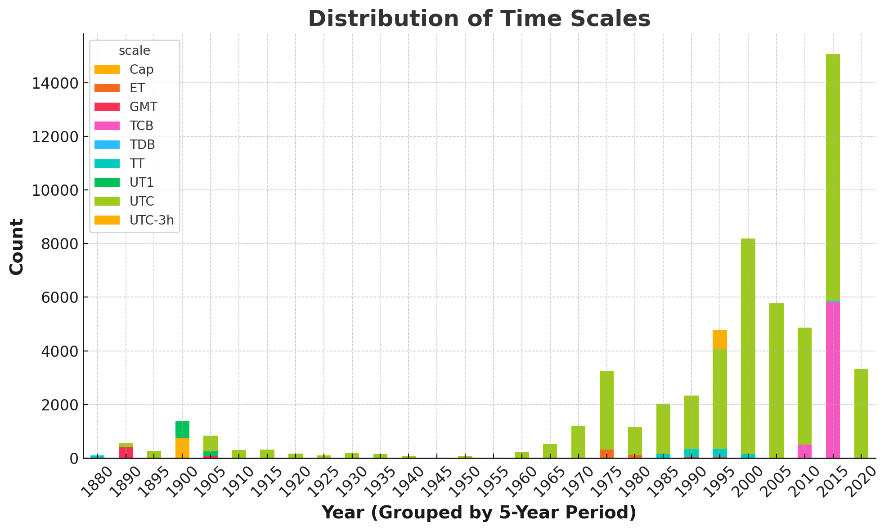
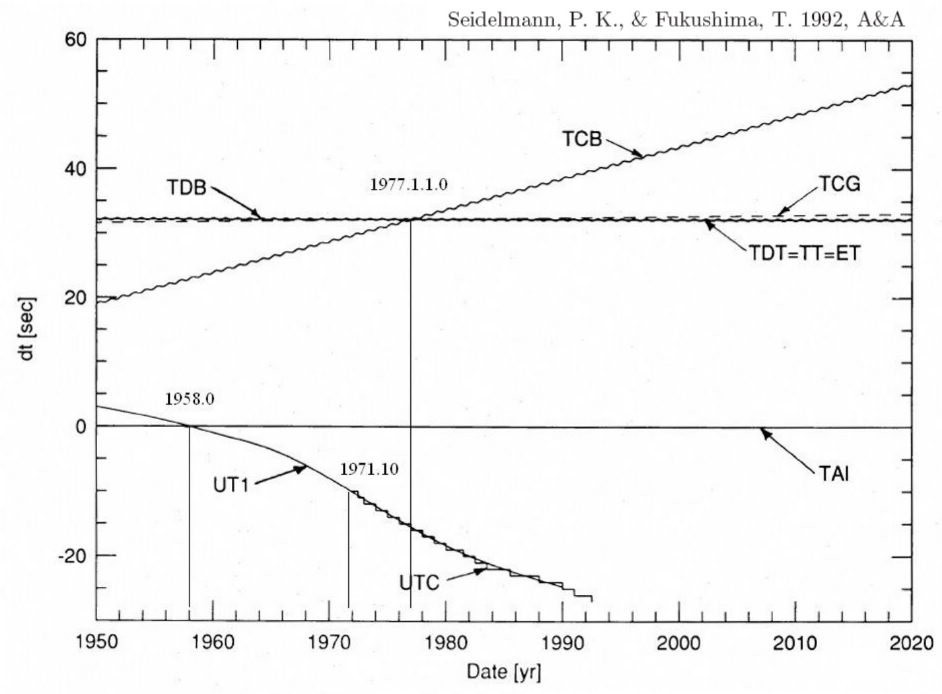
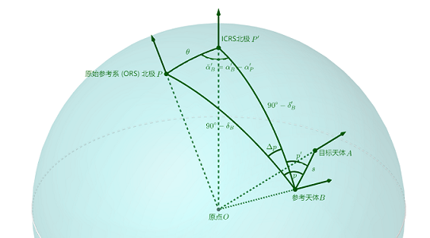

## 1. Organization

- 2024.11: 完成NSDC的数据处理✅
- 2024.12: 搜集新数据整理&准备考试📚
- 2025.01: 完成所有的数据&转换🔄
- 2025.02: 完善数据分析&矫正并撰写初稿✍
- 2025.03: 正式撰写文章📄
- 2025.04: 完善文章准备投递📬

## 2. Record

### 2.1 Date Preprocess

#### 2.1.1 html info

首先，因为NSDC上的数据是以content+data的双文件形式存储的。编写一个类似于爬虫的文本分析文件，将每一个content 的相关数据都整理到了一个csv文件，称之为information。Information里包含了时间尺度、坐标系统和观测台等信息，方便在某些数据记录中不包含某些数据时补上。
Information中包含了以下字段的信息
Id、Type、Dates、Observatory、Reference Frame、Centre of Frame、Epoch of Equinox、Time Scale、Reduction、Coordinates、Diffraction、Receptor、Telescope、Observers、Relative To


其次，因为最一开始并不了解时间尺度和坐标系统的概念和定义，故统计出了information中出现的所有时间尺度的类型。

#### 2.1.2 csv errror

Python对txt文件并不算特别友好，计划将txt文件转换成了csv文件方便之后的各种操作，但是转换途中发现有的观测数据的格式并不完整，编写了一个csv_error程序分析格式错误并改正。

| 文件名     | 错误信息                                                     | 修正 |
| ---------- | ------------------------------------------------------------ | ---- |
| jg0004.csv | 多余的空格                                                   | 删除 |
| jg0008.csv | 多余的空格                                                   | 删除 |
| jg0014.csv | 最后一列是 note(N) Note (if equal to 1) that latitude correction is not accurate | 更名 |
| jg0029.csv | 最后一列是天文台的名称                                       | 删除 |
| jg0033.csv | 特殊标注了一行观测台站变更                                   | 是   |
| jg0050.csv | 多余的空格                                                   | 删除 |
| jo0035.csv | 13. 震级，Mag（若未指定则留空） 14. 震级带，Band（若未指定则留空） | 更名 |
| jo0046.csv | 13. 震级，Mag（若未指定则留空） 14. 震级带，Band（若未指定则留空） | 更名 |
| jo0047.csv | 13. 震级，Mag（若未指定则留空） 14. 震级带，Band（若未指定则留空） | 更名 |
| jo0050.csv | 13. 震级，Mag（若未指定则留空） 14. 震级带，Band（若未指定则留空） | 更名 |
| jo1042.csv | 列 'C12' 空值比例过高 (91.5%)                                |      |
| jo1045.csv | 12. Magnitude in R band (blank if not available)             | 更名 |

改正所有错误之后开始对txt文件进行转换。并给所有的csv文件添加了一个表头，便于根据表头实现对多表的合并。

#### 2.1.3 csv convert

转换之后的csv文件如下，我为每个数据加上前后括号强制转换为文本，防止数据精度丢失。


#### 2.1.4 csv header

为了批量处理时间到统一的格式，亦或方便去对不同的数据类型处理，例如有些数据是赤经赤纬，有些数据是空间坐标。因此要将Data中的数据对应上相应的列名，编写了一个程序首先给所有csv文件增加一行标题行，然后通过编写一个软件实现直接更改各个文件的表头的功能，另外为了防止出错，在右侧会同步输出html文件，最后加上二次验证。确保所有的数据是准确无误的。
替换表头程序：



#### 2.1.5 csv utils



### 2.2 Date Convert

#### 2.2.1 csv merge

基于上述的数据准备，编写一个简单的程序就能实现多表合并，还为所有的行都新增了一列id，以文件名+行号形式构成，方便对数据的检索和对某些指定的数据整理。整合之后的表格如下。一共包含了内部、外部、伽利略卫星等十几个卫星的5万多条观测数据，基本实现了对观测数据的整合。


#### 2.2.2 csv extractor

通过前期整理，总计整理了57258条星表数据。

| file_line |  year  | mon  |     day     | hour | min  | sec  |  JD  |
| :-------: | :----: | :--: | :---------: | :--: | :--: | :--: | :--: |
| jg0002_2  | [1998] | [08] | [26.999456] |      |      |      |      |

根据 `classify` 列分为四大类：

1. 第1类 (`classify=1`)：仅 `file_line`、`year`、`mon` 和 `day` 列有值。`day` 列包含小数，表示完整时间（包括日、时、分、秒）。其他列均为空。
2. 第2类 (`classify=2`)：仅 `file_line`、`year`、`mon`、`day`、`hour`、`min` 和 `sec` 列有值。其他列均为空。
3. 第3类 (`classify=3`)：仅 `jd` 列有值。其他列均为空。
4. 第4类 (`classify=4`)：不符合上述任何分类规则，直接输出 `null`。

使用函数可以实现对数据的分类:

```
=IF(AND(ISNUMBER(SEARCH(".", D2)), D2<>"", E2="", F2="", G2="", H2="", I2="", J2="", A2<>""), 1,IF(AND(A2<>"", B2<>"", C2<>"", D2<>"", E2<>"", F2<>"", G2<>"", H2="", I2="", J2=""), 2,IF(AND(H2<>"", I2="", J2=""), 3,4)))
```

整理如下

| 时间尺度                                                     | 数据类型                                                     | 数据数量                                               |
| ------------------------------------------------------------ | ------------------------------------------------------------ | ------------------------------------------------------ |
| UTC    GMT    <br/>UT1    <br/>TT    ET    <br/>Cape sideral time    <br/>TCB    TDB | 第1类： 只有 `file_line`、`year`、`mon`、`day` 有值，且 `day` 列的值含小数点，其余列为空。<br/>第2类： 只有 `file_line`、`year`、`mon`、`day`、`hour`、`min`、`sec` 有值，其余列为空。<br/>第3类： 只有 `jd` 列有值，其余列为空。<br/>第4类： 不符合上述任何规则。 | 1    22964<br/>2    10726<br/>3    14396<br/>4    9172 |

第四类数据:

| 文件名 | 类别 | 出现总次数 | 异常                  | 处理                                                         |
| ------ | ---- | ---------- | --------------------- | ------------------------------------------------------------ |
| jg0001 | 2    | 1606       | sec格式不一           |                                                              |
| jg0004 | 3    | 144        | 有jd,无时分秒         | 按jd                                                         |
| jg0008 | 4    | 738        | Cape sideral time     |                                                              |
| jg0032 | 3    | 448        | 有jd,有年月带小数的秒 | 按jd                                                         |
| ji0015 | 3    | 54         | jd                    | Julian date of observation (TDB)                             |
| jg0020 | 4    | 26         | mjd                   | MJD - time of topocentric observation (MJD=JD-2400000.5), TT |
| jg0021 | 4    | 16         | mjd                   | MJD - time of topocentric observation (MJD=JD-2400000.5), TT |
| jg0069 | 4    | 209        | Epoch_TCB             | Gaia-centric epoch in TCB relative to 2455197.5 (Epoch_TCB, days) |
| jg0073 | 4    | 295        | Epoch_TCB             | Gaia-centric epoch in TCB relative to 2455197.5 (Epoch_TCB, days) |
| ji0001 | 4    | 35         | hour带小数无min sec   | Hour of the moment of observation with decimals              |
| ji0002 | 4    | 160        | hour带小数无min sec   | Hour of the moment of observation with decimals              |
| ji0004 | 4    | 123        | hour带小数无min sec   | Hour of the moment of observation with decimals              |
| ji0005 | 4    | 156        | min                   | Minutes from 0 h UTC, 3 December 1988 (JD=2447498.5)         |
| ji0007 | 4    | 10         | mjd                   | MJD of observation with decimals (43494 = 17 Dec 1977)       |
| jo0069 | 4    | 1712       | Epoch_TCB             | Gaia-centric epoch in TCB relative to 2455197.5 (Epoch_TCB, days) |
| jo0077 | 4    | 3756       | Epoch_TCB             | Gaia-centric epoch in TCB relative to 2455197.5 (Epoch_TCB, days) |
| jo1057 | 4    | 92         | Epoch_TCB             | Gaia-centric epoch in TCB relative to 2455197.5 (Epoch_TCB, days) |
| jo1061 | 4    | 238        | Epoch_TCB             | Gaia-centric epoch in TCB relative to 2455197.5 (Epoch_TCB, days) |

**完成代码的提取之后就要选用时间转换的工具，本文依照IAU的公益项目SOFA，使用C++平台进行编写。**

* **SOFA的支持的时间尺度？**

  * TAI (国际原子时): 这是国际上采用的原子时基准，其时间单位是SI秒（国际单位制秒）。TAI不受地球自转等天文现象的影响，其时间连续且均匀。它是所有其他时间尺度的基础。

  * UTC (协调世界时): 这是民用时间标准，基于TAI，但为了与地球自转保持大致一致，会周期性地引入闰秒。闰秒的引入使得UTC的时间并非完全均匀，但它与日常生活中的时间保持一致。

  * UT1 (世界时): 这是基于地球自转的时间尺度。由于地球自转并不完全均匀，UT1的秒长会略微变化。UT1主要用于天文观测中需要考虑地球自转影响的场合，例如望远镜指向、天文测量等。

  * TT (地球时): 这是用于太阳系星历计算的时间尺度。TT与TAI之间存在一个固定的偏移量，它在理论上更接近于地球上的理想钟表所指示的时间。

  * TCG (地心坐标时): 这是以地球质心为参考点的时间尺度，用于相对论性地心坐标系 (GCRS) 的计算。它与TT之间存在线性关系，考虑了地球的引力势的影响。

  * TCB (质心坐标时): 这是以太阳系质心为参考点的时间尺度，用于相对论性质心坐标系 (BCRS) 的计算。它考虑了观测者相对于太阳系质心的运动和引力势的影响，与TCG之间存在四维时空变换的关系。

  * TDB (质心动力学时): 这是TCB的一种修正形式，旨在使其平均上与TT保持一致。TDB与TT的差异是准周期性的，主要由地球的周年运动引起。它主要用于太阳系天体的运动计算。

* **SOFA各个时间尺度下的转换流程是怎么样的？**


* **SOFA的基本函数，以及各个时间系统之间的转换关系**


* **还有一些要注意的事项是什么？**

  * 1925年前的观测日期以中午12时为一天的起点。

  * 天文日期可用格里高利历或儒略日（JD）表示。

  * 修正儒略日（MJD）与JD的关系为： JD = MJD + 2400000.5。

> 完全掌握上述内容之后，即可以根据SOFA来编写时间系统转换程序。
>
> 函数流程
>
>     1.根据classify对所有的数据进行分类处理 
>
>     2.将所有数据的方括号去掉 
>
>     3.先将年月日等时间类型转换到mjd 
>
>     4.将各个时间尺度下的mjd转换到TT下。
>
> 注意 
> 1.实质上Astropy和SOFA的函数逻辑是相同的的，两者计算出的精度区别是由于SOFA是依靠程序内部的闰秒表，而Astropy是通过内部函数从网络上更新闰秒表。 
> 2.Astropy可以更好的对数组进行处理，不用担心精度丢失的问题

基于sofa的C程序为:

```c
#include <stdio.h>
#include "sofa.h"

// 函数声明
int convert_time(const char *source, const char *target, double jd1, double jd2, double *res1, double *res2);

int main() {
    // 输入：源时间尺度和儒略日期
    const char *source = "UTC";  // 输入的时间尺度
    const char *target = "TCB";  // 目标时间尺度
    double jd1 = 2460120.5;      // 儒略日期部分1（整数部分）
    double jd2 = 0.0;            // 儒略日期部分2（小数部分）
    double res1, res2;           // 转换后的时间尺度

    // 调用转换函数
    if (convert_time(source, target, jd1, jd2, &res1, &res2) == 0) {
        printf("Converted time: JD1 = %.10f, JD2 = %.10f\n", res1, res2);
    } else {
        printf("Error: Conversion failed.\n");
    }

    return 0;
}

// 时间尺度转换函数
int convert_time(const char *source, const char *target, double jd1, double jd2, double *res1, double *res2) {
    double temp1 = jd1, temp2 = jd2;
    double intermediate1, intermediate2;
    int status = 0;

    if (strcmp(source, "UTC") == 0 && strcmp(target, "TAI") == 0) {
        // UTC -> TAI
        status = iauUtctai(temp1, temp2, &intermediate1, &intermediate2);
    } else if (strcmp(source, "TAI") == 0 && strcmp(target, "TT") == 0) {
        // TAI -> TT
        status = iauTaitt(temp1, temp2, &intermediate1, &intermediate2);
    } else if (strcmp(source, "TT") == 0 && strcmp(target, "TCG") == 0) {
        // TT -> TCG
        status = iauTttcg(temp1, temp2, &intermediate1, &intermediate2);
    } else if (strcmp(source, "TT") == 0 && strcmp(target, "TDB") == 0) {
        // TT -> TDB
        status = iauTttdb(temp1, temp2, 0.0, &intermediate1, &intermediate2);
    } else if (strcmp(source, "TDB") == 0 && strcmp(target, "TCB") == 0) {
        // TDB -> TCB
        status = iauTdbtcb(temp1, temp2, &intermediate1, &intermediate2);
    } else if (strcmp(source, "TCB") == 0 && strcmp(target, "TDB") == 0) {
        // TCB -> TDB
        status = iauTcbtdb(temp1, temp2, &intermediate1, &intermediate2);
    } else if (strcmp(source, "TDB") == 0 && strcmp(target, "TT") == 0) {
        // TDB -> TT
        status = iauTdbtt(temp1, temp2, 0.0, &intermediate1, &intermediate2);
    } else if (strcmp(source, "TT") == 0 && strcmp(target, "TAI") == 0) {
        // TT -> TAI
        status = iauTtut1(temp1, temp2, 0.0, &intermediate1, &intermediate2);
    } else if (strcmp(source, "TAI") == 0 && strcmp(target, "UTC") == 0) {
        // TAI -> UTC
        status = iauTaiutc(temp1, temp2, &intermediate1, &intermediate2);
    } else if (strcmp(source, "UTC") == 0 && strcmp(target, "UT1") == 0) {
        // UTC -> UT1
        status = iauUtcut1(temp1, temp2, 0.0, &intermediate1, &intermediate2);
    } else if (strcmp(source, "UT1") == 0 && strcmp(target, "UTC") == 0) {
        // UT1 -> UTC
        status = iauUtcut1(temp1, temp2, 0.0, &intermediate1, &intermediate2);
    } else {
        printf("Error: Unsupported time conversion from %s to %s.\n", source, target);
        return -1;
    }

    // 检查转换是否成功
    if (status != 0) {
        printf("Error during conversion from %s to %s.\n", source, target);
        return -1;
    }

    // 输出转换结果
    *res1 = intermediate1;
    *res2 = intermediate2;

    return 0;
}
```

#### 2.3.3 time convert

> 在完成代码编写后，需要对代码的准确性进行验证。
>  将Observational catalogs and numerical ephemerides for the satellite system of Neptune（以下简称Nep）文中已经处理完成的数据作为对照组，验证准确性。Nep中共收集了91个观测原数据文件，涉及14574条观测信息。具体流程如下。随机提取每一个时间尺度下的三条观测信息，其中：
>  ts为观测选用的时间尺度
>  obsTime为观测时刻的儒略日
>  obsTt为转换到TT下的mjd
> 另外的，美国中部标准时 (Central standard time)、太平洋标准时 (Pacific standard time)、巴黎平时 (Paris mean time)、地方平时 (local mean time)等地方时木星卫星未涉及到，暂不做验证。即验证集为。

Nep中的OCNS2019_full部分数据：

| db   | df                         | pubRef              | ts   | obsTime             | obsTt               | pubSrc | site | type | tech | rfs   |
| ---- | -------------------------- | ------------------- | ---- | ------------------- | ------------------- | ------ | ---- | ---- | ---- | ----- |
| ADS  | 1974AJ**_**79__489R        | 1974AJ.....79..489R | ET   | 33037.276           | 33037.27600000007   | ADS    | 711  | O    | P    | B1950 |
| ADS  | 1974AJ**_**79__489R        | 1974AJ.....79..489R | ET   | 33065.192           | 33065.191999999806  | ADS    | 711  | O    | P    | B1950 |
| ADS  | 1996A+AS**115**319V-Nereid | 1996A&AS..115..319V | TDT  | 45859.231180555566  | 45859.23118055565   | ADS    | 874  | O    | P    | B1950 |
| ADS  | 1996A+AS**115**319V-Nereid | 1996A&AS..115..319V | TDT  | 45859.25201388889   | 45859.25201388868   | ADS    | 874  | O    | P    | B1950 |
| NSDC | nm0042                     | 1900AJ.....20..191H | GMT  | -4040.6497916666663 | -4040.1497165388428 | ADS    | 802  | O    | M    | TOD   |
| NSDC | nm0042                     | 1900AJ.....20..191H | GMT  | -4038.660416666666  | -4038.1603415426794 | ADS    | 802  | O    | M    | TOD   |
| NSDC | nm0075                     | 1928LicOB..14....8C | UT   | 25289.27430555556   | 25289.274586940184  | ADS    | 662  | O    | M    | TOD   |
| NSDC | nm0075                     | 1928LicOB..14....8C | UT   | 25289.29513888889   | 25289.295420273207  | ADS    | 662  | O    | M    | TOD   |
| NSDC | nm0083                     | 2016OAP....29..155Y | UTC  | 38093.079012        | 38093.07950024074   | ADS    | 083  | O    | P    | ICRS  |
| NSDC | nm0009                     | 1978AJ.....83..838W | UTC  | 42589.2566          | 42589.25713453721   | ADS    | 689  | O    | P    | TOD   |

1996A&AS..115..319V文献数据如下



1974AJ.....79..489R文献数据如下


在获取原始数据时，发现imcce网站上的数据并不完全准确，例如观测数据编号**nm0075**在imcce中的time scale为UTC，但文献中是UT。在之后的工作中可能还要对数据的准确性做进一步的验证。


整理的上述文献得待转换的Time Scale为：

| file_line           | scale | year | mon  | day      | hour | min  | sec  | classify |
| ------------------- | ----- | ---- | ---- | -------- | ---- | ---- | ---- | -------- |
| nm0075_2            | UT1   | 1928 | 2    | 13       | 6    | 35   | 0    | 2        |
| nm0075_3            | UT1   | 1928 | 2    | 13       | 7    | 5    | 0    | 2        |
| nm0009_2            | UTC   | 1975 | 6    | 26.2566  |      |      |      | 1        |
| nm0042_2            | GMT   | 1847 | 10   | 25       | 8    | 24   | 18   | 2        |
| nm0042_3            | GMT   | 1847 | 10   | 27       | 8    | 9    | 0    | 2        |
| nm0083_2            | UTC   | 1963 | 3    | 5.079012 |      |      |      | 1        |
| 1974AJ.....79..489R | ET    | 1949 | 5    | 1.276    |      |      |      | 1        |
| 1974AJ.....79..489R | ET    | 1949 | 5    | 29.192   |      |      |      | 1        |
| 1996A&AS..115..319V | TDT   | 1984 | 6    | 8        | 5    | 32   | 54   | 2        |
| 1996A&AS..115..319V | TDT   | 1984 | 6    | 8        | 6    | 2    | 54   | 2        |
