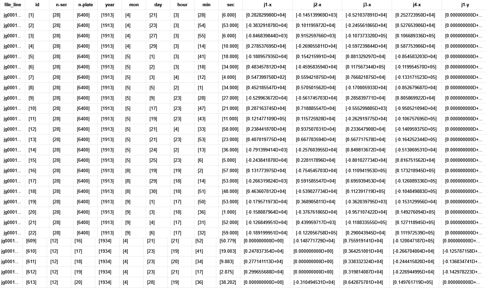

[TOC]

#  名词解释

## 岁差

由于日月行星引力的共同作用,地球自转轴在空间的方向发生周期性变化。岁差的变化缓慢且相对规则,可通过岁差模型(如IAU推荐的岁差模型)实现精确计算和修正。

## 章动

在行星或陀螺仪的自转运动中,轴在进动中的一种轻微不规则运动,使自转轴在方向的改变中出现如“点头”般的摇晃现象。行星的章动来自于力,并使得岁差的速度不是常数,而会随着时间改变。通常采用IAU推荐的章动理论模型(如IAU2000章动模型),实现章动的改正。如下图所示,绿色为地球自转轴,蓝色表示岁差影响,红色表示岁差与章动影响。

根据是否考虑岁差与章动改正分成以下三种：

- 不考虑岁差和章动影响：国际天球坐标系

- 仅考虑岁差影响：瞬时平天球坐标系（去除了章动干扰）

- 考虑岁差和章动影响：瞬时真天球坐标系

只要有岁差和章动改正数，就能实现上述三种坐标系统的相互转换

表 坐标系统的相互转换

| 参考系名称           | 是否考虑岁差 | 是否考虑章动 | Z轴垂直方向        | X轴指向          |
| -------------------- | ------------ | ------------ | ------------------ | ---------------- |
| 真赤道真春分点参考系 | 是           | 是           | 真赤道（瞬时赤道） | 真春分点（瞬时） |
| 平赤道平春分点参考系 | 是           | 否           | 平赤道             | 平春分点         |
| 国际天球参考系(ICRS) | 否           | 否           | J2000.0平赤道      | J2000.0平春分点  |

## 光行差

光行差是由于观测者的运动速度与光速合成效应引起的恒星视位置偏移。地球绕太阳公转、以及地球自转,都使得从地球上观测到的恒星方向与恒星实际所在方向之间存在微小夹角。
根据经典力学和相对论中的速度合成原理,运动的观测者看到的光线传播方向会因自身速度而发生改变。该效应与天体本身无关,只与地球运动有关。年度光行差最大值约为20.5角秒,发生在天体与地球公转速度方向垂直时。日周光行差最大约为0.3角秒,影响更小,常用于高精度地面天文台建模。当从天体视位置转换为平均位置时(或构造星表时),需要减去光行差;若从平均位置计算可见位置,则要加上光行差。光行差模型广泛用于从视方向反推真实方向。

天狼星的平均位置在天球上的变化量在一年内会受到光行差影响最大达20角秒,对于高精度星表(如Gaia)必须考虑。

## 光行差E项

E项是FK4系统在星表编制时人为引入的静态修正项,用于近似补偿地球绕太阳椭圆轨道运动产生的光行差偏移。这一项在天体位置中始终存在,不随观测时间变化。由于太阳绕地黄道轨道为椭圆形,FK4系统在恒星位置中加入了依赖黄经的周期性项,以减少建表误差。但在FK5或ICRS系统中该项被剔除,因其不再符合现代动态模型。该项的最大偏移约为0.3角秒,在全天球呈现周期性变化,方向与黄道位置有关。从FK4→FK5的坐标转换时必须剔除该项,否则会引入系统性位置误差。SOFA中的iauFk45z和iauFk425函数会自动处理E项剔除。

一颗恒星位于黄道上的某一点,若不剔除E项,其位置与FK5坐标系下的参考结果会偏移最多达0.3角秒,在VLBI或Gaia数据比对中产生不可接受的误差。

## 自行

自行是恒星在天球上由于其自身空间速度所引起的位置变化,表现为赤经与赤纬的逐年微小变化,通常以毫角秒(mas/yr)表示。恒星与太阳一样在银河系中运动,但由于距离遥远,其运动在天球中表现为缓慢的线性漂移。自行不包括地球公转或恒星视差引起的视位置变化。典型恒星自行在1~100mas/yr范围,最著名的Barnard星每年约10.3角秒,是当前记录中最大的恒星自行。进行不同历元之间的位置传播(如从B1950转换至1980或J2000)时,必须加上历元差乘以自行项。若自行项不精确,将导致恒星位置系统性漂移。

若某恒星在1950年赤经为100度,自行为50mas/yr,至2000年位置将变为100.000694度。对于高精度恒星导航任务,必须使用此项。

## 分点差

分点差是由于FK4与FK5两个坐标系统中分点(即赤经起始点)的定义不一致,导致恒星赤经坐标在两个系统中存在常量偏移,约为0.085角秒。FK4使用Newcomb的岁差常数,而FK5使用Lieske等人的改进模型,两者在春分点位置的定义存在系统差异。该差异在赤经方向上表现为一个常量修正。赤经偏移约为+0.085角秒,具体值随历元略有不同。赤纬方向影响非常小,通常可忽略。在进行FK4→FK5转换时必须应用该修正,SOFA提供的转换函数中已包含分点差校正。

一颗恒星在FK4系统中赤经为120.000000度,若未修正分点差,其转换后FK5赤经将比真实值小约0.085角秒,相当于4.1e-5度的系统性误差。

## 周年视差

周年视差是地球在绕太阳公转轨道上从不同位置观测恒星时,恒星位置在天球上的视在变化。该角度变化称为视差,反映了恒星距离。视差是一个几何三角测量过程。距离越近的恒星,因地球位置变化带来的背景星方向差越大;距离越远,角度越小。单位是角秒,1角秒视差对应1秒差距(pc)距离。最亮的近距离恒星如比邻星视差为0.77角秒,大多数恒星在0.01角秒~0.1角秒之间,银河系中心的恒星视差小于0.001角秒。高精度恒星坐标转换或构造星历时,需要视差配合地球轨道模型计算天体在不同时间下的真实方向。未考虑视差将导致近距离天体位置显著偏移。

Gaia星表中,一颗10pc的恒星具有0.1角秒的周年视差,若忽略该效应,其视位置将在天球上偏移最多0.1角秒,对精度要求为1mas的任务来说误差高达100倍。

#  背景意义

##  研究背景

从上世纪80年代以来，随着天文观测技术的不断进步和卫星探测任务的增多，系内行星的卫星被观测的数量急剧增加。土星已确认274颗轨道卫星，木星95颗卫星，位居太阳系第二。并且木星作为太阳系中最大的行星，其卫星系统不仅涵盖伽利略卫星（木卫一至木卫四），还包括众多小型不规则卫星，这些卫星的轨道特性和物理属性十分复杂。然而，现有的木卫观测星表普遍存在时间系统不统一、数据格式参差不齐等问题，导致在构建卫星运动学模型和进行长期轨道预测时需要额外进行大量的数据预处理和时间转换工作。

| 名称     | 平均半径(km) | 质量($\times 10^{22}$kg) | 半长轴(km) | 公转周期(地球日) | 轨道倾角($^\circ$) | 轨道离心率 | 星等 |
| -------- | ------------ | ------------------------ | ---------- | ---------------- | ------------------ | ---------- | ---- |
| Io       | 1,821.30     | 8.93                     | 421,700    | 1.769            | 0.04               | 0.0041     | -1.7 |
| Europa   | 1,560.80     | 4.78                     | 671,034    | 3.551            | 0.47               | 0.0094     | -1.4 |
| Ganymede | 2,634.10     | 14.8                     | 1,070,412  | 7.155            | 0.195              | 0.0013     | -2.1 |
| Callisto | 2,410.30     | 10.76                    | 1,882,700  | 16.689           | 0.281              | 0.0074     | -1.2 |
| Amalthea | 83.5         | 0.208                    | 181,366    | 0.498            | 0.375              | 0.0032     | 14.1 |
| Himalia  | 85           | 0.66                     | 11,480,000 | 250.566          | 27.52              | 0.157      | 14.6 |
| Thebe    | 50           | 0.43                     | 221,889    | 0.674            | 1.08               | 0.012      | 16.0 |

##  研究意义

图中展示了伽利略卫星在不同年份模型下1903年到2043年的偏差情况，清晰表明：随着观测数据的不断减少，模型与实际情况的偏差会逐步增大。这是由于历表模型是依据观测数据来构建的，观测数据越多构建出的模型越接近实际。本研究旨在解决现有星表中存在的数据混乱问题，对历年木卫观测数据进行标准化处理，构建了一份更新、更准确的木星卫星观测星表。

完成这一系列数据标准化工作后，后续研究者无需再重复进行繁琐的时间转换与数据整合工作，而可以直接利用该标准化星表结合建立运动学模型，可以开展更深入的轨道动力学分析、捕获机制研究以及演化历史探讨，从而大幅提高研究效率并推动相关基础科学问题的突破。

##  整体框架

- 观测资料的收集
- 时间系统
- 坐标系统
- 星表偏差改正
- 绘制观测星表

在状态建模层面，我们以初始状态量为起点，通过数值积分器对目标进行轨道传播，得到状态量。同时引入动力学模型，计算得到理论观测量C，并与实测观测量O进行比较，形成残差O-C。
利用O-C残差与偏导信息，我们进一步完成对初始状态的修正，并将其反馈回初始状态形成闭环迭代。该过程支持逐步收敛，实现轨道改进与模型精度提升。

#  数据介绍

##  IMCCE数据

观测星表的主要来源是IMCCE网站上记录的各时间段、观测台站以及观测设备所采集的数据，采用「目录+数据+content」三层进行存储。本文的目标是对这些观测记录进行系统化整理、清洗与合并，最终形成一个统一的观测数据表，为后续研究提供高精度数据支持。

#  工作流程

##  数据预处理

###  文本与格式处理

1. 首先，将每条观测记录中涉及的关键信息合并收集，并根据字段含义进行整理和规范化。
2. 在从文本文件转换为CSV文件的过程中，部分观测数据存在格式缺失或不一致的问题，需要进行必要的清洗与修正。[附表1](##附表1 IMCCE数据错误信息及修正)列出了需要修正的文件及其主要错误信息、修正手段。
3. 在所有错误修正完成后，给所有CSV文件添加了统一的表头（header)，方便后续自动合并和批量处理。
4. 为防止数据精度丢失，对数值型数据加上前后括号强制转换为文本。

###  多表合并与数据整合

通过前期整理，总计整理了IMCCE网站上57258条观测数据。为了便于检索与特定数据定位，对每条记录新增一列唯一ID（由「文件名+行号」构成)。编写脚本进行多表合并后，得到一个包含数万条观测记录的整合表格，覆盖了若干颗木星卫星及其相关观测。该整合表格为后续数据分析奠定了基础。

##  时间系统

在天文观测和数据处理中，不同的时间尺度可能同时存在。本文将所有观测记录统一转换为TT（Terrestrial Time）时间尺度。之所以选择TT，是因为构建新的观测星表时，应尽可能采用时间尺度均匀连续的基准，以确保星表在时间轴上的一致性。同时，TT便于与其他常见时间尺度进行相互转换，也适用于后续的历表与动力学计算。本文使用SOFA工具进行时间处理。

###  时间尺度概述

天文观测中常用的时间尺度大致可分为以下几类，表格展示了各时间尺度的定义与关键特点：

| 时间尺度 | 定义                                             | 关键特点                                   |
| -------- | ------------------------------------------------ | ------------------------------------------ |
| GMT      | 以格林尼治皇家天文台为基准的平均太阳时           | 基于地球自转，反映太阳在天球上的位置       |
| UT1      | 反映地球实际自转速度，是修正极移（UT0）后的时间  | 直接用于天文观测，修正了地球自转的不规则性 |
| TAI      | 基于全球约200台原子钟的加权平均，采用SI秒        | 与UT1差约为0，从1958年1月1日起             |
| UTC      | 与TAI同步，通过闰秒调整与UT1的差值               | 保持与UT1的差值不超过0.9秒                 |
| TT       | 定义为TAI+32.184秒，用于历表计算                 | 保持与SI秒一致                             |
| TCB      | 零引力场中质心系坐标静止标准钟的原时秒           | 用于天文学和物理学                         |
| TDB      | 在TT基础上加上相对论修正，时间原点移至太阳系质心 | 用于天体力学和宇宙学研究                   |

1. GMT起源于19世纪末，以格林尼治皇家天文台为基准，基于地球自转，反映太阳相对于格林尼治子午线的视运动。
2. 为了获得更高精度的时间尺度，提出了UT1，它修正了地球自转的非均匀性，能更真实地反映地球自转速度。
3. 随后，TAI于1958年建立，基于全球约200台原子钟的加权平均，标志着时间测量进入高精度时代。
4. 为协调全球时间系统，UTC在TAI基础上引入闰秒调整，以保证其与UT1的偏差不超过0.9秒。
5. 随着天文历法的发展，TT被定义为TAI+32.184秒，用于天文历书和动力学计算。
6. TCB的引入用于在零引力场的质心系中定义静止标准钟，作为更严格的物理时间。
7. TDB在TT的基础上引入相对论修正，时间原点转移至太阳系质心，适用于高精度的天体力学计算。

下图展示了1950年至2020年期间各主要时间尺度的长期变化趋势，包括TAI、TT、TDB、TCB、UT1、UTC等之间的差异。可以观察到，TAI与TT之间存在恒定差值；UT1相对于原子时间不断漂移；UTC通过“阶梯式”引入闰秒以跟随UT1；TCB/TCG在相对论修正下持续偏离TT。

构建观测星表应尽量选用均匀连续的时间尺度，以确保时间轴一致性。TT同时具备易于转换和高适用性的优势。

###  记录格式统一

在进行具体的时间转换前，需将不同文件中记录的观测时刻统一为一致的“记录格式”。常见记录形式包括：

1. Day_detail：year、mon、day with detail，小数部分表示当日的时分秒。
2. Full：year、mon、day、hour、min、sec。
3. JD/MJD：儒略日或简化儒略日。
4. 其他地方时或特殊格式，如Cape sidereal time 等。

通过编写程序将记录格式进行分类，[附表2](##附表2 第四类及特殊记录格式) 汇总了第四类格式。最终将所有格式统一转换为Full或JD两段式格式（利用SOFA的iauDtf2d等函数），以便后续在同一基准下进行处理。

###  UTC→TT

UTC转换为TT的基本方法是依照闰秒数据进行处理。但对于1972年的数据存在争议，不同研究者对UT1和UTC的划分节点处理不一。我们对比了Emelyanov、袁烨等人的方法。

| 作者      | 1972年后       | 1972年-1962年  | 1962之前 |
| --------- | -------------- | -------------- | -------- |
| Emelyanov | 按照闰秒表计算 | 按照闰秒表计算 | NULL     |
| 袁烨      | 按照闰秒表计算 | 按照10s计算    | NULL     |
| J.Desmars | 按照闰秒表计算 | NULL           | 视为UT1  |
| 本文      | 按照闰秒表计算 | 按照闰秒表计算 | 视为UT1  |

总结我们的做法如下

1. 1962年之后：使用SOFA内置的闰秒表实现精确转换。
2. 1962年之前（JD=2436934.5）：UTC近似视为UT1，先依据Stephenson和Morrison（1984）中提供的UT1与TT的差值关系进行插值，再查表提高精度。

###  UT1→TT

UT1转TT的转换依赖于已有的$\Delta T$数据，具体步骤如下：

1. 1962年之后：采用IERS发布的“EOP_C04_IAU2000”数据中的UT1–UTC差值，精度达每日，无需插值。
2. 1956–1962年：使用“EOP_C01_IAU2000”中的UT1–TAI差值，以月为单位，需插值至日。
3. 1956年之前：使用Stephenson和Morrison（1984）中的$\Delta T$数据，采用三次样条插值细化至日。

Yuanye曾采用NASA外推公式估算$\Delta T$，但通过比较发现，Stephenson和Morrison（1984）的文献数据拟合效果更优。下图展示了NASA模型、文献数据与已发布海卫星表之间的相对误差，采用均方根误差（RMSE）作为评估指标。结果表明文献插值数据与已发布数据更为一致。

总体策略为整合各辅助文件，并将时间间隔统一插值到日级，构建出1800–2023年的$\Delta T$数据。再通过调用各时间尺度对应的$\Delta T$完成对TT的转换。其精度受限于IERS等权威机构发布的数据质量。

###  TDB→TT

TDB到TT的转换根据所需精度可选用不同方法：

1. 若精度要求在微秒级，可使用以下简化公式：

$$
  TDB - TT = 0.001658 \times \sin(g) + 0.000014 \times \sin(2g)　
   \\
   g = 357.53 + 0.9856003 \times (JD_{TT} - 2451545.0)
$$

2. 若精度要求达到纳秒级，可使用SOFA提供的Dtdb函数，输入包括儒略日（date1,date2）、UT1、经度（elong）、地球自转轴距离（u）和赤道平面距离（v）。其中elong、u、v可由台站地理信息计算获得，而UT1无法直接观测，因此先近似以TT替代TDB计算$\Delta T$，再反推回UT1。

TDB涉及的观测台站参数如下：

| 文件名 | 台站            | elong        | u         | v         |
| ------ | --------------- | ------------ | --------- | --------- |
| ji0015 | 586-Pic du Midi | 0.0024836035 | 0.7365363 | 0.6747957 |

使用Dtdb所得ji0015台站的TDB-TT值与地带模型差值为0.00157秒。[MPC站点](https://www.minorplanetcenter.net/iau/lists/ObsCodes.html)。

###  补充

对于其余时间尺度，本文默认ET=TT，GMT=UT1-12h。在解释或使用1925年之前的天体测量数据时需特别注意：当时的一天通常从“中午”开始（即12时），而现代从“午夜”开始（即0时），因此对早期GMT数据应整体减去0.5日以实现时间对齐。

至此，所有时间尺度均已完成向TT的转换，并尽可能提高了精度。部分转换结果如下：

| scale | index  | type | file_line | d1          | d2            | tt1         | tt2           |
| ----- | ------ | ---- | --------- | ----------- | ------------- | ----------- | ------------- |
| UTC   | [8922] | [2]  | jg0023_49 | [2454249.5] | [0.333195602] | [2454249.5] | [0.333950046] |
| UTC   | [8923] | [2]  | jg0023_50 | [2454177.5] | [0.540383102] | [2454177.5] | [0.541137546] |
| UTC   | [8924] | [2]  | jg0023_51 | [2454179.5] | [0.535182870] | [2454179.5] | [0.535937314] |
| UTC   | [8925] | [2]  | jg0023_52 | [2454201.5] | [0.476787037] | [2454201.5] | [0.477541481] |
| UTC   | [8926] | [2]  | jg0023_53 | [2454209.5] | [0.453296296] | [2454209.5] | [0.454050740] |
| UTC   | [8927] | [2]  | jg0023_54 | [2454215.5] | [0.436283565] | [2454215.5] | [0.437038009] |
| UTC   | [8928] | [2]  | jg0023_55 | [2454218.5] | [0.427291667] | [2454218.5] | [0.428046111] |
| UTC   | [8929] | [2]  | jg0023_56 | [2454219.5] | [0.423895833] | [2454219.5] | [0.424650277] |
| UTC   | [8930] | [2]  | jg0023_57 | [2454228.5] | [0.397473380] | [2454228.5] | [0.398227824] |
| UTC   | [8931] | [2]  | jg0023_58 | [2454229.5] | [0.395025463] | [2454229.5] | [0.395779907] |
| UTC   | [8932] | [2]  | jg0023_59 | [2454232.5] | [0.386464120] | [2454232.5] | [0.387218564] |
| UTC   | [8933] | [2]  | jg0023_60 | [2454235.5] | [0.376500000] | [2454235.5] | [0.377254444] |

为验证时间转换程序的准确性，选用《Observational catalogs and numerical ephemerides for the satellite system of Neptune》（简称OCNS2019）中已转换数据为对照组，对随机抽取的各类时间尺度（UT1、UTC、GMT、ET、TDT等）进行测试。测试结果显示，本文转换程序与文献数据基本一致，说明转换流程具有较高可靠性。

##  坐标系统

###  坐标系统概述

通过前期整理，总计整理了57258条星表数据。空间参考系在木卫中分为三类。J2000、B系列、TOD瞬时真赤道真春分点坐标系。整理得涉及到的数据记录格式如下。

| Type            | Date                                   | Coord  | File | Number |
| --------------- | -------------------------------------- | ------ | ---- | ------ |
| ABS             | J2000                                  | HMS    | 138  | 31260  |
|                 |                                        | RA     | 11   | 10296  |
|                 |                                        | CAMERA | 1    | 289    |
|                 | B1950                                  | HMS    | 11   | 741    |
|                 |                                        | RA     | 4    | 24     |
|                 | Date                                   | HMS    | 4    | 795    |
|                 |                                        | RA     | 1    | 11     |
|                 | 1 Jan Of Year Of Observation           | HMS    | 1    | 66     |
| DIF             | J2000                                  | RA     | 3    | 1673   |
|                 | B1950                                  | RA     | 1    | 24     |
|                 | Date                                   | ?      | 3    | 1554   |
| NAP             | J2000                                  | PS     | 7    | 162    |
|                 |                                        | ?      | 15   | 1893   |
| PAS             | J2000                                  | PS     | 2    | 84     |
|                 | B1950                                  | PS     | 1    | 9      |
|                 | Date                                   | PS     | 1    | 420    |
| TAN             | J2000                                  | XY     | 11   | 1901   |
|                 |                                        | ?      | 4    | 954    |
|                 | B1950                                  | CAMERA | 1    | 1606   |
|                 |                                        | ?      | 1    | 156    |
|                 |                                        | XY     | 1    | 875    |
|                 | Date                                   | XY     | 4    | 1187   |
|                 | Mean Terrestrial Equatorial Frame 1950 | XY     | 1    | 1138   |
| RELATIVE-APPROX | ?                                      | ?      | 2    | 140    |

常用空间参考系的类型及其实现方式见表,图展示了天球坐标系的几何结构及参考方向。

|       空间参考系       |      类型      |                          特点与实现                          |
| :--------------------: | :------------: | :----------------------------------------------------------: |
|          ICRS          | 国际天球参考系 | 基于射电源的绝对惯性系，精度达微角秒级，与J2000.0对齐（ICRS的理论实现）。 |
|          ICRF          | 国际天球参考架 | 使用电波观测到的参考源实现的国际天球参考系。参考架是参考系的物理实现。 |
| FK4 历元平赤道平春分点 |   经典参考系   | 基于FK4星表（B1950历元），含系统误差（分点差、光行差模型过时）。 |
|          TOD           |   瞬时参考系   |    观测时刻的真春分点坐标系（含章动），需转换到标准历元。    |

###  数据记录格式统一

| 项目                                      | 含义                                         | 公式或定义                                                   | 解释                                                 |
| ----------------------------------------- | -------------------------------------------- | ------------------------------------------------------------ | ---------------------------------------------------- |
| Alpha, Delta (h,m,s.decimals)             | 卫星的赤道坐标（赤经与赤纬）。               | Alpha: 赤经，Delta: 赤纬                                     | 表示卫星在天球上的位置，可为地心或地面视角。         |
| Diff.X, Y (arcsec)                        | 相对于参考天体的差值坐标。                   | $X = \Delta(\mathrm{Alpha}) \times \cos(\mathrm{Delta}),\ Y = \Delta(\mathrm{Delta})$ | X 在赤道方向，Y 在子午线方向，单位为角秒。           |
| Diff.S (arcsec), Position angle (degrees) | 选定卫星与参考天体之间的视在角距离和位置角。 | S: 角距离（角秒），Position angle: 位置角（度）              | S 是两个天体之间的角距离，位置角从北向东测量。       |
| Tang.X, Y (arcsec)                        | 天球切平面上的切向坐标。                     | X 向东，Y 向北（单位角秒）                                   | 在参考天体所在点的天球切平面上定义的坐标系统。       |
| Delta(Alpha), Delta(Delta) (arcsec)       | 赤经和赤纬的差值。                           | $\Delta\mathrm{Alpha}$ 与 $\Delta\mathrm{Delta}$             | 卫星与参考天体之间的赤道坐标差值（角秒）。           |
| Pseudo-heliocentric X, Y                  | 类日心差值坐标。                             | $X = \Delta(\mathrm{Alpha}) \times \cos(\mathrm{Delta}),\ Y = \Delta(\mathrm{Delta})$ | 用于建模卫星相互掩食时的投影，考虑光行差，单位角秒。 |

###  ABS

####  TOD

1. 输入TOD坐标系下的赤经与赤纬。
2. 用iauPnm06a函数构造ICRS→TOD的偏转矩阵。
3. 乘矩阵的转置,实现从TOD坐标系向ICRS坐标系的方向变换。

然而，目前海王星卫星的星表中并未包含TOD→J2000绝对坐标的观测数据，因此无法对该转换方法进行实际验证。

####  B1950

1. FK4→FK5坐标转换。
2. FK5@epoch→FK5@J2000。
3. FK5@J2000→ICRS。

实际做法是完全依赖SOFA库函数完成上述转换流程：

1. 使用iaufk45z函数将FK4@1950坐标转换为FK5@J2000。
2. 通过iauFk5hip(rmat,s5h)获取FK5→ICRS的旋转矩阵和原点偏移向量，其中rmat为旋转矩阵，s5h为表示FK5原点相对于ICRS原点的微小偏移向量。

使用上述方法所获得的结果与 yuanye 的处理结果对比如下。

- 测试数据数量：10条
- 平均差值：1mas

####  B1949

1. FK4→FK5坐标转换。
2. FK5@epoch→FK5@J2000。
3. FK5@J2000→ICRS。

实际做法是结合SOFA库函数与Newcomb岁差模型完成上述转换流程：

1. 使用Newcomb岁差模型实现FK4@1949向FK4@1950的转换。
   B1949 坐标转换首先从 MJD 计算出儒略日 JD，再推导对应的 Bessel 年和岁差时间参数：
   $$
   \begin{aligned}
   \zeta&= (2304.250 + 1.396\,T)\cdot t   + 0.302\,t^2 + 0.018\,t^3 \\[10pt]
   z&= \zeta   + 0.791\,t^2 + 0.001\,t^3 \\[10pt]
   \theta  &= (2004.682 - 0.853\,T)\cdot t   - 0.426\,t^2 - 0.042\,t^3\\[10pt]
   JD_{1949} &= \text{MJD} + 2400000.5 \\[10pt]
   T &= \dfrac{JD_{1949} - 2415020.3135}{36524.2199} \\[10pt]
   t &= \dfrac{JD_{1950} - JD_{1949}}{36524.2199}\\[10pt]
   R &= R_z(-z) \cdot R_y(\theta) \cdot R_z(-\zeta)
   \end{aligned}
   $$

2. 使用iaufk45z函数将FK4@1950坐标转换为FK5@J2000。

3. 通过iauFk5hip(rmat,s5h)获取FK5→ICRS的旋转矩阵与零点偏移向量，其中rmat为旋转矩阵，s5h为FK5原点至ICRS原点的微小偏移。

使用上述方法所获得的结果与 yuanye 的处理结果对比如下。

- 测试数据数量：10条
- 平均差值：1mas

###  PAS

目标是将TOD坐标系下的位置角转换为ICRS坐标系下的位置角。

最终我们将实现方法归纳为两大类：

1. 基于位置角修正量$\Delta p$的方法（yuanye方法）
   该方法通过计算TOD与ICRS系统之间的位置角修正量$\Delta p$，从而由以下公式得到ICRS下的位置角：
   $$
   p_{{ICRS}} = p_{{TOD}} - \Delta p
   $$
   修正量$\Delta p$可通过球面三角公式、余弦定理、向量法等方式推导。但结果较差。

2. 直接求解位置角P的方法
   该方法不依赖于TOD系统下的位置角作为输入，而是直接根据TOD下A、B两星的坐标，经变换后得到ICRS下的绝对坐标，再基于位置角的定义计算出ICRS系统中的位置角。结果较好。

第一类方法侧重于差值建模，而第二类方法则更贴合天体测量中几何定义的本质。

####  yuanye+cot函数法

该方法基于yuanye提出的正弦和反切公式进行位置角修正量$\Delta p$的计算。公式如下：

$$
\begin{aligned}
p_{\text{ICRS}}
  &= p_{\text{TOD}} - \Delta p\\[10pt]
\sin\Delta p
  &= \dfrac{\sin\theta\,\sin\Delta\alpha}{\cos\delta_B}\\[6pt]
\cot\Delta p
  &= -\cot\Delta\alpha\,\sin\delta'_B
     + \csc\Delta\alpha\,\cos\delta'_B\,\cot\theta\\[6pt]
\Delta\alpha
  &= \alpha'_B - \alpha'_P
\end{aligned}
$$

使用上述方法所获得的结果与 yuanye 的处理结果对比如下。

- 测试数据数量：108条
- 平均差值：16,555mas

由结果可见，该方法误差较大。初步怀疑问题可能出现在三角函数中$\cos$项的使用上，例如$\cos\delta_B$或$\cos\delta'_B$的取值是否正确，仍需进一步验证。

####  yuanye+推导cos函数法

本方法使用球面余弦定理的标准形式推导位置角修正量$\Delta p$。其推导过程如下：

$$
\begin{aligned}
p_{\text{ICRS}}
  &= p_{\text{TOD}} - \Delta p\\[10pt]
  &= \cos(90^\circ-\delta_B)\,\cos(90^\circ-\delta'_B)
     + \sin(90^\circ-\delta_B)\,\sin(90^\circ-\delta'_B)\,
       \cos\Delta P\\
  &= \sin\delta_B\,\sin\delta'_B
     + \cos\delta_B\,\cos\delta'_B\,\cos\Delta P\\[6pt]

\cos\Delta P
  &= \dfrac{\cos\theta - \sin\delta_B\,\sin\delta'_B}
           {\cos\delta_B\,\cos\delta'_B}
\end{aligned}
$$

使用上述方法所获得的结果与 yuanye 的处理结果对比如下。

- 测试数据数量：108条
- 平均差值：14,119.168mas

由此可见，该方法的精度虽优于cot函数法，但误差仍较大。我们怀疑可能是$\Delta \alpha$或$\theta$这些中间角度计算出现偏差，导致误差积累，尚需进一步校验各参数的推导和数值精度。

####  yuanye+向量求解法

本方法基于球面几何中二面角的计算逻辑。通过参考星B与TOD北极、ICRS北极之间的空间关系，构建两个大圆弧平面，并求解其二面角$\Delta p$。

$$
\begin{aligned}
\textbf{二面角计算}\\[4pt]
N_{BP'} &= V_B \times V_{P'} 
           \quad (\text{大圆 } BP' \text{ 所在平面法向})\\
N_{BP}  &= V_B \times V_P  
           \quad (\text{大圆 } BP  \text{ 所在平面法向})\\[6pt]

\cos\Delta P 
  &= \dfrac{N_{BP'} \cdot N_{BP}}
          {|N_{BP'}|\;|N_{BP}|}\\[6pt]

\sin\Delta P 
  &= \dfrac{V_B \cdot (V_{P'} \times V_P)}
          {|N_{BP'}|\;|N_{BP}|}
\end{aligned}
$$

使用上述方法所获得的结果与 yuanye 的处理结果对比如下。

- 测试数据数量：108条
- 平均差值：16,608.817mas

从误差可以看出，该方法同样存在较大偏差。原因可能在于位置角本质上定义在天球切平面上，而非球面上的夹角。TOD→ICRS的转换涉及三维旋转与坐标偏移，转换后的天体位置不再共面，因此简单地在TOD切平面中加上$\Delta p$得到ICRS下的位置角并不严谨。

因此，我们进一步提出两种不同于$\Delta p$修正思路的新方法。

####  定义法

本方法严格遵循位置角（P）与角距离（S）的定义，直接构建ICRS坐标系下的位置角计算过程。具体步骤如下：

1. 查询参考星B在ICRS下的绝对坐标，并根据观测历元及光行差模型、岁差章动模型推算其在TOD系统中的位置。
2. 根据观测值中的位置角$\theta$与角距离$\rho$，利用定义公式计算出A星在TOD坐标系下的相对位置。
3. 将A星TOD坐标进行章动与岁差转换，变换至ICRS坐标系。
4. 以A、B两星在ICRS中的绝对坐标为基础，根据位置角定义重新计算ICRS下的位置角。

其坐标与角度关系公式如下：

$$
\begin{aligned}
\textbf{ICRS} &\;\longrightarrow\; \textbf{PS}\\[4pt]
\cos\rho &= \sin\delta_B\,\sin\delta_A + \cos\delta_B\,\cos\delta_A\,\cos\Delta\alpha\\
\theta   &= \operatorname{atan2}\!\Bigl(\sin\Delta\alpha\,\cos\delta_A,\;
             \cos\delta_B\,\sin\delta_A - \sin\delta_B\,\cos\delta_A\,\cos\Delta\alpha\Bigr)\\[10pt]
\textbf{PS} &\;\longrightarrow\; \textbf{ICRS}\\[4pt]
\sin\delta_A &= \sin\delta_B\,\cos\rho + \cos\delta_B\,\sin\rho\,\cos\theta\\
\Delta\alpha &= \operatorname{atan2}\!\Bigl(\sin\rho\,\sin\theta,\;
                 \cos\delta_B\,\cos\rho - \sin\delta_B\,\sin\rho\,\cos\theta\Bigr)\\
\alpha_A     &= \alpha_B + \Delta\alpha\\
\delta_A     &= \arcsin\bigl(\sin\delta_A\bigr)
\end{aligned}
$$

通过上述正向与反向的闭环推导过程，我们得出了ICRS下的全新位置角。其结果由以下几类误差源的累积影响：

- 参考星与目标星的章动与岁差。
- 依赖于历表查出的参考星绝对位置。
- 以及原始观测数据中所给定的P与S值。

使用上述方法所获得的结果与 yuanye 的处理结果对比如下。

- 测试数据数量：752条
- 平均差值：156.918992mas

####  向量法

该方法基于空间向量的几何变换，通过三维向量的转换来完成位置角从TOD向ICRS的转换过程。具体操作流程如下：

1. 查询参考星B在ICRS坐标系中的位置，并推算其在TOD坐标系下的位置（考虑光行时延效应）。
2. 依据B星在TOD系统下的位置角定义出其所在切平面上的单位向量（x方向与y方向）在三维空间中的表示。
3. 将观测得到的位置角转化为该切平面内的二维向量，并与单位向量相乘，获得对应的空间向量。
4. 将该空间向量进行章动岁差转换至ICRS系统，并在ICRS坐标系中重新定义切平面单位向量，从三维向量中提取新的二维分量，计算出ICRS系统下的位置角。

上述过程构成了一个闭环变换链条，即从二维（TOD）→三维→坐标系变换→回到二维（ICRS），可有效避免传统$\Delta p$修正中面不共线带来的系统误差。其结果由以下几类误差源的累积影响：

- 参考星与目标星的章动与岁差。
- 依赖于历表查出的参考星绝对位置。
- 以及原始观测数据中所给定的P与S值。

使用上述方法所获得的结果与yuanye的处理结果对比如下：

- 测试数据数量：752条
- 平均差值：133.499747mas

上述两种方法对比为：

###  DRD

1. 使用DE440/NEP081历表提供B星在ICRS坐标系中的理论绝对位置。
2. 根据观测中记录的差值（即DRD），推导出A星在TOD系统中的位置。
3. 随后将A、B两星的TOD绝对坐标同步转换至ICRS坐标系。
4. 计算在ICRS下的DRD$^{\prime}$。

使用上述方法所获得的结果与yuanye的处理结果对比如下：

- 测试数据数量：3条
- 平均差值：7mas

###  补充

1. DRD 为什么明明有绝对坐标却不用而是要算出主卫经纬之差？
   这是因为主星坐标和卫星坐标之中都包含了误差，但是当两个位置相减就消掉了这些误差，让观测数据更加精确。
2. ABS-B1950 必须将输入时间从JD转为Bessel年格式供iauFk45z使用，否则会导致50–80mas的误差。这里的JD应该选用转换到TT之前/转换到TT之后的时间。
3. ABS-B1950 文中提及的参考架偏差文献是“Global and Local Bias in the FK5 from the Hipparcos Data”给出的FK5与依巴谷星表的旋转角是可以直接应用到FK5→ICRS的。依据为—[第二十三届大会 B2 号决议（1997 年）规定](https://pholus.mtk.nao.ac.jp/~toshio/iaudiv1/IAU_resolutions/Resol-UAI.htm?utm_source=chatgpt.com)：“*That the Hipparcos Catalogue shall be the primary realisation of the International Celestial Reference System (ICRS) at optical wavelengths。*”因此从理论上来说，FK5与依巴谷星表的旋转角可以直接使用，且iauFk5hip(rmat,s5h)的结果与其差异很小，为了减少自定义公式引入的系统差，直接选用iauFk5hip(rmat,s5h)提供旋转矩阵对FK5坐标进行微调，最终得到ICRS系统下的坐标。
4. ABS-B1950 不可以单独使用BPN矩阵里的B（即iauBi00函数）作为旋转矩阵，iauBi00提供的是ICRS到J2000.0的帧偏置参数。这里J2000.0不是FK5，是J2000平赤道平春分点坐标系。但FK5是星表实现，试图对齐J2000.0包含系统性误差。

##  星表修正

1. 根据传入的赤经赤纬在chleapix程序中匹配相应的天区。
2. 根据天区编号在eggl中匹配对应的自行参数。
3. 根据对应的偏差公式计算赤经赤纬的星表偏差。

使用上述方法所获得的结果与yuanye的处理结果对比如下：

- 测试数据数量：6000条
- 平均差值：0mas

对于木卫系统来说，229个文件中一共172文件是绝对观测类型。仅有小部分可以使用eggl的bais数据来修正的。已经统计出的有11个星表在bais数据中没有涉及到，且剩下的三分之二的观测资料都是no information或一些使用软件的描述，需要下载原文去统计具体使用的什么星表。

| **标准化值**                                         | **数量** | **类别**    |
| ---------------------------------------------------- | -------- | ----------- |
| Tycho-2                                              | 10       | 标准星表    |
| UCAC4                                                | 6        | 标准星表    |
| Gaia DR1                                             | 4        | 标准星表    |
| AST                                                  | 5        | 未涉及星表  |
| Gaia DR2                                             | 4        | 未涉及星表  |
| SAO                                                  | 4        | 未涉及星表  |
| AGK3                                                 | 2        | 未涉及星表  |
| Yale                                                 | 1        | 未涉及星表  |
| ACRS                                                 | 1        | 未涉及星表  |
| Palomar Sky Survey                                   | 1        | 未涉及星表  |
| Hipparcos Catalogue                                  | 1        | 未涉及星表  |
| Gaia EDR3                                            | 1        | 未涉及星表  |
| GSC 2.2                                              | 1        | 未涉及星表  |
| FK4 catalogue                                        | 1        | 未涉及星表  |
| Paris zone                                           | 1        | 未涉及星表  |
| ICRF                                                 | 1        | 未涉及星表  |
| no information                                       | 112      | 说明 / 参考 |
| positions corrected (relativistic)                   | 6        | 说明 / 参考 |
| Catalogue diven in the data                          | 3        | 说明 / 参考 |
| referred to the 1976 IAU reference system            | 2        | 说明 / 参考 |
| Transformed to ICRS system using of reference stars  | 1        | 说明 / 参考 |
| PDSP plate reduction software (see comments below)   | 1        | 说明 / 参考 |
| Conversion to FK5/J2000.0                            | 1        | 说明 / 参考 |
| Catalogues PPM and SAO, reduction to the FK5/J2000.0 | 1        | 说明 / 参考 |

# 附录

#  附表1 IMCCE数据错误信息及修正

| 文件名 | 错误信息                       | 修正手段      |
| ------ | ------------------------------ | ------------- |
| jg0001 | 第6行  无效日期：第4个月31日   | 日转换，月加1 |
| jg0001 | 第510行  无效日期：第1个月32日 | 日转换，月加3 |
| jg0001 | 第82行  无效日期：第7个月32日  | 日转换，月加5 |
| jg0013 | 第288行  无效日期：第4个月31日 | 日转换，月加2 |
| jg0013 | 第454行  无效日期：第1个月32日 | 日转换，月加4 |
| jg0013 | 第364行  无效日期：第7个月32日 | 日转换，月加6 |
| jg0029 | 第91行  无效日期：第7个月36日  | 日转换，月加7 |
| jg0029 | 第147行  无效日期：书写错误    | 修正错误      |
| jg0029 | 第178行  无效年份：书写错误    | 修正错误      |

#  附表2 第四类及特殊记录格式

|   id   | number |         error         |                          resolution                          |
| :----: | :----: | :-------------------: | :----------------------------------------------------------: |
| jg0008 |  738   |   Cape sideral time   |                                                              |
| jg0001 |  1606  |      sec格式不一      |                        科学计数法处理                        |
| jg0032 |  448   | 有JD,有年月带小数的秒 |                           按JD处理                           |
| jg0004 |  144   |     有JD,无时分秒     |                           按JD处理                           |
| ji0005 |  156   |          min          |     Minutes from 0 h UTC, 3 December 1988 (JD=2447498.5)     |
| ji0015 |   54   |          JD           |               Julian date of observation (TDB)               |
| jg0020 |   26   |          MJD          | MJD - time of topocentric observation (MJD=JD-2400000.5), TT |
| ji0007 |   10   |          MJD          |    MJD of observation with decimals (43494 = 17 Dec 1977)    |
| jg0021 |   16   |          MJD          | MJD - time of topocentric observation (MJD=JD-2400000.5), TT |
| jg0069 |  209   |       Epoch_TCB       | Gaia-centric epoch in TCB relative to 2455197.5 (Epoch_TCB, days) |
| jg0073 |  295   |       Epoch_TCB       | Gaia-centric epoch in TCB relative to 2455197.5 (Epoch_TCB, days) |
| jo0069 |  1712  |       Epoch_TCB       | Gaia-centric epoch in TCB relative to 2455197.5 (Epoch_TCB, days) |
| jo0077 |  3756  |       Epoch_TCB       | Gaia-centric epoch in TCB relative to 2455197.5 (Epoch_TCB, days) |
| jo1057 |   92   |       Epoch_TCB       | Gaia-centric epoch in TCB relative to 2455197.5 (Epoch_TCB, days) |
| jo1061 |  238   |       Epoch_TCB       | Gaia-centric epoch in TCB relative to 2455197.5 (Epoch_TCB, days) |
| ji0001 |   35   |  hour带小数无min sec  |       Hour of the moment of observation with decimals        |
| ji0002 |  160   |  hour带小数无min sec  |       Hour of the moment of observation with decimals        |
| ji0004 |  123   |  hour带小数无min sec  |       Hour of the moment of observation with decimals        |

# 参考文献

J. Desmars. “A new catalogue of observations of the eight major satellites of Saturn (1874–2007).” *Astronomy & Astrophysics* 493, no. 3 (January 2009): 1183–95. https://doi.org/10.1051/0004-6361:200810203.

Jean-Eudes Arlot. “天然卫星相互现象观察：成就和未来.” *Planetary and Space Science* 169 (May 2019): 70–77. https://doi.org/10.1016/j.pss.2019.02.004.

Ye Yuan. “基于Gaia-DR2 的 11 颗海王星卫星的地面天文观测目录.” *Astronomy & Astrophysics* 645 (January 2021): A48. https://doi.org/10.1051/0004-6361/202038776.

“The Dynamics of Natural Satellites of the Planets.” In *The Dynamics of Natural Satellites of the Planets*, i–iii. Elsevier, 2021. https://doi.org/10.1016/B978-0-12-822704-6.00002-9.

jzhao. “Astronomical Times.” Accessed March 12, 2025. https://lweb.cfa.harvard.edu/~jzhao/times.html#TDB.
