基于LightGBM海洋漂流轨迹预测设计与实现

摘 要：当前海洋环境的复杂多变使得准确预测移动对象的未来运动轨迹成为一项重要的任务。传统的轨迹预测方法存在预测精度不高、计算效率低下等问题。

本设计旨在利用LightGBM算法对35个仿真人体的84000余条漂流轨迹构建模型，实现对仿真人体模型未来漂流轨迹的预测。本设计主要研究了漂流轨迹经纬度和风速流速之间的相关性，设计建模过程中辅助数据的相似替换以及模型参数的优化。通过对模型进行训练，成功预测出16个仿真人体在未来48小时内每隔30分钟的轨迹变化。并将测试结果与真实数据集进行准确率验证及可视化对比。结果表明，在经过多次参数调整和200次模型迭代后，可以达到海洋领域千米范围内95.38%的准确率，700米范围内72.85%的准确率。尽管使用LightGBM进行海洋漂流轨迹预测仍有提升空间，但在多数情况下是有效的。

本设计展示了LightGBM在海洋漂流轨迹预测中的优势，也为类似问题提供了有益参考。

关键词：LightGBM；漂流预测；轨迹可视化

# **绪论**

## 研究背景与意义

全球海洋经济活动愈发频繁以及海洋监测技术日新月异，鉴于海洋环境的复杂多变以及众多不确定性因素的干扰，准确预测海洋移动对象的未来运动轨迹成为一项至关重要的任务。

传统的方法在海洋轨迹预测问题上往往存在局限性，例如预测精度不高、计算效率低下等问题。集成学习技术因其独特的优势而备受关注，它能够有效结合多个学习器的预测结果，从而提升整体的学习性能。其中，LightGBM作为梯度提升决策树算法的一种高效实现，其训练速度快、预测精度高、内存消耗低。

因此，本设计旨在探究如何借助机器学习工具，有效提取海洋轨迹数据中的模式特征，并在此基础上进行精确且实时的轨迹预测，以服务于海洋科学研究、航行安全、海上搜救、渔业管理等诸多实际应用。

## 国内外研究现状

### 国内研究现状

在漂流轨迹方面，茅晨昊等基于高斯过程回归算法对船舶航行轨迹之后24分钟进行预测。在前9分钟精度接近原本船舶轨迹，最后偏差率达到8.9%\[1\]。夏山宏等分别基于解析法和蒙特卡罗方法建立了落水人员漂移轨迹预测模型。实现了落水人员漂移轨迹预测及落水位置12小时内百米精度查询\[2\]。

LightGBM方面，史永胜等采用LightGBM模型，使用GridSearchCV算法的GBRD和RF模型在相同条件下进行比较，该方法能够显著加快模型运算速度。预测的最大MAE、MSE、RMSE分别不超过3.0、17.7、4.2\[3\]。陈勤达等提出一种基于鲸鱼优化算法（WOA）与轻量级梯度提升机（LightGBM）的无创血压检测模型WOA-LightGBM。预测的平均绝对误差均±5mmHg，与传统结果有高度一致性\[4\]。高治鑫等提出一种基于贝叶斯优化与五折交叉验证的模型搜索方案，结合LightGBM模型应用于大坝变形预测中，与其他模型相比。该模型具有更高的预测精度和泛化能力，在3种定量评估指标中均取得最好表现\[5\]。

### 国外研究现状

漂流轨迹方面，Melissa Cook等将海龟漂移数据与美洲海洋系统（AMSEAS）水动力模型的输出相结合，应用于另外247只搁浅的海龟，以产生5d拉格朗日回溯漂移，得出死亡源位置概率图。达到了97.34%的评估精度\[6\]。Piotr Borkowski等提出了一种船舶运动轨迹预测算法，该算法通过数据融合，考虑了来自多个加倍的自主设备对船舶当前位置的测量。大大增加了预测的可靠性和准确性\[7\]。

LightGBM方面，Indu Chhillar等将获得的特征连接起来形成一个特征集。具有纹理、颜色和组合特征的LightGBM。分别以97.72%、99.92%和100%的准确率完成对肺癌和结肠癌图像进行分类\[8\]。Abdul Rahaman Wahab Sait等提出CNN技术用于特征提取，使用多线程的LightGBM模型进行脑组织分类。以99.6%的准确率和灵敏度成功地对脑组织进行了分类\[9\]。Baoshan Xie等使用最大相关最小冗余算法、斯皮尔曼等级相关系数和极端梯度提升特征重要性方法计算所有特征的权重并进行融合，筛选出最优特征子集，利用改进的LightGBM方法进行训练。该模型的评估精度为99.34%，均方误差维持在0.00001水平，在第45次迭代时达到最优收敛值\[10\]。

## 主要内容

本设计主要研究分析仿真人体在48小时之内的漂流轨迹，可分为轨迹模型构建与训练和轨迹预测两部分。首先对经纬度和风速流速等辅助数据的相关性进行研究，确定模型构建方向。通过对测试点分类，划分不动点以减少算力消耗。对于辅助数据使用插值法来解决具体应用中精度不高的问题，之后研究了不同经纬度地域的风速流速补偿方法。拟提出基于LightGBM算法的轨迹模型，从而为实现预测落水人员的漂流轨迹提供支持，最后生成轨迹地图。

## 技术线路

首先利用netCDF4和Pandas库，对导入的风速流速辅助数据和漂流轨迹信息进行格式化处理。使用插值法提高辅助数据的精度。根据LightGBM构建经度模型和纬度模型并训练。最后使用Folium和Matplotlib库对预测结果可视化处理并整合各个距离范围内的准确率。

# **相关技术介绍**

## 集成学习算法

### XGBoost

梯度提升决策树（GBDT）的核心思想在于通过迭代训练决策树，从而逐步优化模型性能，以达到构建最优模型的目的。在训练过程中，GBDT通过不断拟合前一轮迭代后的残差，使得模型能够逐步逼近真实值，从而提高预测精度。此外，由于GBDT采用了集成学习的思想，通过结合多个弱学习器（即决策树）来构建强学习器，有效提高了模型的鲁棒性和稳定性。因此，GBDT在各类机器学习应用中展现出了良好的性能和优势。XGBoost是GBDT的一种，属于Boosting算法。它是一种多项式级的算法，可以通过一定的规则，将弱学习器提高成强学习器\[11\]。GBDT和XGBoost最大的差异是目标函数的定义。带入损失函数后，每个叶子节点的权重取得最小值时，整个目标函数也达到最小值点。

但是这样的预排序算法的缺点也很明显，消耗内存大、时间开销大且无法对Cache进行优化。

### LightGBM

LightGBM结合了梯度提升决策树和基于树的学习算法的优点，原理上与XGBoost相似，都是通过对采用损失函数的负梯度作为残差预测值进行新一轮的拟合，但相比于XGBoost，能够在不降低准确率的前提下加快模型训练速度。LightGBM使用了带有深度限制的节点展开的带深度限制的节点展开Leaf-wise算法，决策树的层级不会无限制地增长。引入直方图算法，降低了梯度的计算复杂度\[12\]。

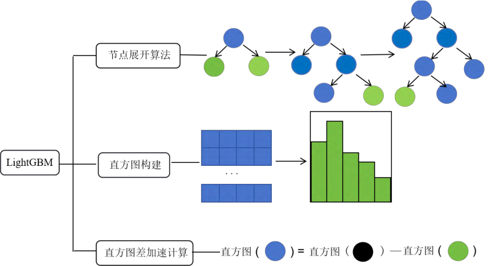

基本思想是：对每个节点遍历所有特征；对节点遍历所有特征，为每个特征构建直方图，每个直方图中应该保存该直方图中样本的梯度和样本数；遍历所有特征，将梯度和以及样本数统计进入直方图中；对特征遍历直方图，分别以当前bin为划分点，得到划分结果，同时根据父节点和叶子节点相减得到另一个兄弟节点的直方图结果。

在构建直方图的过程之中，遍历所有样本，并根据它们的特征值\(f_{i}\)将它们归入相应的桶中。最后更新每个桶的梯度之和以及样本数量。同时，LightGBM还提供了许多高级功能和工具，如交叉验证、自定义损失函数、类别特征的处理等，可以根据需要进行进一步的探索和使用。

## 数据处理技术

### NetCDF4

本项目所需气象辅助数据的变量较多，均以nc文件存储。NetCDF广泛应用于大气领域、水利领域、海洋领域等诸多领域。

|   **特点**   |                           **描述**                           |
| :----------: | :----------------------------------------------------------: |
| 多维数据存储 |      支持创建和组织多维数据集，多个变量可存储在一个文件      |
|    灵活性    | 支持多种开发语言创建和修改文件，同时支持多种工具和应用程序进行访问 |
| 无限维度支持 |         引入无限维度概念，允许创建具有任意长度的维度         |

### 插值方式

插值法是利用函数\(f(x)\)在某区间中已知的若干点的函数值，作出适当的特定函数，在区间的其他点上用这特定函数的值作为函数\(f(x)\)的近似值。广泛应用于数学、物理、工程、统计等领域，用于数据拟合、函数逼近、数值计算等。如果插值法中所使用的特定函数是多项式，那么这种方法就被称为多项式插值，插值多项式的阶数通常与已知点的数量有关。

除此之外，还有许多其他的插值方法，如多项式插值、拉格朗日插值、连分式插值\[13\]。

| **方法名称** |                           **描述**                           |
| :----------: | :----------------------------------------------------------: |
|   nearest    |           插值点处函数值与最邻近的已知点函数值相等           |
|    linear    |      插值点处函数值由连接其最邻近的两侧点的线性函数预测      |
|    pchip     |             保证插值曲线在数据点处的一阶导数连续             |
|    cubic     | 三次插值，通常指三次多项式插值，与pchip类似，但可能包含不同的实现或细微差别 |

## 可视化技术

### Folium

Folium作为一个开源的数据可视化库，根植于Python生态系统之中，展现出强大的功能特性。其不仅能有效地呈现数据的分布状况，更能通过Vincent/Vega等先进工具，在地图上对数据点进行精细标注。此外，Folium还支持GeoJSON和TopoJSON两种文件格式的叠加，使用户得以轻松将数据链接至这两种叠加层，实现更为丰富、深入的数据可视化分析。这一特性不仅提升了数据可视化的灵活性和多样性，也进一步推动了数据分析和解读的精确性与深度。

### Matplotlib

Matplotlib，作为一款2D绘图库，专为Python编程语言及其数值数学扩展包NumPy而设计，由John Hunter在2002年开创，它以各种硬拷贝格式和跨平台的交互式环境生成出版质量级别的图形。此库具备丰富的数据可视化功能，涵盖了线图、散点图、柱状图、饼图、等高线图、3D图形以及极坐标图等多种图表类型。此外，Matplotlib还具备制作动画和交互式图形的能力，进一步拓宽了其应用范围。

# **数据预处理**

## 数据集介绍

本项目使用的漂流轨迹数据集来源于DataFountain社区中的开源数据集，一共包含51个仿真人体模型共84235条实际漂移轨迹数据。其中仿真人体模型的实际漂移轨迹使用random函数按照2:1的比例划分为训练集和测试集，均使用csv文件形式存储。轨迹数据集包含仿真人体的编码、定位日期时刻、纬度和经度等信息，漂流轨迹主要位于福建、广东等附近海域。

预测轨迹所需要的风场和洋流辅助数据来源于开源气象数据工具ERA5。此外洋流的辅助预报信息和风场的辅助预报信息除了和原始数据集对应的经纬度坐标之外，还包含当前时刻的风速分量和流速分量等。

为了简化后续过程之中对日期和时间的遍历过程，以及统一设计中参数调用，采用datatime模块将时间和日期字符串转换。将时间和日期拼接到一起并转换为固定的格式。

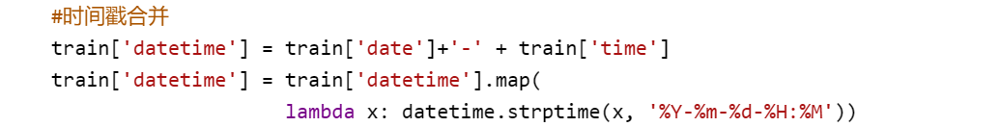

## 经纬度处理

### 风速流速查询

由于本项目的局限性，辅助数据并不是十分完全，需要定义一个时间索引来处理查询不到数据的情况。基于大部分地区的天气环境与地理位置关系密切，对于除去洋流和气候变化巨大地点之外的对象进行模糊操作。具体的做法是用前一天的数据类同替换，首先检查所需文件是否存在于数据集指定的路径下。如果文件不存在，则令所查询日期序列减一，构造出新的文件名重新进行检索。

### 插值函数

从netCDF4文件中提取的风场数据和流速数据，其中包括经度、纬度、东西向风速流速和南北向风速流速。在进行设计之前要先得到各项数据之间关系。所以首先要在各个时间点上对数据进行统一处理，即让每个时间点上的经纬度对应当时的风速流速。但是风速流速通常具有空间异质性，即不同位置上可能差异很大，而且在辅助数据中辅助数据的精度远没有达到和漂流轨迹经纬度对应的精度。因此要通过插值函数，根据风速流速数据变量的相异之处，分别设计插值的方法，在没有直接测量值的位置估计风速和流速。

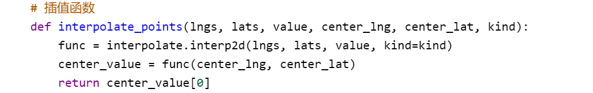

对风速来说，风速数据以网格分布存储，因此可以对待查找点附近的网格进行插值，当对查询点外部一圈网格的点插值时视为一圈，根据插值圈数参数，确定插值所需的网格点范围。这个范围是以查询点为中心的一个方形区域，边长为插值圈数参数的两倍。

具体的做法是通过计算确定目标位置在数据集中的初始网格索引位置，然后通过圈数确定周围网格点的范围。通过转化处理之后对选定好范围进行插值。

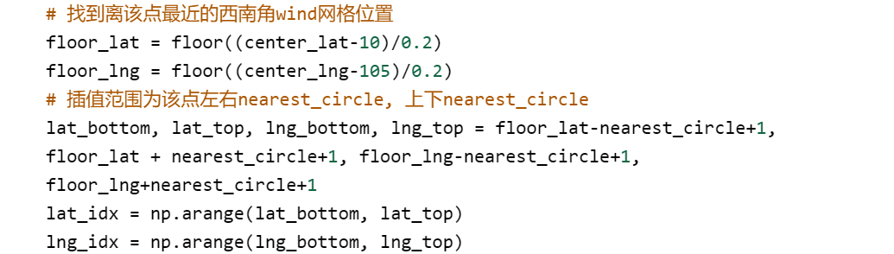

而流速是曲线正交网格形式，无法使用上述方法为流速进行插值。因此通过计算距离的方式直接选出最近的4个点作为插值点，执行线性差值。

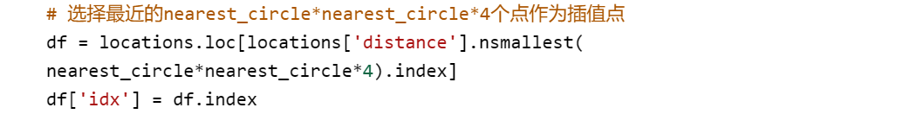

## 轨迹绘制

轨迹路线作为最直观的观测图形和检验方法，是本项目重要的展示手段。但一般的绘图库无法直观准确地绘制漂流轨迹。因此使用Folium库中实现轨迹在一定时间范围内的展示。在轨迹函数中为了适应不同数据集之间的轨迹差异，设置四个变量作为形式参数传入，分别为ID、文件名、原始数据和预测数据。

且允许传入空值，既能直接展示原始轨迹，又能在原始轨迹之上叠加预测轨迹，实现对照功能。同时为方便中文展示和更快的速度，本项目使用高德地图作为地图瓦片，使用Marker方法制作起点和终点标记。使用LatLngPopup方法添加点击反馈，增加轨迹地图的交互性能，并提供保存为HTML文件接口。图中白色曲线为在2020年9月3号至2020年9月5号之间ID为673375的仿真人体模型的经纬度变化轨迹。

## 相关性分析

构建模型之前还需要观测数据点经纬度的偏移量与风速和流速之间的关系。但实际上，1分钟内的经纬度变化幅度很小，因此定义一个函数放大偏移量，将经纬度的偏移量转换为相对数值，通过计算连续时间点的经纬度差异乘以一个系数，生成相应时间序列特征，使得模型能够捕捉到短时间内轨迹的变化趋势。

使用matplotlib库，直观展示特定ID的数据点随时间变化的经纬度偏移量、风速和流速之间的关系。依据风速分量、流速分量以及纬度差异绘制折线图，分别表示东西方向和南北方向的相关性分析。图为在2020年9月3号至2020年9月5号之间ID为673375的仿真人体模型在东西、南北方向上的流速风速分量和经纬度偏移量相关性分析图。

| 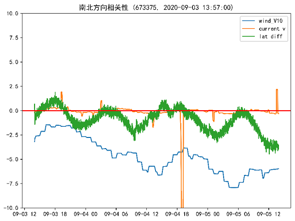 | 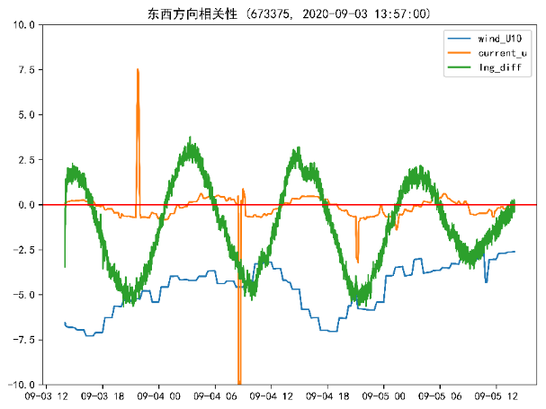 |
| :-----------------------: | :-----------------------: |
|      南北方向相关性       |      东西方向相关性       |

两个子图中蓝色虚线表示风速分量变化，橙色实线表示流速分量变化，绿色点线表示格式化后的经纬度偏移量。由此可以得出，无论在南北方向还是东西方向上，除少数异常值外，经纬度偏移量与流速呈现出较强的正相关性，但风速和经纬度偏移量无明显的相关性。

之后使用随机算法对数据集中的多个数据进行相关性分析，均符合上述结论。为了对结果进行验证，使用主成分分析对辅助数据降维处理。选取风速分量和流速分量作为主成分，执行主成分分析并绘制散点图。

## 不动点处理

为了提高预测效率，并减少在已知固定区域上的计算开销。针对在原始数据信息中轨迹几乎不变的不动点进行删除。一般位于狭窄河道、小岛周围或者靠近海岸的投放点，其轨迹一般符合“原地打转”模式。这些区域可能基于地理特征、环境因素或其他相关因素被确定为不动点范围。因此当进行位置预测或轨迹分析时，首先检查一个点是否位于这些不动点范围内。如果是，则可以直接预测该点将保持原地不动，而无须进行更复杂的分析或计算。

| 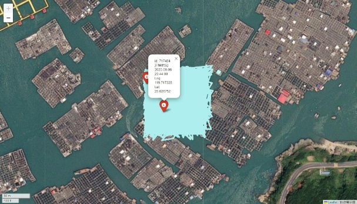 |  |
| :------------------------: | :------------------------: |
|     仿真人体id: 717484     |     仿真人体id:996179      |
| 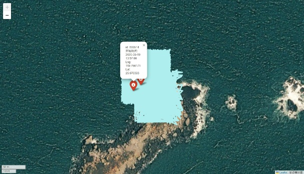 | 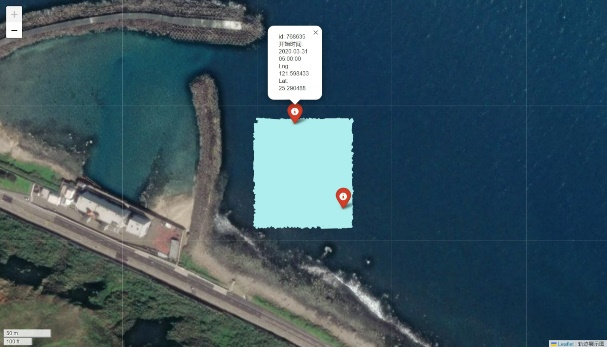 |
|     仿真人体id:803514      |     仿真人体id:768835      |

本设计中定义了一个列表，其中包含多个子列表。每个子列表代表一个固定区域，即在这些区域内的点在预测中被视为不会移动的点。每个子列表包含四个元素，这四个元素定义了一个矩形区域的边界。主要的目的是从原始数据集中识别出那些由于位于特定地形区域而可能保持静止的点，并从数据集中移除它们。经过处理后，DataFrame将只包含那些不受地形因素影响的点。但中国国土广阔无垠，本设计只规划了训练测试集中部分不动点的范围，在真正应用之中需要更加细致的划分传入不动点的范围。

# **模型构建**

## 风速流速补偿

由于高纬度地区风速和流速的计算可能存在误差，根据对时间序列的特征提取可以得出除了流速偶尔的异常值以外，经纬度偏移量与流速呈现出较强的正相关性，但风速和轨迹变化趋势无明显地相关性。而一般位于狭窄河道、小岛周围或者靠近海岸的投放点，其轨迹一般符合“原地打转”模式。不同纬度上同样的风速和流速带来的经度变化不一致，高纬度大而低纬度小\[14\]。本设计中采用三维直角坐标系来描述地球表面。

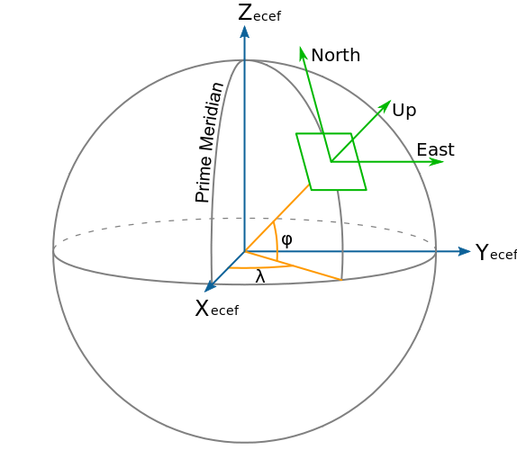

具体的，对于风速流速受到经纬度大小影响的区域，可以通过公式对风速流速进行补偿\[15\]。通过计算补偿，这样高纬度位置就获得了更大的风速与流速，来匹配实际同样速度下更大的经度偏移量，更新过后的\(U_{\text{wind}}\)和\(U_{\text{current}}\)作为实际训练用到的东西向风速和流速。而纬度偏移量则没有这方面的影响，故保持原状。

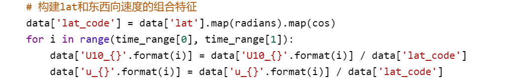

## 模型训练

在处理好各项特征之后开始训练模型，用LightGBM分别来训练两个独立的模型：一个用于预测船只或物体在30分钟后的经度偏移量，另一个用于预测纬度偏移量，即使用风和水流方向上的分量来预测轨迹在经纬度方向上的变化。在本设计中只使用了当前时刻的风速和流向数据作为特征。在本设计中的具体做法是，先定义经纬度模型各自的特征列，在获取30分钟之后的经纬度偏移量。之后创建出训练模型定义模型训练参数。

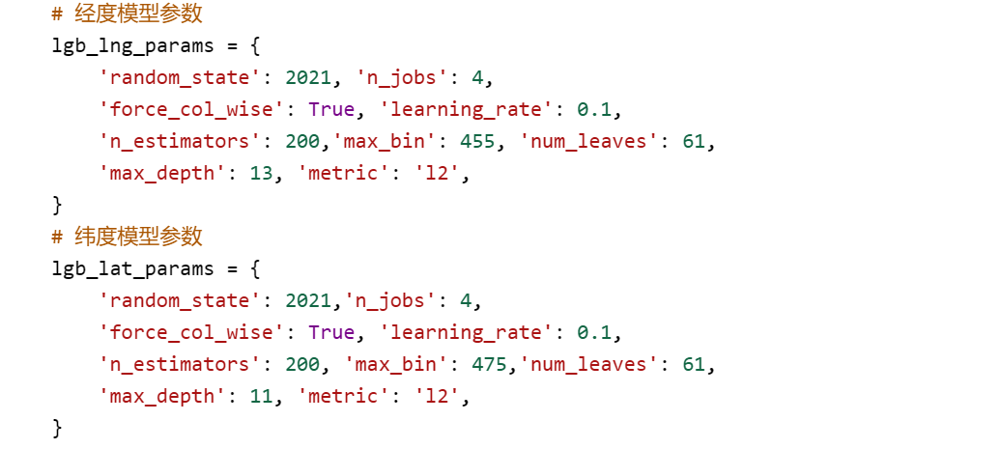

上述代码中，定义了经度模型和纬度模型的LightGBM参数用于控制模型的训练过程。在定义模型参数之后，使用lgb.train函数提供的参数和训练数据集来训练模型。它会返回一个训练好的模型对象，这个对象可以用来进行后续的预测。在对大型数据进行训练时，若要增强训练强度和准确率可以通过提升迭代次数来实现。本设计由于数据量处于低数量级仅使用默认参数，不对迭代次数作提升操作。

训练过程中，LightGBM遵循预设参数构建梯度提升树，并通过迭代机制不断精化模型性能。在每一次迭代中，模型降低训练数据上的损失函数值，以逐步提高预测精度，确保模型能够更精准地捕捉数据的内在规律。

训练模型的同时，为了验证训练参数是否合理，创建训练和验证数据集对象对模型进行评估，本设计使用均方误差作为损失函数。在训练时每过10次打印一次训练信息，如果没有改进就提前停止训练，重新设置参数再训练。直至损失值趋于平稳。可以通过缺陷检测多次调整参数训练后可以得到一个相对最小的损失值\[16\]。

从输出结果可以看到在迭代过程中，没有遇到无法改进的情况，最后得出了一个经度的最佳损失值。根据在验证集上得出的损失值变换，可以得到经纬度训练模型的损失值变换散点图。

| 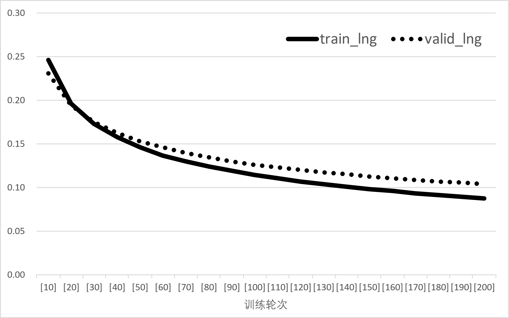 | 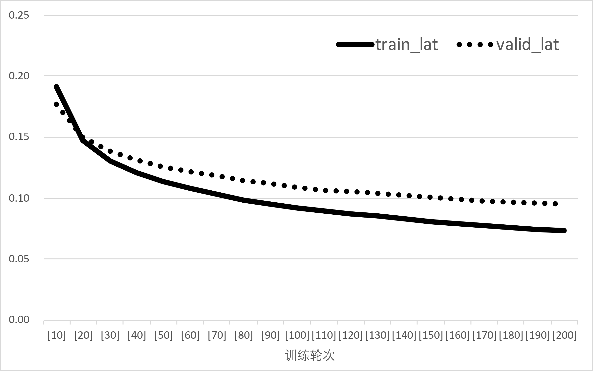 |
| :-----------------------: | :-----------------------: |
|    (a) 经度loss值变化     |    (b) 纬度loss值变换     |

## 模型评估

为了衡量模型的预测能力，本设计使用MAE、MES、RMSE三个指标作为衡量模型预测能力的指标。 MAE是误差的绝对值的平均值，MAE对异常值不敏感，但它不能反映预测误差的分布情况。

MSE（均方误差）是误差平方和的平均值，MSE对异常值敏感（因为当异常值与正常值差距较大时，误差会大于1，取平方值会进一步增大数值），但它们能够反映预测误差的分布情况。

RMSE（均方根误差）是MSE的平方根，RMSE对异常值敏感，但它们能够反映预测误差的分布情况。

在本设计中，添加评估指标代码到模型训练的之后。在训练完成之后输出评估指标。

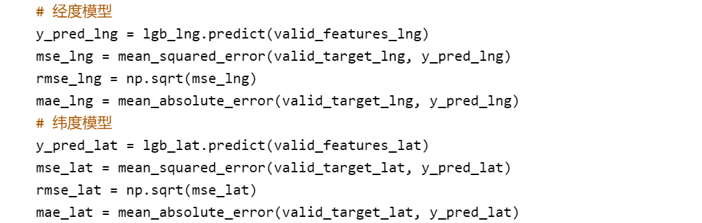

从图得出，MSE为预测值与真实值之差的平方的平均值，鉴于MSE数值极低（逼近1e-6），可以确信两个模型的预测误差均处于极低水平。从MSE的评估视角出发，经度模型的误差表现略优于纬度模型，但两者间的差异并不显著。RMSE是MSE的算术平方根，相较于MSE，RMSE的单位与原始数据保持一致。从RMSE的数值来看，两个模型的误差均保持在较低水平，且经度模型的误差表现略胜一筹。MAE是预测值与真实值之差的绝对值的算术平均值。从MAE的评估结果来看，两个模型的误差均极低，且纬度模型的误差略低于经度模型。

综合上述分析，两个模型均展现出卓越的预测性能，其预测误差均保持在极低水平，表明模型具有较高的稳定性和准确性，可以进行预测。

# **漂流轨迹预测实现**

## 模型预测

### LightGBM预测模型

在对模型预测之前，考虑到一般位于狭窄河道、小岛周围或者靠近海岸的投放点，其轨迹一般符合“原地打转”模式，这些区域可能基于地理特征、环境因素或其他相关因素被确定为不动点范围。因此需要对测试点进行分类，减少在不动点身上的无用功。

首先，检查是否处于DEBUG模式。如果是，则仅选择数据集中id为211423的记录。减少数据处理量，以便更快地运行代码并查看结果。反之则重置筛选后数据的索引，以确保索引是连续的整数。将测试数据集中的date和time列合并为一个新的列。允许后续代码以日期时间格式处理这些数据。初始化测试数据集中的in\_fix\_area列，将其值全部设置为0。这个列用于标记测试数据集中的点是否位于预定义的不动点区域内。遍历fix\_areas列表对于每个不动点区域，使用apply方法和lambda函数来调用in\_area函数，这个函数的返回值被用来更新in\_fix\_area列的值。从测试数据集中筛选出in\_fix\_area列值为1的记录。提取这些记录的id列，并将其转换为列表形式。

### 模型预测

对于改造之后的训练集可以分为两大类别即动点和不动点，如果预测点是不动点，则直接讲初始点作为后续所有的预测，反之则每隔30分钟预测一次位置，并使用新的位置重新找到对应的风速与流速，共循环95次之后得到最终的结果。循环95次的含义是48小时内有96个以30分钟划分的时间点。去除初始状态后还应预测95个时间点。

使用查询到的风速和流速数据作为特征，使用训练的经纬度模型预测经度和纬度的偏移量。根据预测的偏移量更新当前点的经纬度。对时间点进行更新，并将格式化为日期和时间字符串形式。每30分钟，将当前点的信息存储到一个字典中，并添加到预测列表中。

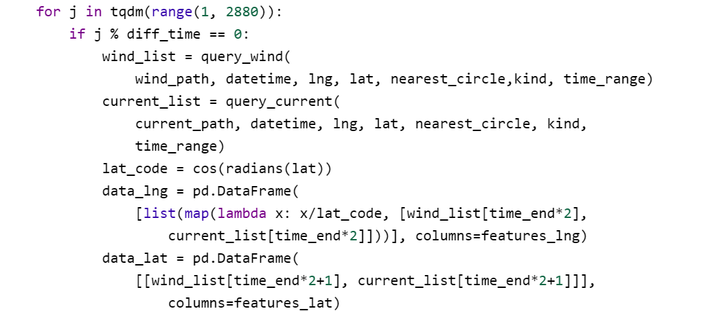

具体的做法是初始化一个预测列表，用于存储后续生成的预测数据。遍历测试数据集中每一个测试点。提取每个点的ID、经度、纬度、日期、时间等信息，并将这些信息存储在一个字典中，然后添加到预测列表中。检查当前点的id是否在不动点ID列表中。如果是不动点，每隔1800秒生成一个新的时间点，并复制当前点的经纬度信息。如果当前点不是不动点，则进行位置预测。每隔diff\_time分钟，通过定义的函数查询当前时间和位置下的风速和流速数据。总计对16个id进行了预测，本设计中由于算力限制，平均每3分钟完成一次预测，可以通过增加算力来提升预测效率。

## 结果与分析

### 预测结果

通过模型预测之后的预测结果存储在rows\_list列表之中，但其中包含多列预测时的暂存数据，为方便调用轨迹显示函数以及对预测结果进行保存，本设计直接使用pandas库的to\_csv方法将结果存储到csv文件中。相应的通过修改存储函数可以将结果存储到MySQL、Hadoop等存储平台。本质上大同小异，不再赘述。

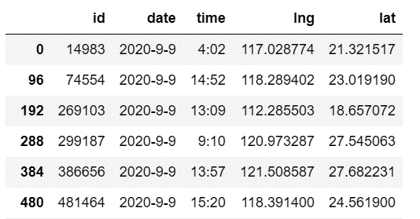

### 可视化及准确率

预测之后的轨迹路线从数值上很难看出变化趋势和大小，但对经纬度而言的很小的变化并不能等同于映射到实际应用里的距离。因此首先对轨迹进行可视化操作。调用之前定义的可视化轨迹函数，本项目为了展示原始轨迹和预测轨迹的对照传入了两个数据框变量，也可仅传入预测数据绘制轨迹。预测后的部分预测对照轨迹如图所示。

| 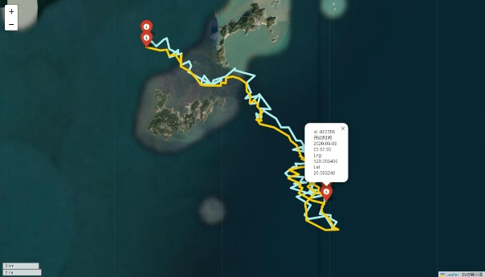 |  |
| :------------------------: | :------------------------: |
|     仿真人体id: 872356     |     仿真人体id:481464      |

根据同样的逻辑，使用经纬度差值映射出的以米为单位的距离，作为预测偏差。使用geodistance函数，根据经纬度，计算出同一时间刻度中预测轨迹与原始轨迹的距离，得到预测偏差。

将时间、原始轨迹、预测轨迹、预测偏差等数据项，合并到同一个数据框里。分别统计出每一个id的偏移最值和平均值得出预测偏差绘制折线图。

图中上三角图案为最大偏移量，下三角图案为最小偏移量，圆点表示平均偏移量。从图中可以看到预测数据的偏差阈值在0至1.2千米之间。除去id为481464判定为不动点之外，其余的测试数据的平均偏差距离大约为0.6千米。

再将所有的仿真人体的预测偏差综合到一起，绘制直方图。用于评测本设计在各个精度内的准确率。

图中，横坐标表示预测偏差的大小，箱宽度为100米。纵坐标表示频数，显然500米是出现频数最高的距离范围。由各自的频数除以预测总条数得出本设计在各个距离范围内的准确率。

| **距离范围（米）** | **准确率** |
| :----------------: | :--------: |
|       0-500        |   33.92%   |
|        700         |   72.85%   |
|        900         |   88.87%   |
|        1000        |   95.38%   |

从表得出，本设计在千米范围内的准确率为95.38%，但随着距离范围的不断缩小，准确率也随之缩减。特别是从700米至500米的区间范围内，准确率骤减。这是因为从整个海洋领域来看，风速和流速是导致漂流轨迹变化的两大因素，但海底震动、对流风、海洋深度和生物干扰等因素也会导致预测轨迹发生偏移。因此在只考虑两种环境因素的情况下，小距离范围内的准确率不高是正常的。

# **总结与展望**

## 结论

本设计以仿真人体模型为对象，通过对辅助数据的相应训练，预测出了16个仿真人体在48小时之内每隔30分钟的轨迹变化，达到了千米范围内较高的准确率。首先，研究漂流轨迹的影响因素进行相关性分析。其次，对辅助数据使用线性插值得到更为接近风速流速数据。第三，采用LightGBM模型进行漂流轨迹预测分析，设计建模过程以及参数优化。最后，将测试数据与真实数据集进行准确率验证，转化经纬度距离并对其可视化展示。

综上，使用LightGBM进行漂流轨迹预测在多数情况下是有效的，但预测精度仍有提升空间。当前选择的特征对预测结果有一定影响，但可能不是最优的特征组合。选用30分钟作为预测间隔可能不是最适合实际应用需求的，需要根据具体场景进行调整。

## 展望

从本设计中的局限性可以看出，漂流轨迹的预测对风速流速等辅助数据的精度依赖性很高，精度越高、划分插值范围越小，得到的预测轨迹准确率越高。而且对不动点的处理依赖于数据传入，没有进行相应的算法研究。在后续的改进中可以补全不动点的范围，或是改进算法识别不动点，将会显著的提高预测准确率和处理耗时。且本设计为了缩减预测时间，选取的预测间隔为30分钟，要根据实际应用需求，调整预测间隔时间。

针对漂流轨迹数据的特点，可以使用数据增强技术，如数据插值、时间序列数据的平滑处理等，以促使模型更快适应新环境。除了LightGBM外，还可以使用其他机器学习或深度学习模型进行预测，如随机森林、梯度提升机、长短期记忆网络等，并比较不同模型的性能。若想要获得更好的预测效果，也可以将多个模型的预测结果进行融合。

通过这一系列的努力，期望能够为海洋活动的安全、高效运行提供有力的技术支撑。

# **参考文献**

1.  茅晨昊,潘晨,尹波,等.基于高斯过程回归的船舶航行轨迹预测\[J\].科技创新与应用,2017(31):28-29+31.

2.  夏山宏,徐纯洁,罗修波,等.海上落水人员漂移轨迹可视化预测研究\[J\].航海,2022(04):38-41.

3.  史永胜,翟欣然,栾飞,等.基于特征选择的LightGBM算法预测钠离子电池剩余寿命\[J\].陕西科技大学学报,2024,42(02):174-181.

4.  陈勤达,陈小惠.一种无创预测血压的改进LightGBM学习方法\[J\].软件导刊,2024,23(03):41-46.

5.  高治鑫,包腾飞,李扬涛,等.基于贝叶斯优化LightGBM的大坝变形预测模型\[J\].长江科学院院报,2021,38(07):46-50+57.

6.  RW N,M C,AT C,et al.Using an ocean model to predict likely drift tracks of sea turtle carcasses in the north central Gulf of Mexico\[J\].*Endangered Species Research*,2013,21(3):191-203.

7.  Borkowski P .The Ship Movement Trajectory Prediction Algorithm Using Navigational Data Fusion\[J\].*Sensors*,2017,17(6):1432.

8.  Chhillar I ,Singh A .A feature engineering-based machine learning technique to detect and classify lung and colon cancer from histopathological images.\[J\].*Medical biological engineering computing*,2024,62(3):913-924.

9.  Sait W R A ,Nagaraj R .An Enhanced LightGBM-Based Breast Cancer Detection Technique Using Mammography Images\[J\].*Diagnostics*,2024,14(2):

10.  Xie B ,Li F ,Li H , et al.Enhanced Internet of Things Security Situation Assessment Model with Feature Optimization and Improved SSA-LightGBM\[J\].*Mathematics*,2023,11(16):

11.  李星彤,龚伟,李帝阅.基于Boosting算法的转炉终点预测模型\[J/OL\].材料与冶金学报:1-17\[2024-04-14\].

12.  林星,梁诗雪,冯斯奕.基于集成学习的蔗渣灰混凝土抗压强度预测模型\[J/OL\].浙江理工大学学报(自然科学版):1-12\[2024-04-13\].

13.  胡云飞,赵前进.保斜渐近线和垂直渐近线的连分式插值\[J\].洛阳师范学院学报,2023,42(08):1-8.

14.  叶林,冯标,钟德华,等.功率曲线特性测试仪有效风速补偿算法的研究\[J\].风能,2016(08):58-61.

15.  杨茂,翟冠强,李大勇,等.基于风速升降特性及支持向量机理论的异常数据重构算法\[J\].电力系统保护与控制,2018,46(16):31-37.

16.  杨萌,张爱军,潘文松.基于改进YOLOv5算法的纸袋缺陷检测\[J\].组合机床与自动化加工技术,2024(03):105-108+113.

# **致 谢**

经过了几个月的努力，毕业设计即将完成，回想设计全程，原本以为在这个过程中会轻松的我，却没想到过程是如此的艰辛，不过正要借着这个经历，我要对在大学期间所有帮助过我的人表示非常的感谢。

设计期间，指导老师侯星晨认真负责的工作态度、严谨的风格，使我深受启发，今后，无论是做什么事情，都应该保持乐观向上的态度和永不放弃的决心；同时，同学们之间的相互探讨，让我明白了团队以及合作的重要性。再次向所有在我设计过程中给予过我帮助与关怀的朋友表示深深的感谢！

毕业设计的结束意味着我在郑州财经学院的学习生活即将画上句号\!回首往事，感慨良多，心潮难平。但无论如何这些实实在在的经历，是我人生中弥足珍贵的记忆。在此，要特别感谢求学过程给予我无限支持和帮助的老师、朋友和亲人们。感谢我的指导老师，从日常的学习，论文题目的确定到论文的撰写，侯星晨老师都给予我悉心的关怀和耐心的指导，给我鼓励和动力，也正是在他的指导和督促下论文才得以如期完成。

感谢我们一起在学校努力的同学，我们彼此关心、互相支持和帮助，留下了许多难忘的回忆。希望可以以本文向你们汇报，以感谢你们对我的关怀与帮助，感谢一直以来对我的支持与鼓励。你们永远是我的精神支柱和继续前进的动力。

所有帮助和关心过我的人们，尽管与你们为我付出的一切相比，所有的语言都显得苍白无力，我仍要真诚地说声：谢谢你们\!祝愿所有老师和同学工作顺利、事业有成！祝愿母校明天更美好\!
